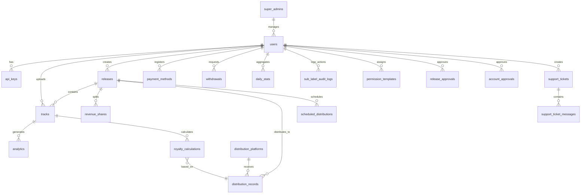

# 5. Database Schema

## TuneMantra Data Models

## TuneMantra Data Models

<div align="center">
  
</div>

### Introduction

This document provides a comprehensive overview of TuneMantra's data models, their relationships, and implementation details. The data architecture is designed around domain-driven principles, with clear boundaries between different functional areas while maintaining the necessary relationships for cross-domain operations.

The database uses PostgreSQL with Drizzle ORM for type-safe access and schema management. The schema is organized by domain contexts with careful consideration for performance, integrity, and scalability.

### Table of Contents

- [Schema Overview](#schema-overview)
- [Core Data Models](#core-data-models)
- [User Management Domain](#user-management-domain)
- [Content Management Domain](#content-management-domain)
- [Distribution Domain](#distribution-domain)
- [Rights Management Domain](#rights-management-domain)
- [Financial Domain](#financial-domain)
- [Analytics Domain](#analytics-domain)
- [Data Relationships](#data-relationships)
- [Schema Evolution](#schema-evolution)

### Schema Overview

TuneMantra's database schema is divided into distinct domains, each representing a core business capability:

<div align="center">
  
</div>

Each domain has its own set of tables with clear responsibilities:

1. **User Management Domain**
   - Handles user accounts, teams, and permissions
   - Manages authentication and authorization data
   - Stores profile and preference information

2. **Content Management Domain**
   - Manages tracks, releases, and artists
   - Handles metadata and assets
   - Tracks content relationships and versions

3. **Distribution Domain**
   - Manages platform connections and delivery
   - Tracks distribution status and availability
   - Stores platform-specific requirements and metadata

4. **Rights Management Domain**
   - Tracks ownership and rights claims
   - Manages splits and shares
   - Stores contracts and agreements

5. **Financial Domain**
   - Processes royalty calculations
   - Manages payment information
   - Tracks transactions and statements

6. **Analytics Domain**
   - Stores performance metrics
   - Manages report data and configurations
   - Tracks user engagement and platform statistics

### Core Data Models

The primary entities that form the foundation of TuneMantra's data model:

#### User

The `users` table represents platform users and their core attributes:

```typescript
export const users = pgTable("users", {
  id: serial("id").primaryKey(),
  username: text("username").notNull().unique(),
  email: text("email").notNull().unique(),
  passwordHash: text("password_hash").notNull(),
  firstName: text("first_name"),
  lastName: text("last_name"),
  role: userRoleEnum("role").default("artist").notNull(),
  status: userStatusEnum("status").default("pending").notNull(),
  parentId: integer("parent_id").references(() => users.id),
  createdAt: timestamp("created_at").defaultNow().notNull(),
  updatedAt: timestamp("updated_at").defaultNow().notNull(),
  lastLoginAt: timestamp("last_login_at"),
  profileImageUrl: text("profile_image_url"),
  timezone: text("timezone").default("UTC"),
  accountSettings: jsonb("account_settings"),
  notificationPreferences: jsonb("notification_preferences"),
  verificationStatus: approvalStatusEnum("verification_status").default("pending"),
  labelSettings: jsonb("label_settings"),
  marketingConsent: boolean("marketing_consent").default(false),
  taxId: text("tax_id"),
  dateOfBirth: date("date_of_birth"),
  country: text("country"),
  city: text("city"),
  address: text("address"),
  postalCode: text("postal_code"),
  phone: text("phone"),
  website: text("website"),
  biography: text("biography"),
  businessName: text("business_name"),
  businessType: text("business_type"),
  isAdmin: boolean("is_admin").default(false),
  isVerified: boolean("is_verified").default(false),
  isBanned: boolean("is_banned").default(false),
});
```

Key aspects:
- Support for hierarchical relationships (parent labels with sub-users)
- Role-based access control
- Account status tracking
- Rich profile data
- Flexible JSON settings for preferences and configurations
- Verification and compliance tracking

#### Track

The `tracks` table represents individual audio recordings and their metadata:

```typescript
export const tracks = pgTable("tracks", {
  id: serial("id").primaryKey(),
  userId: integer("user_id").notNull().references(() => users.id),
  title: text("title").notNull(),
  isrc: text("isrc").unique(),
  duration: integer("duration"),
  releaseDate: date("release_date"),
  recordingDate: date("recording_date"),
  language: text("language"),
  explicit: boolean("explicit").default(false),
  primaryGenre: text("primary_genre"),
  secondaryGenres: text("secondary_genres").array(),
  bpm: integer("bpm"),
  key: text("key"),
  moods: text("moods").array(),
  tags: text("tags").array(),
  lyrics: text("lyrics"),
  description: text("description"),
  audioFileUrl: text("audio_file_url"),
  waveformUrl: text("waveform_url"),
  coverArtUrl: text("cover_art_url"),
  status: text("status").default("draft").notNull(),
  createdAt: timestamp("created_at").defaultNow().notNull(),
  updatedAt: timestamp("updated_at").defaultNow().notNull(),
  primaryArtist: text("primary_artist").notNull(),
  featuredArtists: text("featured_artists").array(),
  composers: text("composers").array(),
  lyricists: text("lyricists").array(),
  producers: text("producers").array(),
  metadata: jsonb("metadata"),
  aiTags: jsonb("ai_tags"),
  royaltyEligible: boolean("royalty_eligible").default(true),
  originalReleaseDate: date("original_release_date"),
  recordLabel: text("record_label"),
  publisher: text("publisher"),
  copyrightText: text("copyright_text"),
  publicationYear: integer("publication_year"),
  contentTags: jsonb("content_tags"),
  aiAnalysis: jsonb("ai_analysis"),
  credits: jsonb("credits"),
  audioMetadata: jsonb("audio_metadata"),
  sampleDetails: jsonb("sample_details"),
  stemFiles: jsonb("stem_files"),
});
```

Key aspects:
- Comprehensive music metadata
- Support for multiple contributors (artists, composers, producers)
- Advanced music attributes (BPM, key, moods)
- Audio file references
- AI-enhanced metadata for discovery
- Detailed rights information
- Technical audio information

#### Release

The `releases` table represents collections of tracks for distribution:

```typescript
export const releases = pgTable("releases", {
  id: serial("id").primaryKey(),
  userId: integer("user_id").notNull().references(() => users.id),
  title: text("title").notNull(),
  upc: text("upc").unique(),
  releaseDate: date("release_date"),
  originalReleaseDate: date("original_release_date"),
  recordLabel: text("record_label"),
  catalogNumber: text("catalog_number"),
  primaryGenre: text("primary_genre"),
  secondaryGenres: text("secondary_genres").array(),
  language: text("language"),
  explicit: boolean("explicit").default(false),
  type: text("type").default("single").notNull(),
  status: text("status").default("draft").notNull(),
  coverArtUrl: text("cover_art_url"),
  description: text("description"),
  createdAt: timestamp("created_at").defaultNow().notNull(),
  updatedAt: timestamp("updated_at").defaultNow().notNull(),
  preOrderDate: date("pre_order_date"),
  primaryArtist: text("primary_artist").notNull(),
  featuredArtists: text("featured_artists").array(),
  compilationArtists: text("compilation_artists").array(),
  metadata: jsonb("metadata"),
  contentWarnings: text("content_warnings").array(),
  copyrightText: text("copyright_text"),
  publishingRights: text("publishing_rights"),
  territoriesExcluded: text("territories_excluded").array(),
  notes: text("notes"),
  visibilitySettings: jsonb("visibility_settings"),
  artwork: jsonb("artwork"),
  distributionStatus: distributionStatusEnum("distribution_status").default("pending"),
  distributionDate: timestamp("distribution_date"),
  contentType: contentTypeEnum("content_type").default("single"),
  contentTags: jsonb("content_tags"),
  aiAnalysis: jsonb("ai_analysis"),
  credits: jsonb("credits"),
  artworkMetadata: jsonb("artwork_metadata"),
});
```

Key aspects:
- Complete release metadata for distribution
- Support for various release types (singles, albums, EPs)
- Territory restrictions and visibility settings
- Distribution status tracking
- Enhanced artwork information
- AI-powered content analysis
- Detailed credits information

#### Distribution Records

The `distributionRecords` table tracks the delivery of releases to platforms:

```typescript
export const distributionRecords = pgTable("distribution_records", {
  id: serial("id").primaryKey(),
  releaseId: integer("release_id").notNull().references(() => releases.id),
  platformId: integer("platform_id").notNull().references(() => distributionPlatforms.id),
  status: distributionStatusEnum("status").default("pending").notNull(),
  distributedAt: timestamp("distributed_at"),
  lastStatusUpdate: timestamp("last_status_update").defaultNow().notNull(),
  platformReleaseId: text("platform_release_id"),
  platformUrl: text("platform_url"),
  errors: jsonb("errors"),
  takedownRequested: boolean("takedown_requested").default(false),
  takedownReason: text("takedown_reason"),
  takedownRequestedAt: timestamp("takedown_requested_at"),
  takedownCompletedAt: timestamp("takedown_completed_at"),
  metadata: jsonb("metadata"),
  scheduledAt: timestamp("scheduled_at"),
  attemptCount: integer("attempt_count").default(0),
  deliveryMethod: text("delivery_method").default("api"),
  platformFeedback: jsonb("platform_feedback"),
  territories: text("territories").array(),
  analyticsSource: text("analytics_source"),
  createdAt: timestamp("created_at").defaultNow().notNull(),
  updatedAt: timestamp("updated_at").defaultNow().notNull(),
  processingDetails: jsonb("processing_details"),
  deliveryPackageUrl: text("delivery_package_url"),
  platformSpecificMetadata: jsonb("platform_specific_metadata"),
  errorCategory: text("error_category"),
  errorDetails: text("error_details"),
  errorResolution: text("error_resolution"),
  distributionBatchId: integer("distribution_batch_id"),
});
```

Key aspects:
- Platform-specific distribution tracking
- Detailed status and error information
- Takedown request handling
- Platform identifiers and URLs
- Territory-specific distribution
- Delivery method and package details
- Error categorization and resolution tracking

#### Rights Claims

The `rightsManagement` table tracks ownership claims on content:

```typescript
export const rightsManagement = pgTable("rights_management", {
  id: serial("id").primaryKey(),
  entityType: text("entity_type").notNull(), // "track" or "release"
  entityId: integer("entity_id").notNull(),
  rightType: roleTypeEnum("right_type").notNull(),
  rightHolder: text("right_holder").notNull(),
  rightHolderType: text("right_holder_type").notNull(), // "user", "label", "publisher", "organization"
  rightHolderId: integer("right_holder_id"),
  percentage: numeric("percentage").notNull(),
  startDate: date("start_date").notNull(),
  endDate: date("end_date"),
  territory: text("territory").array(),
  documentUrl: text("document_url"),
  verificationStatus: approvalStatusEnum("verification_status").default("pending"),
  verifiedBy: integer("verified_by").references(() => users.id),
  verifiedAt: timestamp("verified_at"),
  createdBy: integer("created_by").notNull().references(() => users.id),
  createdAt: timestamp("created_at").defaultNow().notNull(),
  updatedAt: timestamp("updated_at").defaultNow().notNull(),
  notes: text("notes"),
  metadata: jsonb("metadata"),
  ownershipType: ownershipTypeEnum("ownership_type").default("original"),
  isExclusive: boolean("is_exclusive").default(true),
  agreementType: text("agreement_type"),
  agreementId: text("agreement_id"),
  rightsConflict: boolean("rights_conflict").default(false),
  conflictDetails: jsonb("conflict_details"),
  chainOfTitle: jsonb("chain_of_title"),
});
```

Key aspects:
- Flexible rights tracking for different entity types
- Percentage-based ownership
- Time-bound rights (start/end dates)
- Territory-specific rights
- Verification workflow
- Documentation references
- Conflict detection and resolution
- Chain of title tracking

#### Royalty Calculations

The `royaltyCalculations` table tracks financial earning computations:

```typescript
export const royaltyCalculations = pgTable("royalty_calculations", {
  id: serial("id").primaryKey(),
  userId: integer("user_id").notNull().references(() => users.id),
  entityType: text("entity_type").notNull(), // "track" or "release"
  entityId: integer("entity_id").notNull(),
  platformId: integer("platform_id").references(() => distributionPlatforms.id),
  period: text("period").notNull(), // e.g., "2023-03"
  streams: integer("streams"),
  downloads: integer("downloads"),
  amount: numeric("amount").notNull(),
  currency: text("currency").default("USD").notNull(),
  exchangeRate: numeric("exchange_rate").default("1"),
  status: text("status").default("pending").notNull(),
  paidAt: timestamp("paid_at"),
  statementId: integer("statement_id"),
  createdAt: timestamp("created_at").defaultNow().notNull(),
  updatedAt: timestamp("updated_at").defaultNow().notNull(),
  calculationDetails: jsonb("calculation_details"),
  paymentBatchId: integer("payment_batch_id"),
  adjustments: jsonb("adjustments"),
  splitPayments: jsonb("split_payments"),
  royaltySource: text("royalty_source").default("streaming"),
  royaltyType: royaltyTypeEnum("royalty_type").default("performance"),
  territoryCode: text("territory_code"),
  taxWithheld: numeric("tax_withheld").default("0"),
  grossAmount: numeric("gross_amount"),
  processingFee: numeric("processing_fee").default("0"),
  distributionFee: numeric("distribution_fee").default("0"),
  netAmount: numeric("net_amount"),
  recoupmentApplied: numeric("recoupment_applied").default("0"),
  advanceBalance: numeric("advance_balance"),
  paymentMethod: text("payment_method"),
  transactionId: text("transaction_id"),
  sourceData: jsonb("source_data"),
});
```

Key aspects:
- Track and release earnings
- Platform and territory-specific calculations
- Period-based tracking
- Currency and exchange rate handling
- Detailed calculation components
- Split payment tracking
- Tax withholding
- Fee and deduction transparency
- Advance recoupment tracking
- Comprehensive financial details

### User Management Domain

The user management domain handles all aspects of user accounts, authentication, teams, and permissions:

#### User Profiles

Extended user information beyond the core user table:

```typescript
export const userProfiles = pgTable("user_profiles", {
  id: serial("id").primaryKey(),
  userId: integer("user_id").notNull().references(() => users.id).unique(),
  displayName: text("display_name"),
  bio: text("bio"),
  location: text("location"),
  website: text("website"),
  socialLinks: jsonb("social_links"),
  profileCompleteness: integer("profile_completeness").default(0),
  coverImageUrl: text("cover_image_url"),
  genres: text("genres").array(),
  influences: text("influences").array(),
  skills: text("skills").array(),
  yearsActive: integer("years_active"),
  careerLevel: text("career_level"),
  verifiedArtist: boolean("verified_artist").default(false),
  publicProfile: boolean("public_profile").default(true),
  featuredWork: jsonb("featured_work"),
  createdAt: timestamp("created_at").defaultNow().notNull(),
  updatedAt: timestamp("updated_at").defaultNow().notNull(),
});
```

#### Teams

Team management for multi-user accounts:

```typescript
export const teams = pgTable("teams", {
  id: serial("id").primaryKey(),
  name: text("name").notNull(),
  ownerId: integer("owner_id").notNull().references(() => users.id),
  description: text("description"),
  avatarUrl: text("avatar_url"),
  createdAt: timestamp("created_at").defaultNow().notNull(),
  updatedAt: timestamp("updated_at").defaultNow().notNull(),
  type: text("type").default("default"),
  inviteCode: text("invite_code"),
  settings: jsonb("settings"),
  status: text("status").default("active"),
});
```

#### Team Members

Connects users to teams with specific roles:

```typescript
export const teamMembers = pgTable("team_members", {
  id: serial("id").primaryKey(),
  teamId: integer("team_id").notNull().references(() => teams.id),
  userId: integer("user_id").notNull().references(() => users.id),
  role: text("role").default("member").notNull(),
  permissions: jsonb("permissions"),
  joinedAt: timestamp("joined_at").defaultNow().notNull(),
  invitedBy: integer("invited_by").references(() => users.id),
  status: text("status").default("active").notNull(),
  lastActiveAt: timestamp("last_active_at"),
});
```

#### API Keys

For programmatic access to the platform:

```typescript
export const apiKeys = pgTable("api_keys", {
  id: serial("id").primaryKey(),
  userId: integer("user_id").notNull().references(() => users.id),
  name: text("name").notNull(),
  key: text("key").notNull().unique(),
  scopes: text("scopes").array(),
  expiresAt: timestamp("expires_at"),
  lastUsedAt: timestamp("last_used_at"),
  createdAt: timestamp("created_at").defaultNow().notNull(),
  updatedAt: timestamp("updated_at").defaultNow().notNull(),
  isActive: boolean("is_active").default(true),
  ipRestrictions: text("ip_restrictions").array(),
  rateLimit: integer("rate_limit"),
});
```

#### Sessions

Manages user login sessions:

```typescript
export const sessions = pgTable("sessions", {
  id: text("id").primaryKey(),
  userId: integer("user_id").notNull().references(() => users.id),
  userAgent: text("user_agent"),
  ipAddress: text("ip_address"),
  expiresAt: timestamp("expires_at").notNull(),
  createdAt: timestamp("created_at").defaultNow().notNull(),
  lastActiveAt: timestamp("last_active_at").defaultNow().notNull(),
  data: jsonb("data"),
  isAdmin: boolean("is_admin").default(false),
});
```

#### Audit Logs

Tracks important system and user actions:

```typescript
export const auditLogs = pgTable("audit_logs", {
  id: serial("id").primaryKey(),
  userId: integer("user_id").references(() => users.id),
  action: text("action").notNull(),
  entityType: text("entity_type"),
  entityId: text("entity_id"),
  details: jsonb("details"),
  ipAddress: text("ip_address"),
  userAgent: text("user_agent"),
  createdAt: timestamp("created_at").defaultNow().notNull(),
  severity: text("severity").default("info"),
  status: text("status").default("success"),
});
```

### Content Management Domain

The content management domain handles tracks, releases, artists, and their metadata:

#### Artists

Detailed artist information:

```typescript
export const artists = pgTable("artists", {
  id: serial("id").primaryKey(),
  userId: integer("user_id").references(() => users.id),
  name: text("name").notNull(),
  sortName: text("sort_name"),
  type: text("type").default("person").notNull(), // "person", "group", "orchestra", etc.
  biography: text("biography"),
  formedYear: integer("formed_year"),
  dissolvedYear: integer("dissolved_year"),
  country: text("country"),
  website: text("website"),
  socialLinks: jsonb("social_links"),
  imageUrl: text("image_url"),
  genres: text("genres").array(),
  tags: text("tags").array(),
  createdAt: timestamp("created_at").defaultNow().notNull(),
  updatedAt: timestamp("updated_at").defaultNow().notNull(),
  isVerified: boolean("is_verified").default(false),
  spotifyId: text("spotify_id"),
  appleId: text("apple_id"),
  isni: text("isni"),
  memberArtists: jsonb("member_artists"),
  aliases: jsonb("aliases"),
  primaryLabel: text("primary_label"),
  managementContact: text("management_contact"),
  bookingContact: text("booking_contact"),
  pressContact: text("press_contact"),
});
```

#### Track-Release Junction

Connects tracks to releases with ordering information:

```typescript
export const trackReleases = pgTable("track_releases", {
  id: serial("id").primaryKey(),
  trackId: integer("track_id").notNull().references(() => tracks.id),
  releaseId: integer("release_id").notNull().references(() => releases.id),
  trackNumber: integer("track_number").notNull(),
  discNumber: integer("disc_number").default(1).notNull(),
  isBonus: boolean("is_bonus").default(false),
  isInstant: boolean("is_instant").default(false),
  createdAt: timestamp("created_at").defaultNow().notNull(),
  updatedAt: timestamp("updated_at").defaultNow().notNull(),
});
```

#### Assets

Manages digital files associated with content:

```typescript
export const assets = pgTable("assets", {
  id: serial("id").primaryKey(),
  userId: integer("user_id").notNull().references(() => users.id),
  entityType: text("entity_type").notNull(), // "track", "release", "artist", etc.
  entityId: integer("entity_id").notNull(),
  type: text("type").notNull(), // "audio", "image", "document", "video"
  subType: text("sub_type"), // "master", "artwork", "contract", "stems", etc.
  fileUrl: text("file_url").notNull(),
  fileName: text("file_name").notNull(),
  fileSize: integer("file_size"),
  fileType: text("file_type"),
  duration: integer("duration"), // for audio/video
  width: integer("width"), // for images
  height: integer("height"), // for images
  isPublic: boolean("is_public").default(false),
  status: text("status").default("active"),
  createdAt: timestamp("created_at").defaultNow().notNull(),
  updatedAt: timestamp("updated_at").defaultNow().notNull(),
  metadata: jsonb("metadata"),
  checksum: text("checksum"),
  thumbnailUrl: text("thumbnail_url"),
  storageProvider: text("storage_provider").default("s3"),
  processingStatus: text("processing_status").default("complete"),
  processingError: text("processing_error"),
  replacedById: integer("replaced_by_id").references(() => assets.id),
  originalFileName: text("original_file_name"),
});
```

#### Content Tags

Structured tagging system for enhanced discoverability:

```typescript
export const contentTags = pgTable("content_tags", {
  id: serial("id").primaryKey(),
  entityType: text("entity_type").notNull(), // "track", "release", "artist"
  entityId: integer("entity_id").notNull(),
  category: text("category").notNull(), // "genre", "mood", "instrument", "theme"
  tag: text("tag").notNull(),
  source: text("source").default("user"), // "user", "system", "ai"
  confidence: numeric("confidence"), // For AI-generated tags
  createdAt: timestamp("created_at").defaultNow().notNull(),
  createdBy: integer("created_by").references(() => users.id),
  isVerified: boolean("is_verified").default(false),
  verifiedBy: integer("verified_by").references(() => users.id),
  verifiedAt: timestamp("verified_at"),
});
```

#### Version History

Tracks changes to content over time:

```typescript
export const versionHistory = pgTable("version_history", {
  id: serial("id").primaryKey(),
  entityType: text("entity_type").notNull(), // "track", "release", etc.
  entityId: integer("entity_id").notNull(),
  versionNumber: integer("version_number").notNull(),
  changes: jsonb("changes").notNull(),
  changedBy: integer("changed_by").references(() => users.id),
  changedAt: timestamp("changed_at").defaultNow().notNull(),
  comment: text("comment"),
  status: text("status").default("active"),
  isAutomated: boolean("is_automated").default(false),
  previousVersionId: integer("previous_version_id").references(() => versionHistory.id),
});
```

### Distribution Domain

The distribution domain manages the delivery of music to streaming platforms:

#### Distribution Platforms

Information about connected streaming services:

```typescript
export const distributionPlatforms = pgTable("distribution_platforms", {
  id: serial("id").primaryKey(),
  name: text("name").notNull().unique(),
  logoUrl: text("logo_url"),
  apiEndpoint: text("api_endpoint"),
  apiDocumentation: text("api_documentation"),
  deliveryMethod: text("delivery_method").default("api"), // "api", "sftp", "manual"
  isActive: boolean("is_active").default(true),
  processingTime: text("processing_time"), // Estimated processing time
  territories: text("territories").array(),
  requirements: jsonb("requirements"),
  createdAt: timestamp("created_at").defaultNow().notNull(),
  updatedAt: timestamp("updated_at").defaultNow().notNull(),
  supportedFormats: text("supported_formats").array(),
  minAudioQuality: text("min_audio_quality"),
  minImageQuality: text("min_image_quality"),
  supportsPreOrders: boolean("supports_pre_orders").default(false),
  supportsTakedowns: boolean("supports_takedowns").default(true),
  supportsMetadataUpdates: boolean("supports_metadata_updates").default(false),
  fees: jsonb("fees"),
  integrationDetails: jsonb("integration_details"),
  rateLimits: jsonb("rate_limits"),
  category: text("category").default("dsp"), // "dsp", "video", "social"
  tier: text("tier").default("standard"), // "premium", "standard", "basic"
});
```

#### Platform Credentials

Securely stores connection credentials for platforms:

```typescript
export const platformCredentials = pgTable("platform_credentials", {
  id: serial("id").primaryKey(),
  userId: integer("user_id").notNull().references(() => users.id),
  platformId: integer("platform_id").notNull().references(() => distributionPlatforms.id),
  credentials: jsonb("credentials").notNull(),
  status: text("status").default("active"),
  createdAt: timestamp("created_at").defaultNow().notNull(),
  updatedAt: timestamp("updated_at").defaultNow().notNull(),
  verificationStatus: text("verification_status").default("pending"),
  verifiedAt: timestamp("verified_at"),
  expiresAt: timestamp("expires_at"),
  isDefault: boolean("is_default").default(false),
  labels: text("labels").array(),
  scope: text("scope").default("all"),
  integrationLevel: text("integration_level").default("basic"),
  connectionType: text("connection_type").default("oauth"),
});
```

#### Scheduled Distributions

Manages future-dated content deliveries:

```typescript
export const scheduledDistributions = pgTable("scheduled_distributions", {
  id: serial("id").primaryKey(),
  userId: integer("user_id").notNull().references(() => users.id),
  releaseId: integer("release_id").notNull().references(() => releases.id),
  scheduledAt: timestamp("scheduled_at").notNull(),
  platformIds: integer("platform_ids").array().notNull(),
  status: text("status").default("pending").notNull(),
  createdAt: timestamp("created_at").defaultNow().notNull(),
  updatedAt: timestamp("updated_at").defaultNow().notNull(),
  executedAt: timestamp("executed_at"),
  territoryRestrictions: text("territory_restrictions").array(),
  exclusivePlatforms: integer("exclusive_platforms").array(),
  distributionStrategy: text("distribution_strategy").default("simultaneous"),
  distributionPriority: text("distribution_priority").default("standard"),
  callbackUrl: text("callback_url"),
  deliveryNotificationEmail: text("delivery_notification_email"),
  distributionJobId: text("distribution_job_id"),
  metadata: jsonb("metadata"),
  retryBehavior: jsonb("retry_behavior"),
  failureNotification: boolean("failure_notification").default(true),
});
```

#### Distribution Batches

Groups related distribution activities:

```typescript
export const distributionBatches = pgTable("distribution_batches", {
  id: serial("id").primaryKey(),
  userId: integer("user_id").notNull().references(() => users.id),
  name: text("name"),
  description: text("description"),
  status: text("status").default("in_progress").notNull(),
  startedAt: timestamp("started_at").defaultNow().notNull(),
  completedAt: timestamp("completed_at"),
  totalItems: integer("total_items").notNull(),
  processedItems: integer("processed_items").default(0).notNull(),
  successItems: integer("success_items").default(0),
  failedItems: integer("failed_items").default(0),
  batchType: text("batch_type").default("release").notNull(), // "release", "takedown", "update"
  createdAt: timestamp("created_at").defaultNow().notNull(),
  updatedAt: timestamp("updated_at").defaultNow().notNull(),
  metadata: jsonb("metadata"),
  priority: text("priority").default("normal"),
  callbackUrl: text("callback_url"),
  notificationEmail: text("notification_email"),
  batchSource: text("batch_source").default("user"), // "user", "scheduled", "automated"
});
```

### Rights Management Domain

The rights management domain handles ownership, splits, and rights administration:

#### Agreements

Tracks contracts and legal documents:

```typescript
export const agreements = pgTable("agreements", {
  id: serial("id").primaryKey(),
  userId: integer("user_id").notNull().references(() => users.id),
  title: text("title").notNull(),
  type: text("type").notNull(), // "recording", "publishing", "distribution", etc.
  status: text("status").default("draft").notNull(),
  startDate: date("start_date"),
  endDate: date("end_date"),
  documentUrl: text("document_url"),
  parties: jsonb("parties").notNull(),
  territoryScope: text("territory_scope").array(),
  createdAt: timestamp("created_at").defaultNow().notNull(),
  updatedAt: timestamp("updated_at").defaultNow().notNull(),
  signedAt: timestamp("signed_at"),
  metadata: jsonb("metadata"),
  terms: jsonb("terms"),
  rightsGranted: jsonb("rights_granted"),
  royaltyTerms: jsonb("royalty_terms"),
  exclusivity: boolean("exclusivity").default(false),
  confidentiality: boolean("confidentiality").default(true),
  autoRenew: boolean("auto_renew").default(false),
  renewalTerms: jsonb("renewal_terms"),
  terminationClauses: jsonb("termination_clauses"),
  governingLaw: text("governing_law"),
  disputeResolution: text("dispute_resolution"),
  amendmentsHistory: jsonb("amendments_history"),
  relatedAgreements: integer("related_agreements").array(),
});
```

#### Royalty Splits

Manages revenue sharing between rights holders:

```typescript
export const royaltySplits = pgTable("royalty_splits", {
  id: serial("id").primaryKey(),
  entityType: text("entity_type").notNull(), // "track", "release"
  entityId: integer("entity_id").notNull(),
  rightType: royaltyTypeEnum("right_type").notNull(),
  recipientType: text("recipient_type").notNull(), // "user", "artist", "organization"
  recipientId: integer("recipient_id"),
  recipientName: text("recipient_name").notNull(),
  percentage: numeric("percentage").notNull(),
  isApproved: boolean("is_approved").default(false),
  approvedBy: integer("approved_by").references(() => users.id),
  approvedAt: timestamp("approved_at"),
  createdBy: integer("created_by").notNull().references(() => users.id),
  createdAt: timestamp("created_at").defaultNow().notNull(),
  updatedAt: timestamp("updated_at").defaultNow().notNull(),
  agreementId: integer("agreement_id").references(() => agreements.id),
  effectiveFrom: date("effective_from"),
  effectiveTo: date("effective_to"),
  notes: text("notes"),
  status: text("status").default("active"),
  paymentDetails: jsonb("payment_details"),
  territory: text("territory").array(),
  splitGroupId: integer("split_group_id"),
  version: integer("version").default(1),
});
```

#### Split Templates

Reusable split configurations:

```typescript
export const splitTemplates = pgTable("split_templates", {
  id: serial("id").primaryKey(),
  userId: integer("user_id").notNull().references(() => users.id),
  name: text("name").notNull(),
  description: text("description"),
  rightType: royaltyTypeEnum("right_type").notNull(),
  splits: jsonb("splits").notNull(),
  isDefault: boolean("is_default").default(false),
  createdAt: timestamp("created_at").defaultNow().notNull(),
  updatedAt: timestamp("updated_at").defaultNow().notNull(),
  applicableTo: text("applicable_to").array(), // "tracks", "releases", etc.
  status: text("status").default("active"),
  templateType: text("template_type").default("standard"), // "standard", "project", "label"
  visibility: text("visibility").default("private"), // "private", "team", "public"
  usageCount: integer("usage_count").default(0),
  tags: text("tags").array(),
});
```

#### Rights Conflicts

Tracks and manages ownership disputes:

```typescript
export const rightsConflicts = pgTable("rights_conflicts", {
  id: serial("id").primaryKey(),
  entityType: text("entity_type").notNull(), // "track", "release"
  entityId: integer("entity_id").notNull(),
  rightType: royaltyTypeEnum("right_type").notNull(),
  conflictingClaimIds: integer("conflicting_claim_ids").array().notNull(),
  status: text("status").default("open").notNull(),
  detectedAt: timestamp("detected_at").defaultNow().notNull(),
  resolvedAt: timestamp("resolved_at"),
  resolvedBy: integer("resolved_by").references(() => users.id),
  resolutionNotes: text("resolution_notes"),
  resolutionType: text("resolution_type"), // "accepted_claim", "split_adjusted", "disputed"
  createdAt: timestamp("created_at").defaultNow().notNull(),
  updatedAt: timestamp("updated_at").defaultNow().notNull(),
  severity: text("severity").default("medium"),
  impactedRevenue: numeric("impacted_revenue"),
  disputeDocuments: jsonb("dispute_documents"),
  resolutionDocuments: jsonb("resolution_documents"),
  notifiedParties: jsonb("notified_parties"),
  assignedTo: integer("assigned_to").references(() => users.id),
  escalationLevel: integer("escalation_level").default(0),
  systemActions: jsonb("system_actions"),
});
```

### Financial Domain

The financial domain handles payments, royalties, and financial transactions:

#### Payment Methods

Stores user payment information:

```typescript
export const paymentMethods = pgTable("payment_methods", {
  id: serial("id").primaryKey(),
  userId: integer("user_id").notNull().references(() => users.id),
  type: text("type").notNull(), // "bank_account", "paypal", "stripe", etc.
  name: text("name").notNull(),
  details: jsonb("details").notNull(),
  isDefault: boolean("is_default").default(false),
  status: text("status").default("active").notNull(),
  createdAt: timestamp("created_at").defaultNow().notNull(),
  updatedAt: timestamp("updated_at").defaultNow().notNull(),
  verificationStatus: text("verification_status").default("pending"),
  verifiedAt: timestamp("verified_at"),
  lastFourDigits: text("last_four_digits"),
  expiryDate: text("expiry_date"),
  country: text("country"),
  currency: text("currency"),
  metadata: jsonb("metadata"),
  billingAddress: jsonb("billing_address"),
  verification_attempts: integer("verification_attempts").default(0),
  last_verification_attempt: timestamp("last_verification_attempt"),
  verification_notes: text("verification_notes"),
});
```

#### Withdrawals

Tracks payment requests from users:

```typescript
export const withdrawals = pgTable("withdrawals", {
  id: serial("id").primaryKey(),
  userId: integer("user_id").notNull().references(() => users.id),
  amount: numeric("amount").notNull(),
  currency: text("currency").default("USD").notNull(),
  status: text("status").default("pending").notNull(),
  paymentMethodId: integer("payment_method_id").notNull().references(() => paymentMethods.id),
  processedAt: timestamp("processed_at"),
  requestedAt: timestamp("requested_at").defaultNow().notNull(),
  reference: text("reference"),
  notes: text("notes"),
  fee: numeric("fee").default("0"),
  taxWithheld: numeric("tax_withheld").default("0"),
  netAmount: numeric("net_amount"),
  exchangeRate: numeric("exchange_rate").default("1"),
  paymentBatchId: integer("payment_batch_id"),
  createdAt: timestamp("created_at").defaultNow().notNull(),
  updatedAt: timestamp("updated_at").defaultNow().notNull(),
  estimatedArrivalDate: date("estimated_arrival_date"),
  actualArrivalDate: date("actual_arrival_date"),
  paymentDetails: jsonb("payment_details"),
  failureReason: text("failure_reason"),
  retryCount: integer("retry_count").default(0),
  lastRetryAt: timestamp("last_retry_at"),
  adminNotes: text("admin_notes"),
  internalReference: text("internal_reference"),
});
```

#### Statements

Provides formal records of earnings:

```typescript
export const statements = pgTable("statements", {
  id: serial("id").primaryKey(),
  userId: integer("user_id").notNull().references(() => users.id),
  period: text("period").notNull(), // e.g., "2023-Q1"
  startDate: date("start_date").notNull(),
  endDate: date("end_date").notNull(),
  totalAmount: numeric("total_amount").notNull(),
  currency: text("currency").default("USD").notNull(),
  status: text("status").default("generated").notNull(),
  generatedAt: timestamp("generated_at").defaultNow().notNull(),
  viewedAt: timestamp("viewed_at"),
  documentUrl: text("document_url"),
  createdAt: timestamp("created_at").defaultNow().notNull(),
  updatedAt: timestamp("updated_at").defaultNow().notNull(),
  statementType: text("statement_type").default("royalty"),
  summary: jsonb("summary"),
  platformBreakdown: jsonb("platform_breakdown"),
  releaseBreakdown: jsonb("release_breakdown"),
  trackBreakdown: jsonb("track_breakdown"),
  territoryBreakdown: jsonb("territory_breakdown"),
  taxSummary: jsonb("tax_summary"),
  deductionsSummary: jsonb("deductions_summary"),
  paymentStatus: text("payment_status").default("unpaid"),
  paidAmount: numeric("paid_amount"),
  paidAt: timestamp("paid_at"),
  paymentReference: text("payment_reference"),
  statementFormat: text("statement_format").default("standard"),
});
```

#### Payment Batches

Manages grouped payment processing:

```typescript
export const paymentBatches = pgTable("payment_batches", {
  id: serial("id").primaryKey(),
  name: text("name"),
  description: text("description"),
  status: text("status").default("pending").notNull(),
  processingStartedAt: timestamp("processing_started_at"),
  processingCompletedAt: timestamp("processing_completed_at"),
  totalAmount: numeric("total_amount").notNull(),
  currency: text("currency").default("USD").notNull(),
  totalPayments: integer("total_payments").notNull(),
  successfulPayments: integer("successful_payments").default(0),
  failedPayments: integer("failed_payments").default(0),
  createdBy: integer("created_by").references(() => users.id),
  createdAt: timestamp("created_at").defaultNow().notNull(),
  updatedAt: timestamp("updated_at").defaultNow().notNull(),
  paymentType: text("payment_type").default("royalty"), // "royalty", "advance", "bonus"
  scheduledFor: timestamp("scheduled_for"),
  executionStrategy: text("execution_strategy").default("immediate"),
  paymentMethod: text("payment_method").default("bank_transfer"),
  processedBy: integer("processed_by").references(() => users.id),
  notes: text("notes"),
  batchSettings: jsonb("batch_settings"),
  batchErrors: jsonb("batch_errors"),
  batchWarnings: jsonb("batch_warnings"),
  notificationSent: boolean("notification_sent").default(false),
  externalReference: text("external_reference"),
});
```

#### Advances

Tracks prepayments against future earnings:

```typescript
export const advances = pgTable("advances", {
  id: serial("id").primaryKey(),
  userId: integer("user_id").notNull().references(() => users.id),
  amount: numeric("amount").notNull(),
  currency: text("currency").default("USD").notNull(),
  issuedAt: timestamp("issued_at").defaultNow().notNull(),
  status: text("status").default("active").notNull(),
  recoupmentRate: numeric("recoupment_rate").default("1").notNull(), // 1 = 100% recoupment
  recoupedAmount: numeric("recouped_amount").default("0"),
  remainingAmount: numeric("remaining_amount"),
  agreementId: integer("agreement_id").references(() => agreements.id),
  createdAt: timestamp("created_at").defaultNow().notNull(),
  updatedAt: timestamp("updated_at").defaultNow().notNull(),
  issuedBy: integer("issued_by").references(() => users.id),
  recoupmentType: text("recoupment_type").default("all_income"), // "all_income", "specific_releases", etc.
  recoupmentSources: jsonb("recoupment_sources"),
  recoupmentPeriod: jsonb("recoupment_period"), // Duration or ending date
  interestRate: numeric("interest_rate").default("0"),
  paymentPlan: jsonb("payment_plan"),
  recoupmentHistory: jsonb("recoupment_history"),
  notes: text("notes"),
  advanceType: text("advance_type").default("standard"),
  approvedBy: integer("approved_by").references(() => users.id),
  paymentStatus: text("payment_status").default("pending"),
  paymentDate: date("payment_date"),
  paymentReference: text("payment_reference"),
});
```

### Analytics Domain

The analytics domain handles performance metrics, reporting, and business intelligence:

#### Platform Analytics

Stores performance data from streaming platforms:

```typescript
export const platformAnalytics = pgTable("platform_analytics", {
  id: serial("id").primaryKey(),
  userId: integer("user_id").notNull().references(() => users.id),
  entityType: text("entity_type").notNull(), // "track", "release", "artist"
  entityId: integer("entity_id").notNull(),
  platformId: integer("platform_id").references(() => distributionPlatforms.id),
  date: date("date").notNull(),
  streams: integer("streams").default(0),
  downloads: integer("downloads").default(0),
  revenue: numeric("revenue").default("0"),
  currency: text("currency").default("USD"),
  listeners: integer("listeners"),
  saves: integer("saves"),
  completionRate: numeric("completion_rate"),
  skipRate: numeric("skip_rate"),
  playlists: integer("playlists"),
  shares: integer("shares"),
  comments: integer("comments"),
  likes: integer("likes"),
  followsGained: integer("follows_gained"),
  territoryCode: text("territory_code"),
  deviceType: text("device_type"),
  listeningMethod: text("listening_method"), // "user_collection", "playlist", "radio", etc.
  createdAt: timestamp("created_at").defaultNow().notNull(),
  updatedAt: timestamp("updated_at").defaultNow().notNull(),
  sourceData: jsonb("source_data"),
  isEstimated: boolean("is_estimated").default(false),
  batchId: integer("batch_id"),
  demographicData: jsonb("demographic_data"),
  playbackSource: text("playback_source"), // "user_library", "search", "playlist", etc.
  avgPlaybackDuration: integer("avg_playback_duration"),
  uniqueListeners: integer("unique_listeners"),
  newListeners: integer("new_listeners"),
  returningListeners: integer("returning_listeners"),
});
```

#### Audience Demographics

Stores listener demographic information:

```typescript
export const audienceDemographics = pgTable("audience_demographics", {
  id: serial("id").primaryKey(),
  userId: integer("user_id").notNull().references(() => users.id),
  entityType: text("entity_type").notNull(), // "artist", "track", "release"
  entityId: integer("entity_id").notNull(),
  period: text("period").notNull(), // e.g., "2023-03"
  ageRanges: jsonb("age_ranges"), // e.g., {"18-24": 0.35, "25-34": 0.4, ...}
  genders: jsonb("genders"), // e.g., {"male": 0.6, "female": 0.35, "other": 0.05}
  countries: jsonb("countries"), // e.g., {"US": 0.4, "UK": 0.2, ...}
  cities: jsonb("cities"), // Top cities
  platforms: jsonb("platforms"), // e.g., {"spotify": 0.7, "apple": 0.2, ...}
  devices: jsonb("devices"), // e.g., {"mobile": 0.6, "desktop": 0.3, "other": 0.1}
  createdAt: timestamp("created_at").defaultNow().notNull(),
  updatedAt: timestamp("updated_at").defaultNow().notNull(),
  sourceId: integer("source_id"), // Reference to data source
  confidence: numeric("confidence").default("1"),
  dataQuality: text("data_quality").default("high"),
  listeningPreferences: jsonb("listening_preferences"),
  genreAffinities: jsonb("genre_affinities"),
  engagementMetrics: jsonb("engagement_metrics"),
  growthTrends: jsonb("growth_trends"),
  audienceSegments: jsonb("audience_segments"),
  relatedArtists: jsonb("related_artists"),
});
```

#### Saved Reports

Stores user-generated reports:

```typescript
export const savedReports = pgTable("saved_reports", {
  id: serial("id").primaryKey(),
  userId: integer("user_id").notNull().references(() => users.id),
  name: text("name").notNull(),
  description: text("description"),
  type: text("type").notNull(), // "performance", "financial", "audience", "custom"
  parameters: jsonb("parameters").notNull(),
  schedule: jsonb("schedule"), // For recurring reports
  lastRunAt: timestamp("last_run_at"),
  createdAt: timestamp("created_at").defaultNow().notNull(),
  updatedAt: timestamp("updated_at").defaultNow().notNull(),
  format: text("format").default("web"), // "web", "pdf", "excel", "csv"
  isPublic: boolean("is_public").default(false),
  isTemplate: boolean("is_template").default(false),
  category: text("category"),
  tags: text("tags").array(),
  thumbnailUrl: text("thumbnail_url"),
  lastResultUrl: text("last_result_url"),
  queryData: jsonb("query_data"),
  visualizations: jsonb("visualizations"),
  sharing: jsonb("sharing"),
  version: integer("version").default(1),
  parentReportId: integer("parent_report_id").references(() => savedReports.id),
  executionStats: jsonb("execution_stats"),
});
```

#### Report Exports

Tracks exported report documents:

```typescript
export const reportExports = pgTable("report_exports", {
  id: serial("id").primaryKey(),
  reportId: integer("report_id").references(() => savedReports.id),
  userId: integer("user_id").notNull().references(() => users.id),
  format: text("format").notNull(), // "pdf", "excel", "csv", "json"
  url: text("url").notNull(),
  createdAt: timestamp("created_at").defaultNow().notNull(),
  expiresAt: timestamp("expires_at"),
  size: integer("size"),
  downloadCount: integer("download_count").default(0),
  parameters: jsonb("parameters"),
  status: text("status").default("completed"),
  processingTime: integer("processing_time"),
  errorDetails: text("error_details"),
  notificationSent: boolean("notification_sent").default(false),
  recipientEmail: text("recipient_email"),
  jobId: text("job_id"),
  name: text("name"),
  pages: integer("pages"),
  thumbnailUrl: text("thumbnail_url"),
  isPasswordProtected: boolean("is_password_protected").default(false),
  watermarked: boolean("watermarked").default(false),
});
```

### Data Relationships

Key relationships between entities in the data model:

#### One-to-Many Relationships

1. **User to Tracks**
   - A user can own many tracks
   - Each track is owned by one user

2. **User to Releases**
   - A user can own many releases
   - Each release is owned by one user

3. **User to PaymentMethods**
   - A user can have multiple payment methods
   - Each payment method belongs to one user

4. **Team to TeamMembers**
   - A team can have many members
   - Each team membership is associated with one team

#### Many-to-Many Relationships

1. **Tracks to Releases**
   - A track can be part of multiple releases
   - A release can contain multiple tracks
   - Implemented via the `trackReleases` junction table

2. **Releases to DistributionPlatforms**
   - A release can be distributed to multiple platforms
   - A platform can host many releases
   - Implemented via the `distributionRecords` table

3. **Users to Teams**
   - A user can be a member of multiple teams
   - A team can have multiple user members
   - Implemented via the `teamMembers` table

#### Complex Relationships

1. **Polymorphic Associations**
   - Tables like `assets`, `contentTags`, and `rightsManagement` relate to different entity types
   - They use the pattern of `entityType` + `entityId` fields to create flexible relationships

2. **Hierarchical Relationships**
   - Users can have parent-child relationships (label to sub-labels)
   - Implemented via self-referential `parentId` in the users table

3. **Temporal Relationships**
   - Rights claims have effective dates
   - Contracts have start and end dates
   - Ensures proper historical tracking and time-bound relationships

### Schema Evolution

TuneMantra's database schema evolves through controlled migration processes:

#### Migration Strategy

1. **Schema Versioning**
   - Every schema change is versioned
   - Migrations are applied sequentially
   - Version history is maintained in the database

2. **Backward Compatibility**
   - Schema changes preserve existing data
   - Breaking changes are avoided when possible
   - Deprecation periods for obsolete fields

3. **Migration Tools**
   - Drizzle Kit for schema migrations
   - Version control for migration scripts
   - Automated testing of migrations

#### Schema Changes

Types of schema changes and their handling:

1. **Additive Changes**
   - Adding new tables
   - Adding new columns (with defaults for existing rows)
   - Adding new relationships

2. **Modificative Changes**
   - Renaming columns (with temporary views for backward compatibility)
   - Changing column types (with data conversion)
   - Modifying constraints (with validation)

3. **Removing Fields**
   - Marking as deprecated first
   - Setting up transitional periods
   - Eventually removing after ensuring no dependencies

#### Data Migration

Approaches for migrating data during schema changes:

1. **In-Place Migration**
   - Transforming data within the same table
   - Updating values to match new schemas
   - Running data cleanup operations

2. **Copy Migration**
   - Creating new structures
   - Copying and transforming data to new tables
   - Switching over once migration is complete

3. **Background Migration**
   - Running migrations in the background
   - Implementing dual-write patterns during transition
   - Gradually moving to new structures without downtime

---

**Document Information:**
- Version: 2.0
- Last Updated: March 25, 2025
- Contact: database@tunemantra.com

*Source: /home/runner/workspace/.archive/archive_docs/doc_backup/data-models.md*

---

## Database Schema Documentation

## Database Schema Documentation

<div align="center">
  
</div>

### Overview

This document provides a comprehensive description of the TuneMantra database schema. The database is implemented using PostgreSQL and is accessed through the Drizzle ORM. The schema is designed to support all aspects of the music distribution platform, including user management, content management, distribution tracking, rights management, royalty calculations, and analytics.

### Entity Relationship Diagram



### Core Tables

#### User Management Tables

##### `users` Table

The users table stores information about all users in the system, including artists, label managers, and administrators.

```typescript
export const users = pgTable("users", {
  id: serial("id").primaryKey(),
  username: varchar("username", { length: 50 }).notNull().unique(),
  email: varchar("email", { length: 255 }).notNull().unique(),
  password: varchar("password", { length: 255 }).notNull(),
  fullName: varchar("full_name", { length: 100 }).notNull(),
  role: userRoleEnum("role").notNull().default("artist"),
  status: userStatusEnum("status").notNull().default("pending"),
  profile: jsonb("profile").default({}),
  settings: jsonb("settings").default({}),
  parentLabelId: integer("parent_label_id").references(() => users.id),
  approvalStatus: approvalStatusEnum("approval_status").default("pending"),
  emailVerified: boolean("email_verified").default(false),
  createdAt: timestamp("created_at").defaultNow(),
  updatedAt: timestamp("updated_at").defaultNow(),
});
```

Fields:
- `id`: Unique identifier for the user
- `username`: Unique username for login
- `email`: User's email address
- `password`: Hashed password for authentication
- `fullName`: User's full name
- `role`: User's role in the system (artist, label, admin, etc.)
- `status`: Account status (pending, active, suspended, etc.)
- `profile`: Flexible JSON structure for profile information
- `settings`: User preferences and settings
- `parentLabelId`: For sub-labels, references the parent label
- `approvalStatus`: Status of account approval process
- `emailVerified`: Whether the user's email has been verified
- `createdAt`: Timestamp when the account was created
- `updatedAt`: Timestamp when the account was last updated

##### `api_keys` Table

Stores API keys for programmatic access to the platform.

```typescript
export const apiKeys = pgTable("api_keys", {
  id: serial("id").primaryKey(),
  userId: integer("user_id").notNull().references(() => users.id, { onDelete: "cascade" }),
  name: varchar("name", { length: 50 }).notNull(),
  key: varchar("key", { length: 64 }).notNull().unique(),
  scopes: text("scopes").array().notNull(),
  lastUsed: timestamp("last_used"),
  expiresAt: timestamp("expires_at"),
  createdAt: timestamp("created_at").defaultNow(),
});
```

Fields:
- `id`: Unique identifier for the API key
- `userId`: ID of the user who owns this API key
- `name`: Name/label for the API key
- `key`: The actual API key string
- `scopes`: Array of permission scopes for this key
- `lastUsed`: Timestamp when the key was last used
- `expiresAt`: Expiration timestamp for the key
- `createdAt`: Timestamp when the key was created

#### Content Management Tables

##### `releases` Table

Stores information about music releases (albums, singles, EPs, etc.).

```typescript
export const releases = pgTable("releases", {
  id: serial("id").primaryKey(),
  userId: integer("user_id").notNull().references(() => users.id, { onDelete: "cascade" }),
  title: varchar("title", { length: 255 }).notNull(),
  type: contentTypeEnum("type").notNull(),
  releaseDate: timestamp("release_date").notNull(),
  artwork: varchar("artwork", { length: 255 }),
  upc: varchar("upc", { length: 20 }).unique(),
  genre: varchar("genre", { length: 50 }),
  language: languageEnum("language").default("english"),
  isExplicit: boolean("is_explicit").default(false),
  description: text("description"),
  artistNames: varchar("artist_names", { length: 255 }).notNull(),
  status: varchar("status", { length: 50 }).default("draft"),
  metadata: jsonb("metadata").default({}),
  tags: jsonb("tags").default({}),
  aiAnalysis: jsonb("ai_analysis").default({}),
  credits: jsonb("credits").default({}),
  createdAt: timestamp("created_at").defaultNow(),
  updatedAt: timestamp("updated_at").defaultNow(),
});
```

Fields:
- `id`: Unique identifier for the release
- `userId`: ID of the user who created the release
- `title`: Title of the release
- `type`: Type of release (single, album, EP, etc.)
- `releaseDate`: Scheduled or actual release date
- `artwork`: Path to artwork image file
- `upc`: Universal Product Code for the release
- `genre`: Primary genre of the release
- `language`: Primary language of the release content
- `isExplicit`: Whether the release contains explicit content
- `description`: Text description of the release
- `artistNames`: Display names of artists on the release
- `status`: Current status of the release
- `metadata`: Flexible JSON structure for extended metadata
- `tags`: Content tags for improved discoverability
- `aiAnalysis`: AI-generated insights and metadata
- `credits`: Detailed credits information
- `createdAt`: Timestamp when the release was created
- `updatedAt`: Timestamp when the release was last updated

##### `tracks` Table

Stores information about individual tracks within releases.

```typescript
export const tracks = pgTable("tracks", {
  id: serial("id").primaryKey(),
  releaseId: integer("release_id").references(() => releases.id, { onDelete: "cascade" }),
  userId: integer("user_id").notNull().references(() => users.id, { onDelete: "cascade" }),
  title: varchar("title", { length: 255 }).notNull(),
  artist: varchar("artist", { length: 255 }).notNull(),
  duration: integer("duration"),
  audioFile: varchar("audio_file", { length: 255 }),
  isrc: varchar("isrc", { length: 15 }).unique(),
  trackNumber: integer("track_number"),
  isExplicit: boolean("is_explicit").default(false),
  lyrics: text("lyrics"),
  genre: varchar("genre", { length: 50 }),
  language: languageEnum("language").default("english"),
  bpm: integer("bpm"),
  key: varchar("key", { length: 10 }),
  metadata: jsonb("metadata").default({}),
  tags: jsonb("tags").default({}),
  aiAnalysis: jsonb("ai_analysis").default({}),
  credits: jsonb("credits").default({}),
  createdAt: timestamp("created_at").defaultNow(),
  updatedAt: timestamp("updated_at").defaultNow(),
});
```

Fields:
- `id`: Unique identifier for the track
- `releaseId`: ID of the release this track belongs to
- `userId`: ID of the user who uploaded the track
- `title`: Title of the track
- `artist`: Artist name for the track
- `duration`: Duration of the track in seconds
- `audioFile`: Path to the audio file
- `isrc`: International Standard Recording Code
- `trackNumber`: Position of track within the release
- `isExplicit`: Whether the track contains explicit content
- `lyrics`: Text of the track lyrics
- `genre`: Primary genre of the track
- `language`: Primary language of the track
- `bpm`: Beats per minute (tempo)
- `key`: Musical key of the track
- `metadata`: Flexible JSON structure for extended metadata
- `tags`: Content tags for improved discoverability
- `aiAnalysis`: AI-generated insights and metadata
- `credits`: Detailed credits information
- `createdAt`: Timestamp when the track was created
- `updatedAt`: Timestamp when the track was last updated

#### Distribution Management Tables

##### `distribution_platforms` Table

Stores information about external platforms where content can be distributed.

```typescript
export const distributionPlatforms = pgTable("distribution_platforms", {
  id: serial("id").primaryKey(),
  name: varchar("name", { length: 100 }).notNull(),
  logoUrl: varchar("logo_url", { length: 255 }),
  apiEndpoint: varchar("api_endpoint", { length: 255 }),
  apiCredentials: jsonb("api_credentials").default({}),
  status: varchar("status", { length: 20 }).default("active"),
  deliveryMethod: varchar("delivery_method", { length: 50 }).notNull(),
  requirements: jsonb("requirements").default({}),
  formatSpecs: jsonb("format_specs").default({}),
  supportedContent: text("supported_content").array(),
  territoryRestrictions: text("territory_restrictions").array(),
  processingTime: varchar("processing_time", { length: 50 }),
  royaltyRate: decimal("royalty_rate", { precision: 10, scale: 6 }),
  createdAt: timestamp("created_at").defaultNow(),
  updatedAt: timestamp("updated_at").defaultNow(),
});
```

Fields:
- `id`: Unique identifier for the platform
- `name`: Name of the distribution platform
- `logoUrl`: URL to the platform's logo image
- `apiEndpoint`: Base URL for the platform's API
- `apiCredentials`: Securely stored API credentials
- `status`: Current status of the platform integration
- `deliveryMethod`: Method used for content delivery
- `requirements`: Platform-specific content requirements
- `formatSpecs`: Specifications for audio and artwork formats
- `supportedContent`: Types of content supported by the platform
- `territoryRestrictions`: Geographic availability restrictions
- `processingTime`: Estimated processing time for submissions
- `royaltyRate`: Standard royalty rate paid by the platform
- `createdAt`: Timestamp when the platform was added
- `updatedAt`: Timestamp when the platform was last updated

##### `distribution_records` Table

Tracks the status and details of distributions to specific platforms.

```typescript
export const distributionRecords = pgTable("distribution_records", {
  id: serial("id").primaryKey(),
  releaseId: integer("release_id").notNull().references(() => releases.id, { onDelete: "cascade" }),
  platformId: integer("platform_id").notNull().references(() => distributionPlatforms.id),
  status: distributionStatusEnum("status").notNull().default("pending"),
  distributionDate: timestamp("distribution_date"),
  platformReleaseId: varchar("platform_release_id", { length: 100 }),
  platformUrl: varchar("platform_url", { length: 255 }),
  errorDetails: text("error_details"),
  processingDetails: jsonb("processing_details").default({}),
  submissionHistory: jsonb("submission_history").array().default([]),
  lastStatusUpdate: timestamp("last_status_update"),
  metadata: jsonb("metadata").default({}),
  createdAt: timestamp("created_at").defaultNow(),
  updatedAt: timestamp("updated_at").defaultNow(),
});
```

Fields:
- `id`: Unique identifier for the distribution record
- `releaseId`: ID of the distributed release
- `platformId`: ID of the platform the release was distributed to
- `status`: Current status of the distribution
- `distributionDate`: Date when the distribution was processed
- `platformReleaseId`: ID assigned by the platform to the release
- `platformUrl`: URL to the release on the platform
- `errorDetails`: Details of any errors encountered
- `processingDetails`: Additional details about processing
- `submissionHistory`: History of submission attempts
- `lastStatusUpdate`: Timestamp of the last status change
- `metadata`: Flexible JSON structure for extended metadata
- `createdAt`: Timestamp when the record was created
- `updatedAt`: Timestamp when the record was last updated

##### `scheduled_distributions` Table

Manages scheduled future distributions for releases.

```typescript
export const scheduledDistributions = pgTable("scheduled_distributions", {
  id: serial("id").primaryKey(),
  releaseId: integer("release_id").notNull().references(() => releases.id, { onDelete: "cascade" }),
  userId: integer("user_id").notNull().references(() => users.id),
  scheduledDate: timestamp("scheduled_date").notNull(),
  platforms: integer("platform_ids").array().notNull(),
  status: varchar("status", { length: 20 }).notNull().default("pending"),
  completedPlatforms: integer("completed_platform_ids").array().default([]),
  failedPlatforms: jsonb("failed_platforms").default({}),
  notificationSent: boolean("notification_sent").default(false),
  createdAt: timestamp("created_at").defaultNow(),
  updatedAt: timestamp("updated_at").defaultNow(),
});
```

Fields:
- `id`: Unique identifier for the scheduled distribution
- `releaseId`: ID of the release to be distributed
- `userId`: ID of the user who scheduled the distribution
- `scheduledDate`: Date when the distribution should occur
- `platforms`: Array of platform IDs to distribute to
- `status`: Current status of the scheduled distribution
- `completedPlatforms`: Platforms where distribution completed
- `failedPlatforms`: Details of distribution failures
- `notificationSent`: Whether notification was sent on completion
- `createdAt`: Timestamp when the schedule was created
- `updatedAt`: Timestamp when the schedule was last updated

#### Royalty Management Tables

##### `royalty_calculations` Table

Stores royalty calculations derived from streams, sales, and other revenue sources.

```typescript
export const royaltyCalculations = pgTable("royalty_calculations", {
  id: serial("id").primaryKey(),
  trackId: integer("track_id").notNull().references(() => tracks.id, { onDelete: "cascade" }),
  platformId: integer("platform_id").references(() => distributionPlatforms.id),
  distributionId: integer("distribution_id").references(() => distributionRecords.id),
  period: varchar("period", { length: 20 }).notNull(),
  streams: integer("streams").default(0),
  revenue: decimal("revenue", { precision: 12, scale: 4 }).default("0"),
  royaltyType: royaltyTypeEnum("royalty_type").notNull(),
  calculationDate: timestamp("calculation_date").notNull(),
  status: varchar("status", { length: 20 }).default("pending"),
  paidDate: timestamp("paid_date"),
  details: jsonb("details").default({}),
  exchangeRate: decimal("exchange_rate", { precision: 10, scale: 6 }),
  currency: varchar("currency", { length: 3 }).default("USD"),
  territory: varchar("territory", { length: 50 }),
  createdAt: timestamp("created_at").defaultNow(),
  updatedAt: timestamp("updated_at").defaultNow(),
});
```

Fields:
- `id`: Unique identifier for the royalty calculation
- `trackId`: ID of the track generating royalties
- `platformId`: ID of the platform generating royalties
- `distributionId`: ID of the related distribution record
- `period`: Time period for the calculation (e.g., "2025-03")
- `streams`: Number of streams for the period
- `revenue`: Revenue generated during the period
- `royaltyType`: Type of royalty (performance, mechanical, etc.)
- `calculationDate`: Date when the calculation was performed
- `status`: Current status of the royalty payment
- `paidDate`: Date when the royalty was paid
- `details`: Detailed breakdown of the calculation
- `exchangeRate`: Exchange rate used for currency conversion
- `currency`: Currency of the original revenue
- `territory`: Geographic region for the royalty
- `createdAt`: Timestamp when the calculation was created
- `updatedAt`: Timestamp when the calculation was last updated

##### `revenue_shares` Table

Defines revenue sharing arrangements between collaborators.

```typescript
export const revenueShares = pgTable("revenue_shares", {
  id: serial("id").primaryKey(),
  releaseId: integer("release_id").references(() => releases.id, { onDelete: "cascade" }),
  trackId: integer("track_id").references(() => tracks.id, { onDelete: "cascade" }),
  userId: integer("user_id").notNull().references(() => users.id),
  percentage: decimal("percentage", { precision: 5, scale: 2 }).notNull(),
  role: varchar("role", { length: 50 }).notNull(),
  name: varchar("name", { length: 100 }).notNull(),
  email: varchar("email", { length: 255 }),
  status: varchar("status", { length: 20 }).default("pending"),
  agreement: varchar("agreement", { length: 255 }),
  splitType: varchar("split_type", { length: 50 }).default("royalty"),
  customTerms: jsonb("custom_terms").default({}),
  createdAt: timestamp("created_at").defaultNow(),
  updatedAt: timestamp("updated_at").defaultNow(),
});
```

Fields:
- `id`: Unique identifier for the revenue share
- `releaseId`: ID of the release (for release-level splits)
- `trackId`: ID of the track (for track-level splits)
- `userId`: ID of the user receiving the share
- `percentage`: Percentage of revenue allocated
- `role`: Role of the contributor (composer, performer, etc.)
- `name`: Display name of the contributor
- `email`: Email address for notifications
- `status`: Current status of the agreement
- `agreement`: Reference to the signed agreement document
- `splitType`: Type of revenue split
- `customTerms`: Any custom terms for this arrangement
- `createdAt`: Timestamp when the split was created
- `updatedAt`: Timestamp when the split was last updated

##### `payment_methods` Table

Stores payment method information for royalty disbursements.

```typescript
export const paymentMethods = pgTable("payment_methods", {
  id: serial("id").primaryKey(),
  userId: integer("user_id").notNull().references(() => users.id, { onDelete: "cascade" }),
  type: varchar("type", { length: 50 }).notNull(),
  name: varchar("name", { length: 100 }).notNull(),
  details: jsonb("details").notNull(),
  isDefault: boolean("is_default").default(false),
  status: varchar("status", { length: 20 }).default("active"),
  lastUsed: timestamp("last_used"),
  verificationStatus: varchar("verification_status", { length: 20 }).default("pending"),
  createdAt: timestamp("created_at").defaultNow(),
  updatedAt: timestamp("updated_at").defaultNow(),
});
```

Fields:
- `id`: Unique identifier for the payment method
- `userId`: ID of the user who owns this payment method
- `type`: Type of payment method
- `name`: Name/label for the payment method
- `details`: Securely stored payment details
- `isDefault`: Whether this is the default payment method
- `status`: Current status of the payment method
- `lastUsed`: Timestamp when the method was last used
- `verificationStatus`: Status of verification process
- `createdAt`: Timestamp when the method was created
- `updatedAt`: Timestamp when the method was last updated

##### `withdrawals` Table

Tracks withdrawal requests and their status.

```typescript
export const withdrawals = pgTable("withdrawals", {
  id: serial("id").primaryKey(),
  userId: integer("user_id").notNull().references(() => users.id, { onDelete: "cascade" }),
  paymentMethodId: integer("payment_method_id").notNull().references(() => paymentMethods.id),
  amount: decimal("amount", { precision: 12, scale: 4 }).notNull(),
  currency: varchar("currency", { length: 3 }).default("USD"),
  status: varchar("status", { length: 20 }).default("pending"),
  processingDate: timestamp("processing_date"),
  completionDate: timestamp("completion_date"),
  reference: varchar("reference", { length: 100 }),
  notes: text("notes"),
  adminId: integer("admin_id").references(() => users.id),
  createdAt: timestamp("created_at").defaultNow(),
  updatedAt: timestamp("updated_at").defaultNow(),
});
```

Fields:
- `id`: Unique identifier for the withdrawal
- `userId`: ID of the user requesting the withdrawal
- `paymentMethodId`: ID of the payment method to use
- `amount`: Amount to withdraw
- `currency`: Currency of the withdrawal
- `status`: Current status of the withdrawal
- `processingDate`: Date when processing began
- `completionDate`: Date when the withdrawal completed
- `reference`: External reference number
- `notes`: Additional notes about the transaction
- `adminId`: ID of the admin who processed the withdrawal
- `createdAt`: Timestamp when the withdrawal was requested
- `updatedAt`: Timestamp when the withdrawal was last updated

#### Analytics Tables

##### `analytics` Table

Stores detailed analytics data for tracks.

```typescript
export const analytics = pgTable("analytics", {
  id: serial("id").primaryKey(),
  trackId: integer("track_id").notNull().references(() => tracks.id, { onDelete: "cascade" }),
  platformId: integer("platform_id").references(() => distributionPlatforms.id),
  date: date("date").notNull(),
  streams: integer("streams").default(0),
  downloads: integer("downloads").default(0),
  revenue: decimal("revenue", { precision: 12, scale: 4 }).default("0"),
  territory: varchar("territory", { length: 50 }),
  demographicData: jsonb("demographic_data").default({}),
  marketingSource: varchar("marketing_source", { length: 100 }),
  playlistData: jsonb("playlist_data").default({}),
  createdAt: timestamp("created_at").defaultNow(),
});
```

Fields:
- `id`: Unique identifier for the analytics record
- `trackId`: ID of the track being analyzed
- `platformId`: ID of the platform providing the data
- `date`: Date of the analytics data
- `streams`: Number of streams on this date
- `downloads`: Number of downloads on this date
- `revenue`: Revenue generated on this date
- `territory`: Geographic territory for the data
- `demographicData`: Demographic information about listeners
- `marketingSource`: Source of traffic (if applicable)
- `playlistData`: Data about playlist inclusions
- `createdAt`: Timestamp when the record was created

##### `daily_stats` Table

Provides aggregated daily statistics for users.

```typescript
export const dailyStats = pgTable("daily_stats", {
  id: serial("id").primaryKey(),
  userId: integer("user_id").notNull().references(() => users.id, { onDelete: "cascade" }),
  date: date("date").notNull(),
  totalStreams: integer("total_streams").default(0),
  totalRevenue: decimal("total_revenue", { precision: 12, scale: 4 }).default("0"),
  platformBreakdown: jsonb("platform_breakdown").default({}),
  territoryBreakdown: jsonb("territory_breakdown").default({}),
  trackPerformance: jsonb("track_performance").default({}),
  releasePerformance: jsonb("release_performance").default({}),
  trendData: jsonb("trend_data").default({}),
  createdAt: timestamp("created_at").defaultNow(),
});
```

Fields:
- `id`: Unique identifier for the stats record
- `userId`: ID of the user these stats belong to
- `date`: Date of the statistics
- `totalStreams`: Total streams across all platforms
- `totalRevenue`: Total revenue generated
- `platformBreakdown`: Breakdown of stats by platform
- `territoryBreakdown`: Breakdown of stats by territory
- `trackPerformance`: Performance metrics for individual tracks
- `releasePerformance`: Performance metrics for releases
- `trendData`: Data about trends and growth
- `createdAt`: Timestamp when the record was created

#### Rights Management Tables

The rights management tables handle verification, ownership, and licensing of content.

##### `rights_management` Table

Tracks content ownership, licensing, and rights verification.

```typescript
export const rightsManagement = pgTable("rights_management", {
  id: serial("id").primaryKey(),
  releaseId: integer("release_id").references(() => releases.id, { onDelete: "cascade" }),
  trackId: integer("track_id").references(() => tracks.id, { onDelete: "cascade" }),
  userId: integer("user_id").notNull().references(() => users.id),
  ownershipType: ownershipTypeEnum("ownership_type").notNull(),
  verificationStatus: varchar("verification_status", { length: 20 }).default("pending"),
  verificationDate: timestamp("verification_date"),
  verifiedBy: integer("verified_by").references(() => users.id),
  documentationUrl: varchar("documentation_url", { length: 255 }),
  expirationDate: timestamp("expiration_date"),
  territories: text("territories").array(),
  royaltyTerms: jsonb("royalty_terms").default({}),
  licenseTerms: jsonb("license_terms").default({}),
  createdAt: timestamp("created_at").defaultNow(),
  updatedAt: timestamp("updated_at").defaultNow(),
});
```

Fields:
- `id`: Unique identifier for the rights record
- `releaseId`: ID of the release (for release-level rights)
- `trackId`: ID of the track (for track-level rights)
- `userId`: ID of the user claiming ownership
- `ownershipType`: Type of ownership claim
- `verificationStatus`: Status of verification process
- `verificationDate`: Date when verification was completed
- `verifiedBy`: ID of the admin who verified the claim
- `documentationUrl`: URL to supporting documentation
- `expirationDate`: Expiration date for the rights
- `territories`: Geographic territories covered
- `royaltyTerms`: Terms for royalty payments
- `licenseTerms`: Terms for licensing
- `createdAt`: Timestamp when the record was created
- `updatedAt`: Timestamp when the record was last updated

#### Administration Tables

##### `support_tickets` Table

Manages support requests from users.

```typescript
export const supportTickets = pgTable("support_tickets", {
  id: serial("id").primaryKey(),
  userId: integer("user_id").notNull().references(() => users.id),
  subject: varchar("subject", { length: 255 }).notNull(),
  description: text("description").notNull(),
  status: varchar("status", { length: 20 }).notNull().default("open"),
  priority: varchar("priority", { length: 20 }).default("medium"),
  category: varchar("category", { length: 50 }).notNull(),
  assignedTo: integer("assigned_to").references(() => users.id),
  lastResponseDate: timestamp("last_response_date"),
  resolution: text("resolution"),
  createdAt: timestamp("created_at").defaultNow(),
  updatedAt: timestamp("updated_at").defaultNow(),
});
```

Fields:
- `id`: Unique identifier for the ticket
- `userId`: ID of the user who created the ticket
- `subject`: Ticket subject line
- `description`: Detailed description of the issue
- `status`: Current status of the ticket
- `priority`: Priority level of the ticket
- `category`: Category of the support issue
- `assignedTo`: ID of the admin assigned to the ticket
- `lastResponseDate`: Timestamp of the last response
- `resolution`: Description of the resolution
- `createdAt`: Timestamp when the ticket was created
- `updatedAt`: Timestamp when the ticket was last updated

##### `support_ticket_messages` Table

Stores messages in support ticket threads.

```typescript
export const supportTicketMessages = pgTable("support_ticket_messages", {
  id: serial("id").primaryKey(),
  ticketId: integer("ticket_id").notNull().references(() => supportTickets.id, { onDelete: "cascade" }),
  userId: integer("user_id").notNull().references(() => users.id),
  message: text("message").notNull(),
  attachments: jsonb("attachments").default([]),
  isInternal: boolean("is_internal").default(false),
  createdAt: timestamp("created_at").defaultNow(),
});
```

Fields:
- `id`: Unique identifier for the message
- `ticketId`: ID of the ticket this message belongs to
- `userId`: ID of the user who sent the message
- `message`: Text content of the message
- `attachments`: Array of attachment metadata
- `isInternal`: Whether the message is only visible to staff
- `createdAt`: Timestamp when the message was created

##### `super_admins` Table

Provides elevated privileges for platform administrators.

```typescript
export const superAdmins = pgTable("super_admins", {
  id: serial("id").primaryKey(),
  userId: integer("user_id").notNull().references(() => users.id).unique(),
  permissions: jsonb("permissions").default({}),
  lastLogin: timestamp("last_login"),
  createdAt: timestamp("created_at").defaultNow(),
  updatedAt: timestamp("updated_at").defaultNow(),
});
```

Fields:
- `id`: Unique identifier for the super admin record
- `userId`: ID of the user with super admin privileges
- `permissions`: Detailed permission configuration
- `lastLogin`: Timestamp of the last login
- `createdAt`: Timestamp when the record was created
- `updatedAt`: Timestamp when the record was last updated

##### `permission_templates` Table

Defines reusable permission sets for user roles.

```typescript
export const permissionTemplates = pgTable("permission_templates", {
  id: serial("id").primaryKey(),
  name: varchar("name", { length: 100 }).notNull(),
  description: text("description"),
  permissions: jsonb("permissions").notNull(),
  isDefault: boolean("is_default").default(false),
  createdBy: integer("created_by").notNull().references(() => users.id),
  createdAt: timestamp("created_at").defaultNow(),
  updatedAt: timestamp("updated_at").defaultNow(),
});
```

Fields:
- `id`: Unique identifier for the template
- `name`: Name of the permission template
- `description`: Description of the template's purpose
- `permissions`: JSON structure defining permissions
- `isDefault`: Whether this is a default template
- `createdBy`: ID of the user who created the template
- `createdAt`: Timestamp when the template was created
- `updatedAt`: Timestamp when the template was last updated

### Data Types & Enumerations

The schema uses several PostgreSQL enumerations to enforce consistent values for certain fields:

#### `user_role` Enumeration

```typescript
export const userRoleEnum = pgEnum('user_role', [
  'artist',
  'label',
  'distributor',
  'admin',
  'sub_label',
  'publisher',
  'accountant',
  'marketing',
  'support',
  'viewer'
]);
```

#### `user_status` Enumeration

```typescript
export const userStatusEnum = pgEnum('user_status', [
  'pending',
  'active',
  'suspended',
  'deactivated',
  'pending_approval',
  'rejected',
  'locked',
  'verification_required'
]);
```

#### `approval_status` Enumeration

```typescript
export const approvalStatusEnum = pgEnum('approval_status', [
  'pending',
  'approved',
  'rejected',
  'needs_info',
  'under_review'
]);
```

#### `content_type` Enumeration

```typescript
export const contentTypeEnum = pgEnum('content_type', [
  'single',
  'album',
  'ep',
  'compilation',
  'remix',
  'live'
]);
```

#### `language` Enumeration

```typescript
export const languageEnum = pgEnum('language', [
  'english',
  'spanish',
  'french',
  'german',
  'hindi',
  'japanese',
  'korean',
  'portuguese',
  'russian',
  'mandarin',
  'cantonese',
  'arabic',
  'instrumental'
]);
```

#### `distribution_status` Enumeration

```typescript
export const distributionStatusEnum = pgEnum('distribution_status', [
  'pending',
  'processing',
  'distributed',
  'failed',
  'scheduled',
  'canceled'
]);
```

#### `royalty_type` Enumeration

```typescript
export const royaltyTypeEnum = pgEnum('royalty_type', [
  'performance',
  'mechanical',
  'synchronization',
  'print',
  'digital'
]);
```

#### `ownership_type` Enumeration

```typescript
export const ownershipTypeEnum = pgEnum('ownership_type', [
  'original',
  'licensed',
  'public_domain',
  'sample_cleared',
  'remix_authorized'
]);
```

### JSON Structures

Many tables use JSON fields for flexible storage of complex data. Here are the key JSON structures:

#### ContentTags Interface

```typescript
export interface ContentTags {
  genres: string[];
  moods: string[];
  themes: string[];
  keywords: string[];
  musicalElements: string[];
  occasions: string[];
  cultures: string[];
  eras: string[];
}
```

#### AIAnalysis Interface

```typescript
export interface AIAnalysis {
  summary: string;
  qualityScore: number;
  contentWarnings: string[];
  suggestedImprovements: string[];
  genrePredictions: {
    primaryGenre: string;
    confidence: number;
    secondaryGenres: Array<{genre: string, confidence: number}>;
  };
  moodPredictions: Array<{mood: string, confidence: number}>;
  similarArtists: string[];
  keyPrediction: string;
  bpmPrediction: number;
  energyLevel: number;
  danceability: number;
  marketPotential: {
    streamingPotential: number;
    radioFriendliness: number;
    commercialViability: number;
    targetDemographics: string[];
  };
}
```

#### Credits Interface

```typescript
export interface Credits {
  primaryArtist: string[];
  featuredArtists: string[];
  composers: string[];
  lyricists: string[];
  producers: string[];
  mixingEngineers: string[];
  masteringEngineers: string[];
  musicians: Array<{
    name: string;
    role: string;
    instrument?: string;
  }>;
  vocalists: Array<{
    name: string;
    role: string; // e.g., "lead", "backup", "harmony"
  }>;
  additionalPersonnel: Array<{
    name: string;
    role: string;
  }>;
  artworkCredits: {
    designer: string;
    photographer?: string;
    illustrator?: string;
    artDirector?: string;
  };
}
```

### Schema Validation with Zod

The database schema uses Zod for runtime validation of data that is inserted into the database. Here are the key validation schemas:

```typescript
// User insertion schema
export const insertUserSchema = createInsertSchema(users)
  .omit({ id: true, createdAt: true, updatedAt: true })
  .extend({
    email: z.string().email("Invalid email format"),
    password: z.string().min(8, "Password must be at least 8 characters"),
    username: z.string()
      .min(3, "Username must be at least 3 characters")
      .max(50, "Username must be at most 50 characters")
      .regex(/^[a-zA-Z0-9_-]+$/, "Username can only contain letters, numbers, underscores, and hyphens"),
  });

// Track insertion schema
export const insertTrackSchema = createInsertSchema(tracks)
  .omit({ id: true, createdAt: true, updatedAt: true })
  .extend({
    title: z.string().min(1, "Title is required"),
    artist: z.string().min(1, "Artist name is required"),
  });

// Release insertion schema
export const insertReleaseSchema = createInsertSchema(releases)
  .omit({ id: true, createdAt: true, updatedAt: true, upc: true })
  .extend({
    title: z.string().min(1, "Title is required"),
    artistNames: z.string().min(1, "Artist names are required"),
    releaseDate: z.coerce.date(),
  });
```

### Data Relationships

The schema has several important relationships that define how data is connected:

1. **User → Content**: Users create releases and tracks
2. **Release → Tracks**: Releases contain multiple tracks
3. **Content → Distribution**: Releases are distributed to platforms
4. **Content → Analytics**: Tracks generate analytics data
5. **Content → Royalties**: Tracks generate royalty calculations
6. **User → Finance**: Users have payment methods and withdrawals
7. **Content → Rights**: Releases and tracks have rights management records

### Index Strategy

The schema uses strategic indexes to optimize query performance:

```typescript
// Example indexes on the tracks table
export const tracksByUserIdIndex = pgIndex('idx_tracks_user_id').on(tracks).using('btree')([tracks.userId]);
export const tracksByReleaseIdIndex = pgIndex('idx_tracks_release_id').on(tracks).using('btree')([tracks.releaseId]);
export const tracksByIsrcIndex = pgIndex('idx_tracks_isrc').on(tracks).using('btree')([tracks.isrc]);

// Example indexes on the analytics table
export const analyticsByTrackIdIndex = pgIndex('idx_analytics_track_id').on(analytics).using('btree')([analytics.trackId]);
export const analyticsByDateIndex = pgIndex('idx_analytics_date').on(analytics).using('btree')([analytics.date]);
export const analyticsByTrackIdAndDateIndex = pgIndex('idx_analytics_track_id_date').on(analytics).using('btree')([analytics.trackId, analytics.date]);
```

### Migration Strategy

The project uses Drizzle Kit for database schema migrations. To apply schema changes:

1. Update the schema definitions in `shared/schema.ts`
2. Run `npm run db:push` to push schema changes to the database
3. For complex migrations that require data transformation, create a migration script

### Best Practices for Developers

When working with this database schema:

1. **Use Type Inference**: Always use the generated types (e.g., `User`, `Track`) for type-safe code
2. **Validate Input**: Use the Zod schemas (e.g., `insertUserSchema`) to validate input data
3. **Handle Relationships**: Ensure referential integrity by carefully managing relationships
4. **JSON Validation**: Validate JSON data against the defined interfaces before storage
5. **Query Optimization**: Use the provided indexes to optimize query performance
6. **Transactions**: Use transactions for operations that affect multiple tables
7. **Error Handling**: Implement proper error handling for database operations

### Example Database Operations

```typescript
// Example: Create a new user
const newUser: InsertUser = {
  username: 'artist123',
  email: 'artist@example.com',
  password: await hashPassword('securePassword123'),
  fullName: 'John Artist',
  role: 'artist',
};

const user = await db.insert(users).values(newUser).returning();

// Example: Create a release with tracks
const newRelease: InsertRelease = {
  userId: user.id,
  title: 'My First Album',
  type: 'album',
  releaseDate: new Date('2025-07-01'),
  artistNames: 'John Artist',
};

const release = await db.insert(releases).values(newRelease).returning();

const newTrack: InsertTrack = {
  releaseId: release.id,
  userId: user.id,
  title: 'Track One',
  artist: 'John Artist',
  trackNumber: 1,
};

await db.insert(tracks).values(newTrack);

// Example: Query tracks with release data
const tracksWithRelease = await db.query.tracks.findMany({
  with: {
    release: true,
  },
  where: eq(tracks.userId, user.id),
});
```

*Source: /home/runner/workspace/.archive/archive_docs/doc_backup/database-schema.md*

---

## Reference to Duplicate Content (66)

## Reference to Duplicate Content

**Original Path:** all_md_files/PPv1/md_analysis/backup/database-schema-legacy.md

**Title:** TuneMantra Schema Reference

**MD5 Hash:** 5d3762745ed902d056799628cd2a7ad9

**Duplicate of:** unified_documentation/archived/main-database-schema-legacy.md


*Source: /home/runner/workspace/.archive/archive_docs/documentation/backup/metadata/PPv1_database-schema-legacy.md.md*

---

## Reference to Duplicate Content (67)

## Reference to Duplicate Content

**Original Path:** all_md_files/PPv1/docs/technical/database-schema.md

**Title:** TuneMantra Database Schema Documentation

**MD5 Hash:** e8c49a36b9084522e692eb4829b1950d

**Duplicate of:** unified_documentation/technical/organized-database-schema.md


*Source: /home/runner/workspace/.archive/archive_docs/documentation/backup/metadata/PPv1_database-schema.md.md*

---

## Reference to Duplicate Content (68)

## Reference to Duplicate Content

**Original Path:** all_md_files/main/md_analysis/backup/database-schema-legacy.md

**Title:** TuneMantra Schema Reference

**MD5 Hash:** 5d3762745ed902d056799628cd2a7ad9

**Duplicate of:** unified_documentation/archived/main-database-schema-legacy.md


*Source: /home/runner/workspace/.archive/archive_docs/documentation/backup/metadata/main_database-schema-legacy.md.md*

---

## Reference to Duplicate Content (69)

## Reference to Duplicate Content

**Original Path:** all_md_files/organized/api-reference/database-schema-legacy.md

**Title:** TuneMantra Schema Reference

**MD5 Hash:** 5d3762745ed902d056799628cd2a7ad9

**Duplicate of:** unified_documentation/archived/main-database-schema-legacy.md


*Source: /home/runner/workspace/.archive/archive_docs/documentation/backup/metadata/organized_database-schema-legacy.md.md*

---

## Metadata for database-schema.md

## Metadata for database-schema.md

**Original Path:** all_md_files/organized/api-reference/database-schema.md

**Title:** TuneMantra Database Schema Documentation

**Category:** technical

**MD5 Hash:** e8c49a36b9084522e692eb4829b1950d

**Source Branch:** organized

**Note:** This file has duplicate content in other branches.


*Source: /home/runner/workspace/.archive/archive_docs/documentation/backup/metadata/organized_database-schema.md.md*

---

## Reference to Duplicate Content (70)

## Reference to Duplicate Content

**Original Path:** all_md_files/replit-agent/md_analysis/backup/database-schema-legacy.md

**Title:** TuneMantra Schema Reference

**MD5 Hash:** 5d3762745ed902d056799628cd2a7ad9

**Duplicate of:** unified_documentation/archived/main-database-schema-legacy.md


*Source: /home/runner/workspace/.archive/archive_docs/documentation/backup/metadata/replit-agent_database-schema-legacy.md.md*

---

## Reference to Duplicate Content (71)

## Reference to Duplicate Content

**Original Path:** all_md_files/replit-agent/docs/technical/database-schema.md

**Title:** TuneMantra Database Schema Documentation

**MD5 Hash:** e8c49a36b9084522e692eb4829b1950d

**Duplicate of:** unified_documentation/technical/organized-database-schema.md


*Source: /home/runner/workspace/.archive/archive_docs/documentation/backup/metadata/replit-agent_database-schema.md.md*

---

## Reference to Duplicate Content (72)

## Reference to Duplicate Content

**Original Path:** all_md_files/temp-3march/md_analysis/backup/database-schema-legacy.md

**Title:** TuneMantra Schema Reference

**MD5 Hash:** 5d3762745ed902d056799628cd2a7ad9

**Duplicate of:** unified_documentation/archived/main-database-schema-legacy.md


*Source: /home/runner/workspace/.archive/archive_docs/documentation/backup/metadata/temp-3march_database-schema-legacy.md.md*

---

## Reference to Duplicate Content (73)

## Reference to Duplicate Content

**Original Path:** all_md_files/temp-extraction/docs/developer/database-schema.md

**Title:** TuneMantra Database Schema Reference

**MD5 Hash:** 0cf0caa516c8a7e6d9af44692d1894b6

**Duplicate of:** unified_documentation/technical/17032025-database-schema.md


*Source: /home/runner/workspace/.archive/archive_docs/documentation/backup/metadata/temp-extraction_database-schema.md.md*

---

## TuneMantra Database Schema Reference

## TuneMantra Database Schema Reference

**Version: 1.0 | Last Updated: March 18, 2025**

This document provides a comprehensive reference for the TuneMantra database schema, detailing all tables, relationships, and key fields. It serves as the definitive reference for developers working with the platform's data model.

### Schema Overview

TuneMantra uses a PostgreSQL database with a normalized schema design, providing efficient storage and retrieval for music distribution, royalty management, analytics, and user management. The schema leverages PostgreSQL's advanced features, including:

- JSON/JSONB columns for flexible metadata storage
- Enums for type-safe categorical data
- Proper indexing for query performance
- Referential integrity through foreign keys

### Core Schema Components

The database schema is divided into several logical components:

1. **User Management**: Users, authentication, and roles
2. **Content Management**: Releases, tracks, and metadata
3. **Distribution System**: Distribution records, platforms, and status tracking
4. **Royalty Management**: Splits, statements, and payments
5. **Analytics System**: Performance data and metrics
6. **Rights Management**: Ownership, licensing, and verification

### Schema Details

#### User Management

##### `users` Table

Primary table for user accounts with role-based access control.

```sql
CREATE TABLE "users" (
  "id" SERIAL PRIMARY KEY,
  "username" VARCHAR(255) NOT NULL UNIQUE,
  "email" VARCHAR(255) NOT NULL UNIQUE,
  "password_hash" VARCHAR(255) NOT NULL,
  "role" user_role NOT NULL DEFAULT 'artist',
  "status" user_status NOT NULL DEFAULT 'active',
  "created_at" TIMESTAMP WITH TIME ZONE DEFAULT CURRENT_TIMESTAMP,
  "updated_at" TIMESTAMP WITH TIME ZONE DEFAULT CURRENT_TIMESTAMP,
  "last_login" TIMESTAMP WITH TIME ZONE,
  "client_id" VARCHAR(255) UNIQUE,
  "settings" JSONB,
  "permissions" JSONB
);
```

Key Fields:
- `id`: Unique identifier for the user
- `role`: Role enum ('admin', 'label', 'artist_manager', 'artist')
- `status`: Status enum ('active', 'inactive', 'suspended', 'pending')
- `settings`: JSONB field for user-specific settings
- `permissions`: JSONB field for fine-grained permissions

##### `api_keys` Table

API keys for programmatic access to the platform.

```sql
CREATE TABLE "api_keys" (
  "id" SERIAL PRIMARY KEY,
  "user_id" INTEGER NOT NULL REFERENCES "users"("id") ON DELETE CASCADE,
  "name" VARCHAR(255) NOT NULL,
  "key" VARCHAR(255) NOT NULL UNIQUE,
  "scopes" VARCHAR(255)[] NOT NULL,
  "created_at" TIMESTAMP WITH TIME ZONE DEFAULT CURRENT_TIMESTAMP,
  "last_used" TIMESTAMP WITH TIME ZONE,
  "expires_at" TIMESTAMP WITH TIME ZONE
);
```

#### Content Management

##### `releases` Table

Represents albums, EPs, singles, and other music releases.

```sql
CREATE TABLE "releases" (
  "id" SERIAL PRIMARY KEY,
  "user_id" INTEGER NOT NULL REFERENCES "users"("id"),
  "title" VARCHAR(255) NOT NULL,
  "artist_name" VARCHAR(255) NOT NULL,
  "release_date" DATE,
  "type" content_type NOT NULL,
  "status" VARCHAR(255) NOT NULL DEFAULT 'draft',
  "upc" VARCHAR(255),
  "catalogue_id" VARCHAR(255) NOT NULL UNIQUE,
  "cover_art_url" VARCHAR(255),
  "created_at" TIMESTAMP WITH TIME ZONE DEFAULT CURRENT_TIMESTAMP,
  "updated_at" TIMESTAMP WITH TIME ZONE DEFAULT CURRENT_TIMESTAMP,
  "metadata" JSONB,
  "language" language NOT NULL DEFAULT 'english',
  "genre" genre_category NOT NULL,
  "territories" VARCHAR(255)[],
  "ownership_type" ownership_type NOT NULL DEFAULT 'original',
  "tags" JSONB,
  "ai_analysis" JSONB
);
```

Key Fields:
- `user_id`: Reference to the owner of the release
- `type`: Content type enum ('single', 'album', 'ep', etc.)
- `upc`: Universal Product Code for the release
- `catalogue_id`: Internal unique identifier
- `metadata`: JSONB field for flexible metadata storage
- `tags`: JSONB field for content tagging
- `ai_analysis`: JSONB field for AI-generated analysis

##### `tracks` Table

Individual tracks/songs within releases.

```sql
CREATE TABLE "tracks" (
  "id" SERIAL PRIMARY KEY,
  "release_id" INTEGER REFERENCES "releases"("id") ON DELETE CASCADE,
  "user_id" INTEGER NOT NULL REFERENCES "users"("id"),
  "title" VARCHAR(255) NOT NULL,
  "artist_name" VARCHAR(255) NOT NULL,
  "isrc" VARCHAR(255),
  "audio_url" VARCHAR(255) NOT NULL,
  "duration" INTEGER,
  "track_number" INTEGER,
  "created_at" TIMESTAMP WITH TIME ZONE DEFAULT CURRENT_TIMESTAMP,
  "updated_at" TIMESTAMP WITH TIME ZONE DEFAULT CURRENT_TIMESTAMP,
  "metadata" JSONB,
  "language" language NOT NULL DEFAULT 'english',
  "explicit_content" BOOLEAN DEFAULT FALSE,
  "ownership_type" ownership_type NOT NULL DEFAULT 'original',
  "audio_format" audio_format NOT NULL DEFAULT 'wav',
  "lyrics" TEXT,
  "stems_available" BOOLEAN DEFAULT FALSE,
  "stem_details" JSONB,
  "ai_analysis" JSONB,
  "credits" JSONB
);
```

Key Fields:
- `release_id`: Reference to the containing release
- `isrc`: International Standard Recording Code
- `metadata`: JSONB field for flexible metadata storage
- `stem_details`: JSONB field for stem information
- `credits`: JSONB field for detailed credits information

#### Distribution System

##### `distribution_platforms` Table

Information about distribution platforms (Spotify, Apple Music, etc.).

```sql
CREATE TABLE "distribution_platforms" (
  "id" SERIAL PRIMARY KEY,
  "name" VARCHAR(255) NOT NULL,
  "code" VARCHAR(50) NOT NULL UNIQUE,
  "logo_url" VARCHAR(255),
  "connection_type" VARCHAR(50) NOT NULL,
  "metadata_requirements" JSONB,
  "api_endpoint" VARCHAR(255),
  "delivery_method" VARCHAR(50) NOT NULL,
  "enabled" BOOLEAN NOT NULL DEFAULT TRUE,
  "created_at" TIMESTAMP WITH TIME ZONE DEFAULT CURRENT_TIMESTAMP,
  "updated_at" TIMESTAMP WITH TIME ZONE DEFAULT CURRENT_TIMESTAMP,
  "throttling_rules" JSONB
);
```

##### `distribution_records` Table

Tracks the status of distributions to various platforms.

```sql
CREATE TABLE "distribution_records" (
  "id" SERIAL PRIMARY KEY,
  "release_id" INTEGER NOT NULL REFERENCES "releases"("id") ON DELETE CASCADE,
  "platform_id" INTEGER NOT NULL REFERENCES "distribution_platforms"("id"),
  "status" distribution_status_extended NOT NULL DEFAULT 'pending',
  "reference_id" VARCHAR(255),
  "submitted_at" TIMESTAMP WITH TIME ZONE DEFAULT CURRENT_TIMESTAMP,
  "completed_at" TIMESTAMP WITH TIME ZONE,
  "last_checked" TIMESTAMP WITH TIME ZONE DEFAULT CURRENT_TIMESTAMP,
  "platform_status" JSONB,
  "error_details" JSONB,
  "takedown_requested" BOOLEAN DEFAULT FALSE,
  "retry_count" INTEGER DEFAULT 0,
  "retry_history" JSONB,
  "platform_ids" JSONB,
  "notes" TEXT
);
```

Key Fields:
- `status`: Distribution status enum ('pending', 'processing', 'distributed', 'failed', etc.)
- `platform_status`: JSONB field with platform-specific status details
- `retry_history`: JSONB field tracking retry attempts
- `platform_ids`: JSONB field with platform-specific identifiers

##### `scheduled_distributions` Table

Manages future-scheduled distributions.

```sql
CREATE TABLE "scheduled_distributions" (
  "id" SERIAL PRIMARY KEY,
  "release_id" INTEGER NOT NULL REFERENCES "releases"("id") ON DELETE CASCADE,
  "scheduled_date" TIMESTAMP WITH TIME ZONE NOT NULL,
  "platforms" INTEGER[] NOT NULL,
  "status" VARCHAR(50) NOT NULL DEFAULT 'scheduled',
  "created_at" TIMESTAMP WITH TIME ZONE DEFAULT CURRENT_TIMESTAMP,
  "updated_at" TIMESTAMP WITH TIME ZONE DEFAULT CURRENT_TIMESTAMP,
  "created_by" INTEGER REFERENCES "users"("id"),
  "notes" TEXT
);
```

#### Royalty Management

##### `royalty_splits` Table

Defines how royalties are split among recipients.

```sql
CREATE TABLE "royalty_splits" (
  "id" SERIAL PRIMARY KEY,
  "release_id" INTEGER REFERENCES "releases"("id") ON DELETE CASCADE,
  "track_id" INTEGER REFERENCES "tracks"("id") ON DELETE CASCADE,
  "name" VARCHAR(255) NOT NULL,
  "created_at" TIMESTAMP WITH TIME ZONE DEFAULT CURRENT_TIMESTAMP,
  "updated_at" TIMESTAMP WITH TIME ZONE DEFAULT CURRENT_TIMESTAMP,
  "created_by" INTEGER REFERENCES "users"("id"),
  "notes" TEXT,
  CONSTRAINT "release_or_track_required" CHECK (
    (release_id IS NOT NULL AND track_id IS NULL) OR
    (release_id IS NULL AND track_id IS NOT NULL)
  )
);
```

##### `royalty_split_recipients` Table

Recipients in a royalty split.

```sql
CREATE TABLE "royalty_split_recipients" (
  "id" SERIAL PRIMARY KEY,
  "split_id" INTEGER NOT NULL REFERENCES "royalty_splits"("id") ON DELETE CASCADE,
  "user_id" INTEGER REFERENCES "users"("id"),
  "name" VARCHAR(255),
  "email" VARCHAR(255),
  "percentage" DECIMAL(5,2) NOT NULL,
  "role" VARCHAR(255),
  "payment_method_id" INTEGER REFERENCES "payment_methods"("id"),
  "created_at" TIMESTAMP WITH TIME ZONE DEFAULT CURRENT_TIMESTAMP,
  "updated_at" TIMESTAMP WITH TIME ZONE DEFAULT CURRENT_TIMESTAMP,
  "external_id" VARCHAR(255),
  CONSTRAINT "user_or_contact_info" CHECK (
    (user_id IS NOT NULL) OR
    (name IS NOT NULL AND email IS NOT NULL)
  ),
  CONSTRAINT "percentage_range" CHECK (
    percentage > 0 AND percentage <= 100
  )
);
```

##### `royalty_statements` Table

Generated royalty statements.

```sql
CREATE TABLE "royalty_statements" (
  "id" SERIAL PRIMARY KEY,
  "user_id" INTEGER NOT NULL REFERENCES "users"("id"),
  "period_id" INTEGER NOT NULL REFERENCES "royalty_periods"("id"),
  "status" royalty_status NOT NULL DEFAULT 'draft',
  "amount" DECIMAL(10,2) NOT NULL,
  "currency" VARCHAR(3) NOT NULL DEFAULT 'USD',
  "generated_at" TIMESTAMP WITH TIME ZONE DEFAULT CURRENT_TIMESTAMP,
  "finalized_at" TIMESTAMP WITH TIME ZONE,
  "paid_at" TIMESTAMP WITH TIME ZONE,
  "document_url" VARCHAR(255),
  "statement_data" JSONB,
  "notes" TEXT
);
```

#### Analytics System

##### `analytics` Table

Stores performance data for tracks and releases.

```sql
CREATE TABLE "analytics" (
  "id" SERIAL PRIMARY KEY,
  "release_id" INTEGER REFERENCES "releases"("id") ON DELETE CASCADE,
  "track_id" INTEGER REFERENCES "tracks"("id") ON DELETE CASCADE,
  "platform" VARCHAR(255) NOT NULL,
  "date" DATE NOT NULL,
  "streams" INTEGER DEFAULT 0,
  "downloads" INTEGER DEFAULT 0,
  "revenue" DECIMAL(10,4) DEFAULT 0,
  "currency" VARCHAR(3) DEFAULT 'USD',
  "territory" VARCHAR(2),
  "source" VARCHAR(255) NOT NULL,
  "created_at" TIMESTAMP WITH TIME ZONE DEFAULT CURRENT_TIMESTAMP,
  "updated_at" TIMESTAMP WITH TIME ZONE DEFAULT CURRENT_TIMESTAMP,
  "details" JSONB,
  CONSTRAINT "release_or_track_required" CHECK (
    (release_id IS NOT NULL AND track_id IS NULL) OR
    (release_id IS NULL AND track_id IS NOT NULL)
  )
);
```

##### `daily_stats` Table

Aggregated daily statistics.

```sql
CREATE TABLE "daily_stats" (
  "id" SERIAL PRIMARY KEY,
  "user_id" INTEGER NOT NULL REFERENCES "users"("id"),
  "date" DATE NOT NULL,
  "total_streams" INTEGER DEFAULT 0,
  "total_downloads" INTEGER DEFAULT 0,
  "total_revenue" DECIMAL(10,4) DEFAULT 0,
  "currency" VARCHAR(3) DEFAULT 'USD',
  "platform_breakdown" JSONB,
  "territory_breakdown" JSONB,
  "created_at" TIMESTAMP WITH TIME ZONE DEFAULT CURRENT_TIMESTAMP,
  "updated_at" TIMESTAMP WITH TIME ZONE DEFAULT CURRENT_TIMESTAMP
);
```

#### Rights Management

##### `pro_associations` Table

Tracks associations with Performing Rights Organizations.

```sql
CREATE TABLE "pro_associations" (
  "id" SERIAL PRIMARY KEY,
  "user_id" INTEGER NOT NULL REFERENCES "users"("id"),
  "pro_name" VARCHAR(255) NOT NULL,
  "membership_id" VARCHAR(255) NOT NULL,
  "territory" VARCHAR(50) NOT NULL,
  "status" VARCHAR(50) NOT NULL DEFAULT 'active',
  "verification_status" verification_status NOT NULL DEFAULT 'pending',
  "verification_method" verification_method,
  "verified_at" TIMESTAMP WITH TIME ZONE,
  "created_at" TIMESTAMP WITH TIME ZONE DEFAULT CURRENT_TIMESTAMP,
  "updated_at" TIMESTAMP WITH TIME ZONE DEFAULT CURRENT_TIMESTAMP,
  "notes" TEXT
);
```

##### `work_registrations` Table

Records registrations of musical works with PROs.

```sql
CREATE TABLE "work_registrations" (
  "id" SERIAL PRIMARY KEY,
  "track_id" INTEGER NOT NULL REFERENCES "tracks"("id") ON DELETE CASCADE,
  "pro_id" INTEGER NOT NULL REFERENCES "pro_associations"("id"),
  "work_id" VARCHAR(255),
  "registration_date" DATE,
  "status" VARCHAR(50) NOT NULL DEFAULT 'pending',
  "confirmation_ref" VARCHAR(255),
  "created_at" TIMESTAMP WITH TIME ZONE DEFAULT CURRENT_TIMESTAMP,
  "updated_at" TIMESTAMP WITH TIME ZONE DEFAULT CURRENT_TIMESTAMP,
  "details" JSONB,
  "notes" TEXT
);
```

##### `pro_rights_conflicts` Table

Manages rights conflicts between different claimants.

```sql
CREATE TABLE "pro_rights_conflicts" (
  "id" SERIAL PRIMARY KEY,
  "track_id" INTEGER REFERENCES "tracks"("id") ON DELETE CASCADE,
  "work_id" VARCHAR(255),
  "conflict_type" conflict_type NOT NULL,
  "status" conflict_status NOT NULL DEFAULT 'open',
  "claimant_info" JSONB NOT NULL,
  "counterparty_info" JSONB NOT NULL,
  "created_at" TIMESTAMP WITH TIME ZONE DEFAULT CURRENT_TIMESTAMP,
  "updated_at" TIMESTAMP WITH TIME ZONE DEFAULT CURRENT_TIMESTAMP,
  "escalated" BOOLEAN DEFAULT FALSE,
  "escalated_at" TIMESTAMP WITH TIME ZONE,
  "resolved_at" TIMESTAMP WITH TIME ZONE,
  "resolution_notes" TEXT
);
```

#### KYC Verification

##### `kyc_verifications` Table

Tracks Know Your Customer verification status.

```sql
CREATE TABLE "kyc_verifications" (
  "id" SERIAL PRIMARY KEY,
  "user_id" INTEGER NOT NULL REFERENCES "users"("id") ON DELETE CASCADE,
  "level" kyc_verification_level NOT NULL DEFAULT 'basic',
  "status" kyc_verification_status NOT NULL DEFAULT 'pending',
  "verification_date" TIMESTAMP WITH TIME ZONE,
  "expiry_date" TIMESTAMP WITH TIME ZONE,
  "risk_score" DECIMAL(5,2),
  "verification_data" JSONB,
  "created_at" TIMESTAMP WITH TIME ZONE DEFAULT CURRENT_TIMESTAMP,
  "updated_at" TIMESTAMP WITH TIME ZONE DEFAULT CURRENT_TIMESTAMP,
  "verification_notes" TEXT
);
```

##### `kyc_documents` Table

Stores KYC verification documents.

```sql
CREATE TABLE "kyc_documents" (
  "id" SERIAL PRIMARY KEY,
  "verification_id" INTEGER NOT NULL REFERENCES "kyc_verifications"("id") ON DELETE CASCADE,
  "document_type" kyc_document_type NOT NULL,
  "file_path" VARCHAR(255) NOT NULL,
  "status" kyc_verification_status NOT NULL DEFAULT 'pending',
  "verified_at" TIMESTAMP WITH TIME ZONE,
  "verified_by" INTEGER REFERENCES "users"("id"),
  "expiry_date" DATE,
  "metadata" JSONB,
  "created_at" TIMESTAMP WITH TIME ZONE DEFAULT CURRENT_TIMESTAMP,
  "updated_at" TIMESTAMP WITH TIME ZONE DEFAULT CURRENT_TIMESTAMP,
  "rejection_reason" TEXT
);
```

### Enumerations

The schema uses several PostgreSQL enums for type safety:

```sql
CREATE TYPE user_role AS ENUM ('admin', 'label', 'artist_manager', 'artist');
CREATE TYPE user_status AS ENUM ('active', 'inactive', 'suspended', 'pending');
CREATE TYPE content_type AS ENUM ('single', 'album', 'ep', 'compilation', 'remix', 'live');
CREATE TYPE audio_format AS ENUM ('mp3', 'wav', 'flac', 'aac', 'ogg', 'alac', 'aiff');
CREATE TYPE language AS ENUM ('english', 'spanish', 'french', 'german', 'hindi', 'japanese', 'korean', 'portuguese', 'russian', 'mandarin', 'cantonese', 'arabic', 'instrumental');
CREATE TYPE genre_category AS ENUM ('pop', 'rock', 'hip_hop', 'electronic', 'rb', 'country', 'latin', 'jazz', 'classical', 'folk', 'blues', 'metal', 'reggae', 'world');
CREATE TYPE distribution_status AS ENUM ('pending', 'processing', 'distributed', 'failed', 'scheduled', 'canceled');
CREATE TYPE distribution_status_extended AS ENUM ('pending', 'processing', 'distributed', 'failed', 'scheduled', 'canceled', 'retrying', 'takedown_pending', 'takedown_complete', 'rejected');
CREATE TYPE ownership_type AS ENUM ('original', 'licensed', 'public_domain', 'sample_cleared', 'remix_authorized');
CREATE TYPE royalty_type AS ENUM ('performance', 'mechanical', 'synchronization', 'print', 'digital');
CREATE TYPE royalty_status AS ENUM ('draft', 'finalized', 'paid', 'disputed');
CREATE TYPE export_format AS ENUM ('json', 'csv', 'excel', 'xml', 'pdf');
CREATE TYPE export_status AS ENUM ('pending', 'processing', 'completed', 'failed');
CREATE TYPE import_batch_type AS ENUM ('releases', 'tracks', 'royalties', 'analytics');
CREATE TYPE kyc_verification_level AS ENUM ('basic', 'enhanced', 'advanced');
CREATE TYPE kyc_verification_status AS ENUM ('pending', 'approved', 'rejected', 'expired');
CREATE TYPE kyc_document_type AS ENUM ('passport', 'drivers_license', 'national_id', 'utility_bill', 'bank_statement', 'selfie', 'video_verification');
CREATE TYPE verification_method AS ENUM ('document', 'bank', 'identity_service', 'manual');
CREATE TYPE verification_status AS ENUM ('pending', 'verified', 'rejected', 'expired');
CREATE TYPE conflict_status AS ENUM ('open', 'in_progress', 'resolved', 'escalated');
CREATE TYPE conflict_type AS ENUM ('ownership', 'split_percentage', 'metadata', 'duplicate_registration');
```

### Indexing Strategy

The database employs strategic indexing to optimize query performance:

```sql
-- User table indices
CREATE INDEX idx_users_role ON users(role);
CREATE INDEX idx_users_status ON users(status);
CREATE INDEX idx_users_client_id ON users(client_id);

-- Content indices
CREATE INDEX idx_releases_user_id ON releases(user_id);
CREATE INDEX idx_releases_status ON releases(status);
CREATE INDEX idx_releases_type ON releases(type);
CREATE INDEX idx_releases_catalogue_id ON releases(catalogue_id);
CREATE INDEX idx_releases_genre ON releases(genre);
CREATE INDEX idx_tracks_release_id ON tracks(release_id);
CREATE INDEX idx_tracks_user_id ON tracks(user_id);
CREATE INDEX idx_tracks_isrc ON tracks(isrc);

-- Distribution indices
CREATE INDEX idx_distribution_records_release_id ON distribution_records(release_id);
CREATE INDEX idx_distribution_records_platform_id ON distribution_records(platform_id);
CREATE INDEX idx_distribution_records_status ON distribution_records(status);
CREATE INDEX idx_scheduled_distributions_release_id ON scheduled_distributions(release_id);
CREATE INDEX idx_scheduled_distributions_status ON scheduled_distributions(status);
CREATE INDEX idx_scheduled_distributions_date ON scheduled_distributions(scheduled_date);

-- Analytics indices
CREATE INDEX idx_analytics_release_id ON analytics(release_id);
CREATE INDEX idx_analytics_track_id ON analytics(track_id);
CREATE INDEX idx_analytics_platform ON analytics(platform);
CREATE INDEX idx_analytics_date ON analytics(date);
CREATE INDEX idx_analytics_territory ON analytics(territory);
CREATE INDEX idx_daily_stats_user_id ON daily_stats(user_id);
CREATE INDEX idx_daily_stats_date ON daily_stats(date);

-- Royalty indices
CREATE INDEX idx_royalty_splits_release_id ON royalty_splits(release_id);
CREATE INDEX idx_royalty_splits_track_id ON royalty_splits(track_id);
CREATE INDEX idx_royalty_split_recipients_split_id ON royalty_split_recipients(split_id);
CREATE INDEX idx_royalty_split_recipients_user_id ON royalty_split_recipients(user_id);
CREATE INDEX idx_royalty_statements_user_id ON royalty_statements(user_id);
CREATE INDEX idx_royalty_statements_status ON royalty_statements(status);

-- KYC indices
CREATE INDEX idx_kyc_verifications_user_id ON kyc_verifications(user_id);
CREATE INDEX idx_kyc_verifications_status ON kyc_verifications(status);
CREATE INDEX idx_kyc_verifications_level ON kyc_verifications(level);
CREATE INDEX idx_kyc_documents_verification_id ON kyc_documents(verification_id);
CREATE INDEX idx_kyc_documents_status ON kyc_documents(status);
```

### Schema Updates and Migrations

The schema is maintained through version-controlled migrations. All migrations are located in the `migrations/` directory and are applied through Drizzle ORM's migration tooling.

To apply pending migrations:

```bash
npm run db:push
```

To generate a new migration after schema changes:

```bash
npm run db:generate
```

### Common Database Operations

#### Querying Related Data

Example of querying releases with their tracks:

```typescript
const releasesWithTracks = await db.query.releases.findMany({
  with: {
    tracks: true
  },
  where: eq(releases.user_id, userId)
});
```

#### Working with JSONB Fields

Example of filtering by JSONB content:

```typescript
const releasesWithTag = await db.select()
  .from(releases)
  .where(
    sql`${releases.tags}->>'genres' ? 'pop'`
  );
```

### Best Practices

1. **Always Use Transactions** for operations that modify multiple tables to maintain data integrity.
2. **Leverage Prepared Statements** to prevent SQL injection.
3. **Index Thoughtfully** based on query patterns to optimize performance.
4. **Use Schema Validation** with Zod to ensure data integrity.
5. **Consider Query Performance** particularly for analytics queries that may span large datasets.

### Troubleshooting

Common database issues and their solutions:

1. **Slow Queries**: Check for missing indices or non-optimized queries.
2. **Foreign Key Constraints**: Ensure referenced records exist when creating related records.
3. **JSONB Queries**: Use the correct operators for JSONB queries (e.g., `->`, `->>`, `?`, `?|`).
4. **Connection Pooling**: Configure appropriate pool sizes for your workload.

### Conclusion

This database schema provides a robust foundation for the TuneMantra platform, supporting all critical functionality while maintaining flexibility for future enhancements. The schema balances normalization for data integrity with denormalization (via JSONB) for flexibility in areas requiring dynamic data structures.

For detailed information on specific tables or queries, refer to the relevant API and service documentation.

### Appendix: ER Diagram

[Link to Entity-Relationship Diagram]

### Appendix: Migration History

| Migration | Date | Description |
|-----------|------|-------------|
| 0000_initial | 2024-01-15 | Initial schema creation |
| 0001_user_roles | 2024-01-30 | Enhanced user roles and permissions |
| 0002_distribution | 2024-02-10 | Added distribution system tables |
| 0003_analytics | 2024-02-25 | Analytics system schema |
| 0004_royalties | 2024-03-05 | Royalty management system |
| 0005_kyc | 2024-03-15 | KYC verification system |

*Source: /home/runner/workspace/.archive/archive_docs/documentation/backup/technical/17032025-database-schema.md*

---

## TuneMantra Database Schema Documentation

## TuneMantra Database Schema Documentation

**Last Updated:** March 23, 2025  
**Version:** 1.0

### Overview

This document provides comprehensive documentation of the TuneMantra platform's database schema, based on the actual implementation in the codebase. It covers all tables, their relationships, and key data types used throughout the system.

### Schema Structure

The TuneMantra database uses PostgreSQL with Drizzle ORM for type-safe database interactions. The schema is divided into several logical sections based on functionality.

### Core Entities

#### Users and Authentication

##### `users` Table

Primary table for user information and authentication.

```typescript
export const users = pgTable("users", {
  id: serial("id").primaryKey(),
  username: text("username").notNull().unique(),
  password: text("password").notNull(),
  email: text("email").notNull().unique(),
  fullName: text("full_name"),
  phoneNumber: text("phone_number"),
  entityName: text("entity_name"),
  avatarUrl: text("avatar_url"),
  taxInformation: jsonb("tax_information"),
  role: userRoleEnum("role").notNull().default("artist"),
  status: userStatusEnum("status").notNull().default("pending"),
  approvalStatus: approvalStatusEnum("approval_status").notNull().default("pending"),
  parentLabelId: integer("parent_label_id").references(() => users.id),
  settings: jsonb("settings"),
  permissions: jsonb("permissions"),
  createdAt: timestamp("created_at").notNull().defaultNow(),
  updatedAt: timestamp("updated_at").notNull().defaultNow(),
  lastLoginAt: timestamp("last_login_at"),
  clientId: text("client_id").unique(),
});
```

##### `super_admins` Table

Table for system administrators with elevated privileges.

```typescript
export const superAdmins = pgTable("super_admins", {
  id: serial("id").primaryKey(),
  username: text("username").notNull().unique(),
  password: text("password").notNull(),
  email: text("email").notNull().unique(),
  createdAt: timestamp("created_at").notNull().defaultNow(),
  updatedAt: timestamp("updated_at").notNull().defaultNow(),
  lastLoginAt: timestamp("last_login_at"),
});
```

##### `api_keys` Table

Manages API keys for external application access.

```typescript
export const apiKeys = pgTable("api_keys", {
  id: serial("id").primaryKey(),
  userId: integer("user_id").notNull().references(() => users.id),
  name: text("name").notNull(),
  key: text("key").notNull().unique(),
  scopes: text("scopes").array().notNull(),
  lastUsed: timestamp("last_used"),
  createdAt: timestamp("created_at").notNull().defaultNow(),
  updatedAt: timestamp("updated_at").notNull().defaultNow(),
});
```

#### Music Catalog

##### `releases` Table

Represents a music release (album, EP, single).

```typescript
export const releases = pgTable("releases", {
  id: serial("id").primaryKey(),
  createdAt: timestamp("created_at").notNull().defaultNow(),
  updatedAt: timestamp("updated_at").notNull().defaultNow(),
  status: text("status").notNull().default("draft"),
  userId: integer("user_id").notNull().references(() => users.id),
  description: text("description"),
  type: text("type").notNull(),
  title: text("title").notNull(),
  artistName: text("artist_name").notNull(),
  genre: text("genre").notNull(),
  releaseDate: timestamp("release_date").notNull(),
  coverArtUrl: text("cover_art_url"),
  upc: text("upc"),
  aiAnalysis: jsonb("ai_analysis"),
});
```

##### `tracks` Table

Represents individual music tracks.

```typescript
export const tracks = pgTable("tracks", {
  id: serial("id").primaryKey(),
  createdAt: timestamp("created_at").notNull().defaultNow(),
  updatedAt: timestamp("updated_at").notNull().defaultNow(),
  userId: integer("user_id").notNull().references(() => users.id),
  releaseId: integer("release_id").references(() => releases.id),
  title: text("title").notNull(),
  artistName: text("artist_name").notNull(),
  genre: text("genre").notNull(),
  duration: text("duration").notNull(),
  audioUrl: text("audio_url").notNull(),
  lyrics: text("lyrics"),
  isrc: text("isrc"),
  status: text("status").notNull().default("draft"),
  aiAnalysis: jsonb("ai_analysis"),
});
```

#### Distribution System

##### `distribution_platforms` Table

Information about supported distribution platforms.

```typescript
export const distributionPlatforms = pgTable("distribution_platforms", {
  id: serial("id").primaryKey(),
  name: text("name").notNull(),
  logo: text("logo"),
  apiEndpoint: text("api_endpoint"),
  authType: text("auth_type").notNull(),
  credentials: jsonb("credentials"),
  status: text("status").notNull().default("active"),
  features: jsonb("features"),
  requirements: jsonb("requirements"),
  createdAt: timestamp("created_at").notNull().defaultNow(),
  updatedAt: timestamp("updated_at").notNull().defaultNow(),
});
```

##### `distribution_records` Table

Records of content distribution to platforms.

```typescript
export const distributionRecords = pgTable("distribution_records", {
  id: serial("id").primaryKey(),
  userId: integer("user_id").notNull().references(() => users.id),
  releaseId: integer("release_id").notNull().references(() => releases.id),
  platformId: integer("platform_id").notNull().references(() => distributionPlatforms.id),
  status: text("status").notNull().default("pending"),
  distributedAt: timestamp("distributed_at"),
  platformReleaseId: text("platform_release_id"),
  platformUrl: text("platform_url"),
  errorDetails: text("error_details"),
  metadata: jsonb("metadata"),
  createdAt: timestamp("created_at").notNull().defaultNow(),
  updatedAt: timestamp("updated_at").notNull().defaultNow(),
});
```

##### `scheduled_distributions` Table

Schedules for future distributions.

```typescript
export const scheduledDistributions = pgTable("scheduled_distributions", {
  id: serial("id").primaryKey(),
  userId: integer("user_id").notNull().references(() => users.id),
  releaseId: integer("release_id").notNull().references(() => releases.id),
  platformIds: integer("platform_ids").array().notNull(),
  scheduledFor: timestamp("scheduled_for").notNull(),
  status: text("status").notNull().default("scheduled"),
  completedAt: timestamp("completed_at"),
  metadata: jsonb("metadata"),
  createdAt: timestamp("created_at").notNull().defaultNow(),
  updatedAt: timestamp("updated_at").notNull().defaultNow(),
});
```

#### Royalty Management

##### `royalty_calculations` Table

Tracks royalty calculations for streams and revenue.

```typescript
export const royaltyCalculations = pgTable("royalty_calculations", {
  id: serial("id").primaryKey(),
  createdAt: timestamp("created_at").notNull().defaultNow(),
  updatedAt: timestamp("updated_at").notNull().defaultNow(),
  userId: integer("user_id").notNull().references(() => users.id),
  releaseId: integer("release_id").references(() => releases.id),
  trackId: integer("track_id").references(() => tracks.id),
  platformId: integer("platform_id").references(() => distributionPlatforms.id),
  distributionRecordId: integer("distribution_record_id").references(() => distributionRecords.id),
  calculationDate: timestamp("calculation_date").notNull(),
  streamCount: integer("stream_count").notNull(),
  amount: numeric("amount").notNull(),
  ratePerStream: numeric("rate_per_stream"),
  royaltyType: royaltyTypeEnum("royalty_type").notNull(),
  status: text("status").notNull().default("calculated"),
  isProcessed: boolean("is_processed").notNull().default(false),
  isPaid: boolean("is_paid").notNull().default(false),
  paidDate: timestamp("paid_date"),
  paymentReference: text("payment_reference"),
  timeframe: jsonb("timeframe").notNull(),
  metadata: jsonb("metadata"),
  recipientId: integer("recipient_id"),
  splitPercentage: numeric("split_percentage"),
  recipientType: text("recipient_type"),
  recipientName: text("recipient_name"),
});
```

##### `royalty_splits` Table

Manages revenue sharing between contributors.

```typescript
export const royaltySplits = pgTable("royalty_splits", {
  id: serial("id").primaryKey(),
  createdAt: timestamp("created_at").notNull().defaultNow(),
  updatedAt: timestamp("updated_at").notNull().defaultNow(),
  splitPercentage: numeric("split_percentage").notNull(),
  recipientId: integer("recipient_id").notNull(),
  recipientType: text("recipient_type").notNull(),
  recipientName: text("recipient_name").notNull(),
  releaseId: integer("release_id"),
  trackId: integer("track_id"),
  paymentDetails: jsonb("payment_details"),
  roleType: royaltyTypeEnum("role_type"),
});
```

##### `revenue_shares` Table

Defines revenue sharing relationships between entities.

```typescript
export const revenueShares = pgTable("revenue_shares", {
  id: serial("id").primaryKey(),
  releaseId: integer("release_id").references(() => releases.id),
  parentLabelId: integer("parent_label_id").references(() => users.id),
  subLabelId: integer("sub_label_id").references(() => users.id),
  artistId: integer("artist_id").references(() => users.id),
  parentSharePercentage: numeric("parent_share_percentage").notNull(),
  subLabelSharePercentage: numeric("sub_label_share_percentage"),
  artistSharePercentage: numeric("artist_share_percentage").notNull(),
  effectiveFrom: timestamp("effective_from").notNull().defaultNow(),
  effectiveTo: timestamp("effective_to"),
  isActive: boolean("is_active").notNull().default(true),
  createdAt: timestamp("created_at").notNull().defaultNow(),
  updatedAt: timestamp("updated_at").notNull().defaultNow(),
});
```

#### Analytics

##### `analytics` Table

Stores performance analytics data for tracks.

```typescript
export const analytics = pgTable("analytics", {
  id: serial("id").primaryKey(),
  trackId: integer("track_id").notNull().references(() => tracks.id),
  date: timestamp("date").notNull(),
  platform: text("platform").notNull(),
  streams: integer("streams").notNull(),
  listeners: integer("listeners"),
  likes: integer("likes"),
  shares: integer("shares"),
  playlists: integer("playlists"),
  revenue: numeric("revenue"),
  country: text("country"),
});
```

##### `daily_stats` Table

Aggregated daily statistics for tracks.

```typescript
export const dailyStats = pgTable("daily_stats", {
  id: serial("id").primaryKey(),
  date: timestamp("date").notNull(),
  trackId: integer("track_id").notNull().references(() => tracks.id),
  platform: text("platform").notNull(),
  totalStreams: integer("total_streams").notNull(),
  uniqueListeners: integer("unique_listeners").notNull(),
  totalRevenue: numeric("total_revenue"),
  avgListenTime: text("avg_listen_time"),
});
```

#### Payment Processing

##### `payment_methods` Table

Stores user payment methods.

```typescript
export const paymentMethods = pgTable("payment_methods", {
  id: serial("id").primaryKey(),
  userId: integer("user_id").notNull().references(() => users.id),
  type: text("type").notNull(),
  accountName: text("account_name").notNull(),
  accountNumber: text("account_number").notNull(),
  routingNumber: text("routing_number"),
  bankName: text("bank_name"),
  currency: text("currency").notNull(),
  isDefault: boolean("is_default").notNull().default(false),
  metadata: jsonb("metadata"),
  createdAt: timestamp("created_at").notNull().defaultNow(),
  updatedAt: timestamp("updated_at").notNull().defaultNow(),
});
```

##### `withdrawals` Table

Records withdrawal requests and their status.

```typescript
export const withdrawals = pgTable("withdrawals", {
  id: serial("id").primaryKey(),
  userId: integer("user_id").notNull().references(() => users.id),
  paymentMethodId: integer("payment_method_id").notNull().references(() => paymentMethods.id),
  amount: numeric("amount").notNull(),
  currency: text("currency").notNull(),
  status: text("status").notNull().default("pending"),
  requestedAt: timestamp("requested_at").notNull().defaultNow(),
  processedAt: timestamp("processed_at"),
  reference: text("reference"),
  notes: text("notes"),
  metadata: jsonb("metadata"),
  createdAt: timestamp("created_at").notNull().defaultNow(),
  updatedAt: timestamp("updated_at").notNull().defaultNow(),
});
```

### Enumerations

The schema uses several PostgreSQL enumerations to enforce data integrity:

```typescript
// User roles in the system
export const userRoleEnum = pgEnum('user_role', [
  'super_admin', 
  'admin', 
  'label', 
  'sub_label', 
  'artist', 
  'distributor',
  'manager'
]);

// User account status
export const userStatusEnum = pgEnum('user_status', [
  'active', 
  'pending', 
  'suspended', 
  'deactivated'
]);

// Approval process status
export const approvalStatusEnum = pgEnum('approval_status', [
  'pending', 
  'approved', 
  'rejected', 
  'review_required'
]);

// Content type for releases
export const contentTypeEnum = pgEnum('content_type', [
  'single', 
  'album', 
  'ep', 
  'compilation', 
  'remix', 
  'live'
]);

// Audio format options
export const audioFormatEnum = pgEnum('audio_format', [
  'mp3', 
  'wav', 
  'flac', 
  'aac', 
  'ogg', 
  'alac', 
  'aiff'
]);

// Music language options
export const languageEnum = pgEnum('language', [
  'english', 
  'spanish', 
  'french', 
  'german', 
  'hindi', 
  'japanese', 
  'korean', 
  'portuguese', 
  'russian', 
  'mandarin', 
  'cantonese', 
  'arabic', 
  'instrumental'
]);

// Music genre categories
export const genreCategoryEnum = pgEnum('genre_category', [
  'pop', 
  'rock', 
  'hip_hop', 
  'electronic', 
  'rb', 
  'country', 
  'latin', 
  'jazz', 
  'classical', 
  'folk', 
  'blues', 
  'metal', 
  'reggae', 
  'world'
]);

// Distribution status options
export const distributionStatusEnum = pgEnum('distribution_status', [
  'pending', 
  'processing', 
  'distributed', 
  'failed', 
  'scheduled', 
  'canceled'
]);

// Royalty types (aliased as roleTypeEnum in some places)
export const royaltyTypeEnum = pgEnum('royalty_type', [
  'performance', 
  'mechanical', 
  'synchronization', 
  'print', 
  'digital'
]);

// Ownership type for rights management
export const ownershipTypeEnum = pgEnum('ownership_type', [
  'original', 
  'licensed', 
  'public_domain', 
  'sample_cleared', 
  'remix_authorized'
]);
```

### Schema Relationships

#### User Relationships

- User to Tracks: One-to-Many (User uploads multiple tracks)
- User to Releases: One-to-Many (User creates multiple releases)
- User to User (Parent Label to Sub-Label): One-to-Many hierarchical relationship

#### Catalog Relationships

- Release to Tracks: One-to-Many (A release contains multiple tracks)
- Track to Analytics: One-to-Many (A track has multiple analytics records)
- Track to DailyStats: One-to-Many (A track has multiple daily statistics)

#### Distribution Relationships

- Release to DistributionRecords: One-to-Many (A release can be distributed to multiple platforms)
- DistributionPlatform to DistributionRecords: One-to-Many (A platform can have multiple distribution records)
- User to ScheduledDistributions: One-to-Many (A user can schedule multiple distributions)

#### Royalty Relationships

- Track to RoyaltyCalculations: One-to-Many (A track can have multiple royalty calculations)
- Track to RoyaltySplits: One-to-Many (A track can have multiple royalty splits)
- Release to RoyaltySplits: One-to-Many (A release can have multiple royalty splits)
- User to RevenueShares: Many-to-Many (Users in different roles share revenue)

### Recent Schema Modifications

Based on the commit history, the following recent changes have been made to the database schema:

1. Renamed `participantName` to `recipientName` in royalty_splits and royalty_calculations tables
2. Renamed `participantType` to `recipientType` in royalty_splits and royalty_calculations tables
3. Renamed `sharePercentage` to `splitPercentage` in royalty_splits and royalty_calculations tables
4. Updated `royaltyType` to `roleType` and back to `royaltyType` for consistency across tables
5. Removed redundant `recipientEmail` field from royalty_splits table

### Schema Validation and Type Safety

The schema is tightly integrated with TypeScript through Drizzle ORM and Zod validation:

- Each table has corresponding TypeScript types generated using `$inferSelect` and `$inferInsert`
- Zod schemas are created for insert operations using `createInsertSchema`
- Custom validation rules are applied on top of the base schemas

### Conclusion

The TuneMantra database schema is designed to support all core platform functionalities including user management, music catalog, distribution, royalty management, and analytics. The schema uses PostgreSQL's advanced features including JSON/JSONB columns for flexible data storage and enumerations for data integrity.

*Source: /home/runner/workspace/.archive/archive_docs/documentation/backup/technical/database-schema.md*

---

## Metadata for database-schema.md (2)

## Metadata for database-schema.md

**Original Path:** all_md_files/17032025/docs/developer/database-schema.md

**Title:** TuneMantra Database Schema Reference

**Category:** technical

**MD5 Hash:** 0cf0caa516c8a7e6d9af44692d1894b6

**Source Branch:** 17032025

**Note:** This file has duplicate content in other branches.


*Source: /home/runner/workspace/.archive/archive_docs/documentation/metadata/17032025_database-schema.md.md*

---

## TuneMantra Schema Reference

## TuneMantra Schema Reference

### Introduction

This document provides a comprehensive reference for the TuneMantra database schema. It details all tables, fields, relationships, and enumerations used in the platform, serving as an essential resource for developers, database administrators, and anyone working with the TuneMantra data model.

### Database Technology

TuneMantra uses PostgreSQL as its primary database, with the following configuration:

- **PostgreSQL Version**: 14+ recommended
- **ORM**: Drizzle ORM with TypeScript
- **Schema Management**: Drizzle Kit
- **Validation**: Zod + Drizzle Zod

### Schema Overview

The TuneMantra schema is organized into several logical groups:

1. **User Management**: User accounts, roles, permissions, and authentication
2. **Content Management**: Releases, tracks, and metadata
3. **Distribution**: Distribution records, platforms, and status tracking
4. **Analytics**: Performance metrics and statistics
5. **Rights Management**: Copyright, royalty split, and licensing information
6. **Payment Processing**: Payment methods, withdrawals, and financial records
7. **Support**: Support tickets and messaging

### Enumerations

#### User Management Enumerations

```typescript
export const userRoleEnum = pgEnum('user_role', [
  'admin',
  'label',
  'artist_manager',
  'artist',
  'team_member'
]);

export const userStatusEnum = pgEnum('user_status', [
  'active',
  'pending',
  'pending_approval',
  'suspended',
  'rejected',
  'inactive'
]);

export const approvalStatusEnum = pgEnum('approval_status', [
  'pending',
  'approved',
  'rejected',
  'changes_requested'
]);

export const ticketStatusEnum = pgEnum('ticket_status', [
  'open',
  'in_progress',
  'waiting',
  'closed'
]);

export const ticketPriorityEnum = pgEnum('ticket_priority', [
  'low',
  'medium',
  'high',
  'critical'
]);

export const ticketCategoryEnum = pgEnum('ticket_category', [
  'technical',
  'billing',
  'content',
  'distribution',
  'other'
]);
```

#### Content Management Enumerations

```typescript
export const contentTypeEnum = pgEnum('content_type', [
  'single',
  'album',
  'ep',
  'compilation',
  'remix',
  'live'
]);

export const audioFormatEnum = pgEnum('audio_format', [
  'mp3',
  'wav',
  'flac',
  'aac',
  'ogg',
  'alac',
  'aiff'
]);

export const languageEnum = pgEnum('language', [
  'english',
  'spanish',
  'french',
  'german',
  'hindi',
  'japanese',
  'korean',
  'portuguese',
  'russian',
  'mandarin',
  'cantonese',
  'arabic',
  'instrumental'
]);

export const genreCategoryEnum = pgEnum('genre_category', [
  'pop',
  'rock',
  'hip_hop',
  'electronic',
  'rb',
  'country',
  'latin',
  'jazz',
  'classical',
  'folk',
  'blues',
  'metal',
  'reggae',
  'world'
]);
```

#### Distribution Enumerations

```typescript
export const distributionStatusEnum = pgEnum('distribution_status', [
  'pending',
  'processing',
  'distributed',
  'failed',
  'scheduled',
  'canceled'
]);
```

#### Rights Management Enumerations

```typescript
export const royaltyTypeEnum = pgEnum('royalty_type', [
  'performance',
  'mechanical',
  'synchronization',
  'print',
  'digital'
]);

export const ownershipTypeEnum = pgEnum('ownership_type', [
  'original',
  'licensed',
  'public_domain',
  'sample_cleared',
  'remix_authorized'
]);
```

### Tables

#### User Management Tables

##### superAdmins

```typescript
export const superAdmins = pgTable("super_admins", {
  id: serial("id").primaryKey(),
  username: varchar("username", { length: 255 }).notNull().unique(),
  passwordHash: varchar("password_hash", { length: 255 }).notNull(),
  email: varchar("email", { length: 255 }).notNull().unique(),
  createdAt: timestamp("created_at").defaultNow().notNull(),
  updatedAt: timestamp("updated_at").defaultNow().notNull()
});
```

##### users

```typescript
export const users = pgTable("users", {
  id: serial("id").primaryKey(),
  username: varchar("username", { length: 255 }).notNull().unique(),
  passwordHash: varchar("password_hash", { length: 255 }).notNull(),
  email: varchar("email", { length: 255 }).notNull().unique(),
  fullName: varchar("full_name", { length: 255 }),
  phoneNumber: varchar("phone_number", { length: 20 }),
  entityName: varchar("entity_name", { length: 255 }),
  avatarUrl: varchar("avatar_url", { length: 255 }),
  role: userRoleEnum("role").notNull().default("artist"),
  permissions: jsonb("permissions"),
  parentId: integer("parent_id").references(() => users.id),
  status: userStatusEnum("status").notNull().default("pending"),
  subscriptionInfo: jsonb("subscription_info"),
  createdAt: timestamp("created_at").defaultNow().notNull(),
  updatedAt: timestamp("updated_at").defaultNow().notNull()
});
```

##### apiKeys

```typescript
export const apiKeys = pgTable("api_keys", {
  id: serial("id").primaryKey(),
  userId: integer("user_id").references(() => users.id).notNull(),
  name: varchar("name", { length: 255 }).notNull(),
  key: varchar("key", { length: 255 }).notNull().unique(),
  scopes: text("scopes").array(),
  createdAt: timestamp("created_at").defaultNow().notNull(),
  lastUsed: timestamp("last_used")
});
```

##### permissionTemplates

```typescript
export const permissionTemplates = pgTable("permission_templates", {
  id: serial("id").primaryKey(),
  name: varchar("name", { length: 255 }).notNull(),
  description: text("description"),
  permissions: jsonb("permissions").notNull(),
  createdAt: timestamp("created_at").defaultNow().notNull(),
  updatedAt: timestamp("updated_at").defaultNow().notNull()
});
```

##### subLabelAuditLogs

```typescript
export const subLabelAuditLogs = pgTable("sub_label_audit_logs", {
  id: serial("id").primaryKey(),
  subLabelId: integer("sub_label_id").references(() => users.id).notNull(),
  adminId: integer("admin_id").references(() => users.id).notNull(),
  action: varchar("action", { length: 255 }).notNull(),
  details: jsonb("details"),
  createdAt: timestamp("created_at").defaultNow().notNull()
});
```

##### releaseApprovals

```typescript
export const releaseApprovals = pgTable("release_approvals", {
  id: serial("id").primaryKey(),
  releaseId: integer("release_id").references(() => releases.id).notNull(),
  subLabelId: integer("sub_label_id").references(() => users.id).notNull(),
  adminId: integer("admin_id").references(() => users.id),
  status: approvalStatusEnum("status").notNull().default("pending"),
  comments: text("comments"),
  createdAt: timestamp("created_at").defaultNow().notNull(),
  updatedAt: timestamp("updated_at").defaultNow().notNull()
});
```

##### accountApprovals

```typescript
export const accountApprovals = pgTable("account_approvals", {
  id: serial("id").primaryKey(),
  userId: integer("user_id").references(() => users.id).notNull().unique(),
  adminId: integer("admin_id").references(() => users.id),
  status: approvalStatusEnum("status").notNull().default("pending"),
  notes: text("notes"),
  createdAt: timestamp("created_at").defaultNow().notNull(),
  updatedAt: timestamp("updated_at").defaultNow().notNull()
});
```

##### supportTickets

```typescript
export const supportTickets = pgTable("support_tickets", {
  id: serial("id").primaryKey(),
  userId: integer("user_id").references(() => users.id).notNull(),
  adminId: integer("admin_id").references(() => users.id),
  subject: varchar("subject", { length: 255 }).notNull(),
  message: text("message").notNull(),
  status: ticketStatusEnum("status").notNull().default("open"),
  priority: ticketPriorityEnum("priority").notNull().default("medium"),
  category: ticketCategoryEnum("category").notNull().default("technical"),
  createdAt: timestamp("created_at").defaultNow().notNull(),
  updatedAt: timestamp("updated_at").defaultNow().notNull()
});
```

##### supportTicketMessages

```typescript
export const supportTicketMessages = pgTable("support_ticket_messages", {
  id: serial("id").primaryKey(),
  ticketId: integer("ticket_id").references(() => supportTickets.id).notNull(),
  senderType: varchar("sender_type", { length: 50 }).notNull(),
  senderId: integer("sender_id").notNull(),
  content: text("content").notNull(),
  createdAt: timestamp("created_at").defaultNow().notNull()
});
```

#### Content Management Tables

##### releases

```typescript
export const releases = pgTable("releases", {
  id: serial("id").primaryKey(),
  userId: integer("user_id").references(() => users.id).notNull(),
  title: varchar("title", { length: 255 }).notNull(),
  artistName: varchar("artist_name", { length: 255 }).notNull(),
  type: contentTypeEnum("type").notNull(),
  upc: varchar("upc", { length: 13 }),
  language: languageEnum("language"),
  releaseDate: date("release_date"),
  originalReleaseDate: date("original_release_date"),
  recordLabel: varchar("record_label", { length: 255 }),
  copyright: varchar("copyright", { length: 255 }),
  coverArtUrl: varchar("cover_art_url", { length: 255 }),
  genres: text("genres").array(),
  status: varchar("status", { length: 50 }).notNull().default("draft"),
  explicit: boolean("explicit").default(false),
  notes: text("notes"),
  metadata: jsonb("metadata"),
  visibility: jsonb("visibility"),
  artworkMetadata: jsonb("artwork_metadata"),
  createdAt: timestamp("created_at").defaultNow().notNull(),
  updatedAt: timestamp("updated_at").defaultNow().notNull()
});
```

##### tracks

```typescript
export const tracks = pgTable("tracks", {
  id: serial("id").primaryKey(),
  releaseId: integer("release_id").references(() => releases.id).notNull(),
  title: varchar("title", { length: 255 }).notNull(),
  artistName: varchar("artist_name", { length: 255 }),
  duration: integer("duration"),
  isrc: varchar("isrc", { length: 12 }),
  position: integer("position"),
  version: varchar("version", { length: 100 }),
  explicit: boolean("explicit").default(false),
  lyrics: text("lyrics"),
  language: languageEnum("language"),
  genre: genreCategoryEnum("genre"),
  audioUrl: varchar("audio_url", { length: 255 }),
  status: varchar("status", { length: 50 }).notNull().default("draft"),
  metadata: jsonb("metadata"),
  contributors: jsonb("contributors"),
  audioMetadata: jsonb("audio_metadata"),
  stemDetails: jsonb("stem_details"),
  sampleDetails: jsonb("sample_details"),
  aiAnalysis: jsonb("ai_analysis"),
  createdAt: timestamp("created_at").defaultNow().notNull(),
  updatedAt: timestamp("updated_at").defaultNow().notNull()
});
```

#### Distribution Management Tables

##### distributionPlatforms

```typescript
export const distributionPlatforms = pgTable("distribution_platforms", {
  id: serial("id").primaryKey(),
  name: varchar("name", { length: 255 }).notNull(),
  logoUrl: varchar("logo_url", { length: 255 }),
  deliveryMethod: varchar("delivery_method", { length: 50 }).notNull(),
  apiEndpoint: varchar("api_endpoint", { length: 255 }),
  supportedFormats: text("supported_formats").array(),
  credentials: jsonb("credentials"),
  active: boolean("active").default(true),
  createdAt: timestamp("created_at").defaultNow().notNull(),
  updatedAt: timestamp("updated_at").defaultNow().notNull()
});
```

##### distributionRecords

```typescript
export const distributionRecords = pgTable("distribution_records", {
  id: serial("id").primaryKey(),
  releaseId: integer("release_id").references(() => releases.id).notNull(),
  platformId: integer("platform_id").references(() => distributionPlatforms.id).notNull(),
  status: distributionStatusEnum("status").notNull().default("pending"),
  distributedAt: timestamp("distributed_at"),
  completedAt: timestamp("completed_at"),
  platformReleaseId: varchar("platform_release_id", { length: 255 }),
  platformUrl: varchar("platform_url", { length: 255 }),
  errorMessage: text("error_message"),
  metadata: jsonb("metadata"),
  deliveryDetails: jsonb("delivery_details"),
  territoryRestrictions: text("territory_restrictions").array(),
  createdAt: timestamp("created_at").defaultNow().notNull(),
  updatedAt: timestamp("updated_at").defaultNow().notNull()
});
```

##### scheduledDistributions

```typescript
export const scheduledDistributions = pgTable("scheduled_distributions", {
  id: serial("id").primaryKey(),
  releaseId: integer("release_id").references(() => releases.id).notNull(),
  platformId: integer("platform_id").references(() => distributionPlatforms.id).notNull(),
  scheduledDate: timestamp("scheduled_date").notNull(),
  status: varchar("status", { length: 50 }).notNull().default("scheduled"),
  distributionRecordId: integer("distribution_record_id").references(() => distributionRecords.id),
  createdAt: timestamp("created_at").defaultNow().notNull(),
  updatedAt: timestamp("updated_at").defaultNow().notNull()
});
```

#### Analytics Tables

##### analytics

```typescript
export const analytics = pgTable("analytics", {
  id: serial("id").primaryKey(),
  trackId: integer("track_id").references(() => tracks.id).notNull(),
  platformId: integer("platform_id").references(() => distributionPlatforms.id).notNull(),
  date: date("date").notNull(),
  streams: integer("streams").notNull().default(0),
  downloads: integer("downloads").notNull().default(0),
  revenue: numeric("revenue", { precision: 10, scale: 2 }).notNull().default("0"),
  currency: varchar("currency", { length: 3 }).notNull().default("USD"),
  country: varchar("country", { length: 2 }),
  source: varchar("source", { length: 100 }),
  metadata: jsonb("metadata"),
  createdAt: timestamp("created_at").defaultNow().notNull(),
  updatedAt: timestamp("updated_at").defaultNow().notNull()
});
```

##### dailyStats

```typescript
export const dailyStats = pgTable("daily_stats", {
  id: serial("id").primaryKey(),
  releaseId: integer("release_id").references(() => releases.id),
  userId: integer("user_id").references(() => users.id),
  date: date("date").notNull(),
  totalStreams: integer("total_streams").notNull().default(0),
  totalDownloads: integer("total_downloads").notNull().default(0),
  totalRevenue: numeric("total_revenue", { precision: 10, scale: 2 }).notNull().default("0"),
  platformBreakdown: jsonb("platform_breakdown"),
  geographicBreakdown: jsonb("geographic_breakdown"),
  createdAt: timestamp("created_at").defaultNow().notNull(),
  updatedAt: timestamp("updated_at").defaultNow().notNull()
});
```

#### Rights Management Tables

##### rightsManagement

```typescript
export const rightsManagement = pgTable("rights_management", {
  id: serial("id").primaryKey(),
  releaseId: integer("release_id").references(() => releases.id),
  trackId: integer("track_id").references(() => tracks.id),
  ownershipType: ownershipTypeEnum("ownership_type").notNull().default("original"),
  rightsholder: varchar("rightsholder", { length: 255 }).notNull(),
  territory: text("territory").array().default(['worldwide']),
  startDate: date("start_date").notNull(),
  endDate: date("end_date"),
  licenseDetails: jsonb("license_details"),
  contractTerms: jsonb("contract_terms"),
  documentUrl: varchar("document_url", { length: 255 }),
  createdAt: timestamp("created_at").defaultNow().notNull(),
  updatedAt: timestamp("updated_at").defaultNow().notNull()
});
```

##### royaltySplits

```typescript
export const royaltySplits = pgTable("royalty_splits", {
  id: serial("id").primaryKey(),
  releaseId: integer("release_id").references(() => releases.id),
  trackId: integer("track_id").references(() => tracks.id),
  recipientId: integer("recipient_id").references(() => users.id),
  recipientName: varchar("recipient_name", { length: 255 }).notNull(),
  recipientEmail: varchar("recipient_email", { length: 255 }),
  recipientRole: varchar("recipient_role", { length: 100 }),
  percentage: numeric("percentage", { precision: 5, scale: 2 }).notNull(),
  paymentMethodId: integer("payment_method_id").references(() => paymentMethods.id),
  royaltyType: royaltyTypeEnum("royalty_type").notNull().default("digital"),
  notes: text("notes"),
  createdAt: timestamp("created_at").defaultNow().notNull(),
  updatedAt: timestamp("updated_at").defaultNow().notNull()
});
```

#### Payment Processing Tables

##### paymentMethods

```typescript
export const paymentMethods = pgTable("payment_methods", {
  id: serial("id").primaryKey(),
  userId: integer("user_id").references(() => users.id).notNull(),
  type: varchar("type", { length: 50 }).notNull(),
  accountHolder: varchar("account_holder", { length: 255 }).notNull(),
  accountIdentifier: varchar("account_identifier", { length: 255 }).notNull(),
  currency: varchar("currency", { length: 3 }).notNull().default("USD"),
  isDefault: boolean("is_default").default(false),
  metadata: jsonb("metadata"),
  createdAt: timestamp("created_at").defaultNow().notNull(),
  updatedAt: timestamp("updated_at").defaultNow().notNull()
});
```

##### withdrawals

```typescript
export const withdrawals = pgTable("withdrawals", {
  id: serial("id").primaryKey(),
  userId: integer("user_id").references(() => users.id).notNull(),
  paymentMethodId: integer("payment_method_id").references(() => paymentMethods.id).notNull(),
  amount: numeric("amount", { precision: 10, scale: 2 }).notNull(),
  currency: varchar("currency", { length: 3 }).notNull().default("USD"),
  status: varchar("status", { length: 50 }).notNull().default("pending"),
  transactionId: varchar("transaction_id", { length: 255 }),
  processedAt: timestamp("processed_at"),
  notes: text("notes"),
  createdAt: timestamp("created_at").defaultNow().notNull(),
  updatedAt: timestamp("updated_at").defaultNow().notNull()
});
```

##### revenueShares

```typescript
export const revenueShares = pgTable("revenue_shares", {
  id: serial("id").primaryKey(),
  releaseId: integer("release_id").references(() => releases.id),
  trackId: integer("track_id").references(() => tracks.id),
  analyticsId: integer("analytics_id").references(() => analytics.id),
  recipientId: integer("recipient_id").references(() => users.id),
  amount: numeric("amount", { precision: 10, scale: 2 }).notNull(),
  currency: varchar("currency", { length: 3 }).notNull().default("USD"),
  percentage: numeric("percentage", { precision: 5, scale: 2 }).notNull(),
  datePeriod: date("date_period").notNull(),
  status: varchar("status", { length: 50 }).notNull().default("pending"),
  paidAt: timestamp("paid_at"),
  createdAt: timestamp("created_at").defaultNow().notNull(),
  updatedAt: timestamp("updated_at").defaultNow().notNull()
});
```

#### Asset Management Tables

##### assetBundles

```typescript
export const assetBundles = pgTable("asset_bundles", {
  id: serial("id").primaryKey(),
  userId: integer("user_id").references(() => users.id).notNull(),
  releaseId: integer("release_id").references(() => releases.id),
  name: varchar("name", { length: 255 }).notNull(),
  description: text("description"),
  status: varchar("status", { length: 50 }).notNull().default("pending"),
  metadata: jsonb("metadata"),
  createdAt: timestamp("created_at").defaultNow().notNull(),
  updatedAt: timestamp("updated_at").defaultNow().notNull()
});
```

##### assetVersions

```typescript
export const assetVersions = pgTable("asset_versions", {
  id: serial("id").primaryKey(),
  bundleId: integer("bundle_id").references(() => assetBundles.id).notNull(),
  version: varchar("version", { length: 50 }).notNull(),
  changelog: text("changelog"),
  files: jsonb("files").notNull(),
  createdAt: timestamp("created_at").defaultNow().notNull()
});
```

##### bundleAnalytics

```typescript
export const bundleAnalytics = pgTable("bundle_analytics", {
  id: serial("id").primaryKey(),
  bundleId: integer("bundle_id").references(() => assetBundles.id).notNull(),
  versionId: integer("version_id").references(() => assetVersions.id),
  date: date("date").notNull(),
  downloads: integer("downloads").notNull().default(0),
  uniqueUsers: integer("unique_users").notNull().default(0),
  geographicData: jsonb("geographic_data"),
  createdAt: timestamp("created_at").defaultNow().notNull()
});
```

##### importBatches

```typescript
export const importBatches = pgTable("import_batches", {
  id: serial("id").primaryKey(),
  userId: integer("user_id").references(() => users.id).notNull(),
  name: varchar("name", { length: 255 }).notNull(),
  source: varchar("source", { length: 100 }).notNull(),
  status: varchar("status", { length: 50 }).notNull().default("pending"),
  totalItems: integer("total_items").notNull().default(0),
  processedItems: integer("processed_items").notNull().default(0),
  successfulItems: integer("successful_items").notNull().default(0),
  failedItems: integer("failed_items").notNull().default(0),
  errors: jsonb("errors"),
  metadata: jsonb("metadata"),
  createdAt: timestamp("created_at").defaultNow().notNull(),
  updatedAt: timestamp("updated_at").defaultNow().notNull()
});
```

### Table Relationships

#### User Management Relationships

```typescript
export const usersRelations = relations(users, ({ many, one }) => ({
  releases: many(releases),
  tracks: many(tracks),
  paymentMethods: many(paymentMethods),
  withdrawals: many(withdrawals),
  apiKeys: many(apiKeys),
  teamMembers: many(users, { relationName: "teamMembers" }),
  parent: one(users, {
    fields: [users.parentId],
    references: [users.id],
    relationName: "teamMembers"
  }),
  supportTicketsCreated: many(supportTickets, { relationName: "creator" }),
  supportTicketsAssigned: many(supportTickets, { relationName: "assignee" }),
  accountApproval: one(accountApprovals, {
    fields: [users.id],
    references: [accountApprovals.userId]
  })
}));

export const accountApprovalsRelations = relations(accountApprovals, ({ one }) => ({
  user: one(users, {
    fields: [accountApprovals.userId],
    references: [users.id]
  }),
  admin: one(users, {
    fields: [accountApprovals.adminId],
    references: [users.id]
  })
}));
```

#### Content Management Relationships

```typescript
export const releasesRelations = relations(releases, ({ one, many }) => ({
  user: one(users, {
    fields: [releases.userId],
    references: [users.id]
  }),
  tracks: many(tracks),
  distributionRecords: many(distributionRecords),
  scheduledDistributions: many(scheduledDistributions),
  royaltySplits: many(royaltySplits),
  rightsManagement: many(rightsManagement),
  approvals: many(releaseApprovals)
}));

export const tracksRelations = relations(tracks, ({ one, many }) => ({
  release: one(releases, {
    fields: [tracks.releaseId],
    references: [releases.id]
  }),
  analytics: many(analytics),
  royaltySplits: many(royaltySplits),
  rightsManagement: many(rightsManagement)
}));
```

#### Distribution Management Relationships

```typescript
export const distributionPlatformsRelations = relations(distributionPlatforms, ({ many }) => ({
  distributionRecords: many(distributionRecords),
  scheduledDistributions: many(scheduledDistributions),
  analytics: many(analytics)
}));

export const distributionRecordsRelations = relations(distributionRecords, ({ one }) => ({
  release: one(releases, {
    fields: [distributionRecords.releaseId],
    references: [releases.id]
  }),
  platform: one(distributionPlatforms, {
    fields: [distributionRecords.platformId],
    references: [distributionPlatforms.id]
  }),
  scheduledDistribution: one(scheduledDistributions, {
    fields: [distributionRecords.id],
    references: [scheduledDistributions.distributionRecordId]
  })
}));

export const scheduledDistributionsRelations = relations(scheduledDistributions, ({ one }) => ({
  release: one(releases, {
    fields: [scheduledDistributions.releaseId],
    references: [releases.id]
  }),
  platform: one(distributionPlatforms, {
    fields: [scheduledDistributions.platformId],
    references: [distributionPlatforms.id]
  }),
  distributionRecord: one(distributionRecords, {
    fields: [scheduledDistributions.distributionRecordId],
    references: [distributionRecords.id]
  })
}));
```

### JSON Schema Types

#### User Management JSON Types

```typescript
export const labelSettingsSchema = z.object({
  brandingSettings: z.object({
    logoUrl: z.string().optional(),
    primaryColor: z.string().optional(),
    secondaryColor: z.string().optional(),
    fontFamily: z.string().optional()
  }).optional(),
  distributionSettings: z.object({
    defaultPlatforms: z.array(z.number()).optional(),
    releaseApprovalRequired: z.boolean().optional(),
    metadataRequirements: z.object({
      requireGenre: z.boolean().optional(),
      requireExplicitMarking: z.boolean().optional(),
      requireUPC: z.boolean().optional(),
      requireISRC: z.boolean().optional()
    }).optional()
  }).optional(),
  teamSettings: z.object({
    maxTeamMembers: z.number().optional(),
    defaultPermissions: z.record(z.boolean()).optional()
  }).optional(),
  financialSettings: z.object({
    defaultCurrency: z.string().optional(),
    paymentThreshold: z.number().optional(),
    paymentSchedule: z.string().optional()
  }).optional()
});
```

#### Content Management JSON Types

```typescript
export interface ContentTags {
  genres: string[];
  moods: string[];
  themes: string[];
  keywords: string[];
  musicalElements: string[];
  occasions: string[];
  cultures: string[];
  eras: string[];
}

export interface AIAnalysis {
  summary: string;
  qualityScore: number;
  contentWarnings: string[];
  suggestedImprovements: string[];
  genrePredictions: {
    primaryGenre: string;
    confidence: number;
    secondaryGenres: Array<{genre: string, confidence: number}>;
  };
  moodPredictions: Array<{mood: string, confidence: number}>;
  similarArtists: string[];
  keyPrediction: string;
  bpmPrediction: number;
  energyLevel: number;
  danceability: number;
  marketPotential: {
    streamingPotential: number;
    radioFriendliness: number;
    commercialViability: number;
    targetDemographics: string[];
  };
}

export interface Credits {
  primaryArtist: string[];
  featuredArtists: string[];
  composers: string[];
  lyricists: string[];
  producers: string[];
  mixingEngineers: string[];
  masteringEngineers: string[];
  musicians: Array<{
    name: string;
    role: string;
    instrument?: string;
  }>;
  vocalists: Array<{
    name: string;
    role: string;
  }>;
  additionalPersonnel: Array<{
    name: string;
    role: string;
  }>;
  artworkCredits: {
    designer: string;
    photographer?: string;
    illustrator?: string;
    artDirector?: string;
  };
}

export interface ArtworkMetadata {
  dimensions: {
    width: number;
    height: number;
  };
  resolution: number;
  fileSize: number;
  format: string;
  colorSpace: string;
  primaryColors: string[];
  hasParentalAdvisoryLabel: boolean;
  versions: Array<{
    url: string;
    purpose: string;
    dimensions: {
      width: number;
      height: number;
    };
  }>;
}

export interface AudioMetadata {
  format: string;
  sampleRate: number;
  bitDepth: number;
  channels: number;
  duration: number;
  bitrate: number;
  fileSize: number;
  codec: string;
  checksum: string;
}

export interface SampleDetails {
  originalTrack: string;
  originalArtist: string;
  sampleTimecodes: {
    start: string;
    end: string;
  }[];
  clearanceReference: string;
  clearanceDate?: Date;
  clearanceType: 'paid' | 'royalty' | 'free' | 'fair use';
  usageDescription: string;
}

export interface VisibilitySettings {
  searchable: boolean;
  featured: boolean;
  playlistEligible: boolean;
  storeVisibility: {
    [storeName: string]: boolean;
  };
  territoryRestrictions?: string[];
}

export interface StemDetails {
  vocals?: string;
  instruments?: string;
  drums?: string;
  bass?: string;
  melody?: string;
  customStems?: {
    [name: string]: string;
  };
  format: string;
  individualLicensingAllowed: boolean;
}
```

#### Rights Management JSON Types

```typescript
export interface ContractTerms {
  term: number;
  territory: string[];
  royaltyRate: number;
  advanceAmount?: number;
  exclusivity: boolean;
  optionPeriods?: number;
  terminationClauses: string[];
  specialProvisions?: string[];
}

export interface PaymentDetails {
  paymentMethod: string;
  accountHolder: string;
  accountIdentifier: string;
  currency: string;
  paymentThreshold?: number;
  taxWithholding?: number;
  taxId?: string;
}
```

### Helper Functions

#### ID Generation

```typescript
/**
 * Generates a valid UPC (Universal Product Code)
 * Format: 13-digit number starting with 0
 * 
 * @returns A unique UPC
 */
export function generateUPC(): string {
  // Generate random 11 digits
  let code = "0";
  for (let i = 0; i < 11; i++) {
    code += Math.floor(Math.random() * 10).toString();
  }

  // Calculate check digit
  let sum = 0;
  for (let i = 0; i < 12; i++) {
    sum += parseInt(code[i]) * (i % 2 === 0 ? 1 : 3);
  }
  const checkDigit = (10 - (sum % 10)) % 10;

  // Return complete UPC
  return code + checkDigit.toString();
}

/**
 * Generates a client ID for API authentication
 * Format: tm_client_[random alphanumeric]
 * 
 * @returns A unique client ID
 */
export function generateClientId(): string {
  const random = crypto.randomBytes(16).toString('hex');
  return `tm_client_${random}`;
}
```

#### Validation Functions

```typescript
/**
 * Checks if a string is a valid UPC
 * 
 * @param upc The UPC to validate
 * @returns Whether the UPC is valid
 */
export function isValidUPC(upc: string): boolean {
  // Check format
  if (!/^[0-9]{13}$/.test(upc)) {
    return false;
  }

  // Check check digit
  let sum = 0;
  for (let i = 0; i < 12; i++) {
    sum += parseInt(upc[i]) * (i % 2 === 0 ? 1 : 3);
  }
  const expectedCheckDigit = (10 - (sum % 10)) % 10;
  return parseInt(upc[12]) === expectedCheckDigit;
}

/**
 * Checks if a string is a valid client ID
 * 
 * @param clientId The client ID to validate
 * @returns Whether the client ID is valid
 */
export function isValidClientId(clientId: string): boolean {
  return /^tm_client_[a-f0-9]{32}$/.test(clientId);
}
```

### Schema Migrations

#### Migration Process

TuneMantra uses Drizzle Kit for database migrations. Migrations are typically performed using:

```bash
npm run db:push
```

This command will analyze the schema defined in `shared/schema.ts` and apply necessary changes to the database.

For data-sensitive migrations, custom migration scripts are located in `server/migrations` and can be executed using:

```bash
npm run db:migrate
```

#### Recent Migrations

Recent significant schema migrations include:

1. **Add Role-Based Access**: Added role-based access control fields to the users table
2. **Add Permissions Column**: Added the permissions column to the users table
3. **Add Approval Details**: Added table for storing account approval details
4. **Add Enhanced Metadata**: Enhanced the schema with rich metadata fields for music distribution

### Best Practices

#### Working with Schema

1. **Schema Updates**:
   - All schema changes should be defined in `shared/schema.ts`
   - Use Zod schemas for validation
   - Keep database and TypeScript types in sync

2. **Data Migrations**:
   - For complex data migrations, create a custom migration script
   - Test migrations on a copy of production data before executing in production
   - Document all migration steps

3. **Schema Validation**:
   - Use Zod schemas for all data validation
   - Leverage TypeScript for type safety throughout the application
   - Validate all user input before storing in the database

#### Performance Considerations

1. **Indexing**:
   - The primary key columns are automatically indexed
   - Consider adding indexes for frequently queried fields
   - Be mindful of index overhead for write-heavy tables

2. **Relationships**:
   - Use proper foreign key relationships to maintain data integrity
   - Consider denormalization for performance-critical queries
   - Use junction tables for many-to-many relationships

3. **JSON Storage**:
   - Use PostgreSQL's JSONB type for flexible schema needs
   - Index frequently queried JSON paths
   - Balance between structured columns and JSON flexibility

### Conclusion

This schema reference provides a comprehensive overview of the TuneMantra database structure. It should be used as a reference when developing new features, maintaining existing code, or troubleshooting database-related issues.

For more detailed information about how these database entities are used in the application, refer to the [Architecture Guide](./architecture.md) and [Developer Guide](./developer-guide.md).

---

*© 2025 TuneMantra. All rights reserved.*

*Source: /home/runner/workspace/.archive/archive_docs/documentation/unified/archived/main-database-schema-legacy.md*

---

## Database Schema\n\nThis document provides a comprehensive reference for the database schema used in the TuneMantra platform.

## Database Schema\n\nThis document provides a comprehensive reference for the database schema used in the TuneMantra platform.


*Source: /home/runner/workspace/.archive/archive_docs/documentation_backup_20250330/documentation/new_structure/technical/database-schema.md*

---

