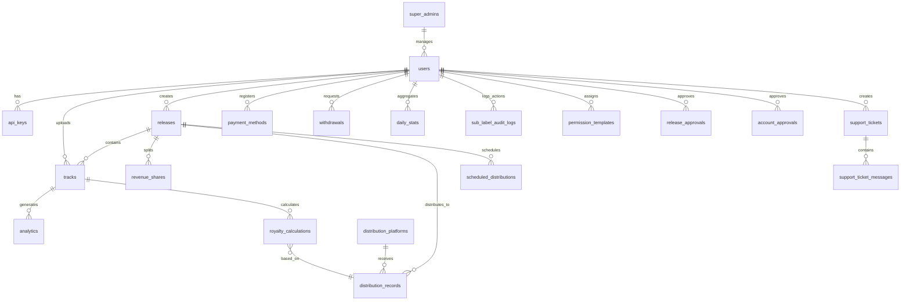

# Database Schema Documentation

<div align="center">
  
</div>

## Overview

This document provides a comprehensive description of the TuneMantra database schema. The database is implemented using PostgreSQL and is accessed through the Drizzle ORM. The schema is designed to support all aspects of the music distribution platform, including user management, content management, distribution tracking, rights management, royalty calculations, and analytics.

## Entity Relationship Diagram



## Core Tables

### User Management Tables

#### `users` Table

The users table stores information about all users in the system, including artists, label managers, and administrators.

```typescript
export const users = pgTable("users", {
  id: serial("id").primaryKey(),
  username: varchar("username", { length: 50 }).notNull().unique(),
  email: varchar("email", { length: 255 }).notNull().unique(),
  password: varchar("password", { length: 255 }).notNull(),
  fullName: varchar("full_name", { length: 100 }).notNull(),
  role: userRoleEnum("role").notNull().default("artist"),
  status: userStatusEnum("status").notNull().default("pending"),
  profile: jsonb("profile").default({}),
  settings: jsonb("settings").default({}),
  parentLabelId: integer("parent_label_id").references(() => users.id),
  approvalStatus: approvalStatusEnum("approval_status").default("pending"),
  emailVerified: boolean("email_verified").default(false),
  createdAt: timestamp("created_at").defaultNow(),
  updatedAt: timestamp("updated_at").defaultNow(),
});
```

Fields:
- `id`: Unique identifier for the user
- `username`: Unique username for login
- `email`: User's email address
- `password`: Hashed password for authentication
- `fullName`: User's full name
- `role`: User's role in the system (artist, label, admin, etc.)
- `status`: Account status (pending, active, suspended, etc.)
- `profile`: Flexible JSON structure for profile information
- `settings`: User preferences and settings
- `parentLabelId`: For sub-labels, references the parent label
- `approvalStatus`: Status of account approval process
- `emailVerified`: Whether the user's email has been verified
- `createdAt`: Timestamp when the account was created
- `updatedAt`: Timestamp when the account was last updated

#### `api_keys` Table

Stores API keys for programmatic access to the platform.

```typescript
export const apiKeys = pgTable("api_keys", {
  id: serial("id").primaryKey(),
  userId: integer("user_id").notNull().references(() => users.id, { onDelete: "cascade" }),
  name: varchar("name", { length: 50 }).notNull(),
  key: varchar("key", { length: 64 }).notNull().unique(),
  scopes: text("scopes").array().notNull(),
  lastUsed: timestamp("last_used"),
  expiresAt: timestamp("expires_at"),
  createdAt: timestamp("created_at").defaultNow(),
});
```

Fields:
- `id`: Unique identifier for the API key
- `userId`: ID of the user who owns this API key
- `name`: Name/label for the API key
- `key`: The actual API key string
- `scopes`: Array of permission scopes for this key
- `lastUsed`: Timestamp when the key was last used
- `expiresAt`: Expiration timestamp for the key
- `createdAt`: Timestamp when the key was created

### Content Management Tables

#### `releases` Table

Stores information about music releases (albums, singles, EPs, etc.).

```typescript
export const releases = pgTable("releases", {
  id: serial("id").primaryKey(),
  userId: integer("user_id").notNull().references(() => users.id, { onDelete: "cascade" }),
  title: varchar("title", { length: 255 }).notNull(),
  type: contentTypeEnum("type").notNull(),
  releaseDate: timestamp("release_date").notNull(),
  artwork: varchar("artwork", { length: 255 }),
  upc: varchar("upc", { length: 20 }).unique(),
  genre: varchar("genre", { length: 50 }),
  language: languageEnum("language").default("english"),
  isExplicit: boolean("is_explicit").default(false),
  description: text("description"),
  artistNames: varchar("artist_names", { length: 255 }).notNull(),
  status: varchar("status", { length: 50 }).default("draft"),
  metadata: jsonb("metadata").default({}),
  tags: jsonb("tags").default({}),
  aiAnalysis: jsonb("ai_analysis").default({}),
  credits: jsonb("credits").default({}),
  createdAt: timestamp("created_at").defaultNow(),
  updatedAt: timestamp("updated_at").defaultNow(),
});
```

Fields:
- `id`: Unique identifier for the release
- `userId`: ID of the user who created the release
- `title`: Title of the release
- `type`: Type of release (single, album, EP, etc.)
- `releaseDate`: Scheduled or actual release date
- `artwork`: Path to artwork image file
- `upc`: Universal Product Code for the release
- `genre`: Primary genre of the release
- `language`: Primary language of the release content
- `isExplicit`: Whether the release contains explicit content
- `description`: Text description of the release
- `artistNames`: Display names of artists on the release
- `status`: Current status of the release
- `metadata`: Flexible JSON structure for extended metadata
- `tags`: Content tags for improved discoverability
- `aiAnalysis`: AI-generated insights and metadata
- `credits`: Detailed credits information
- `createdAt`: Timestamp when the release was created
- `updatedAt`: Timestamp when the release was last updated

#### `tracks` Table

Stores information about individual tracks within releases.

```typescript
export const tracks = pgTable("tracks", {
  id: serial("id").primaryKey(),
  releaseId: integer("release_id").references(() => releases.id, { onDelete: "cascade" }),
  userId: integer("user_id").notNull().references(() => users.id, { onDelete: "cascade" }),
  title: varchar("title", { length: 255 }).notNull(),
  artist: varchar("artist", { length: 255 }).notNull(),
  duration: integer("duration"),
  audioFile: varchar("audio_file", { length: 255 }),
  isrc: varchar("isrc", { length: 15 }).unique(),
  trackNumber: integer("track_number"),
  isExplicit: boolean("is_explicit").default(false),
  lyrics: text("lyrics"),
  genre: varchar("genre", { length: 50 }),
  language: languageEnum("language").default("english"),
  bpm: integer("bpm"),
  key: varchar("key", { length: 10 }),
  metadata: jsonb("metadata").default({}),
  tags: jsonb("tags").default({}),
  aiAnalysis: jsonb("ai_analysis").default({}),
  credits: jsonb("credits").default({}),
  createdAt: timestamp("created_at").defaultNow(),
  updatedAt: timestamp("updated_at").defaultNow(),
});
```

Fields:
- `id`: Unique identifier for the track
- `releaseId`: ID of the release this track belongs to
- `userId`: ID of the user who uploaded the track
- `title`: Title of the track
- `artist`: Artist name for the track
- `duration`: Duration of the track in seconds
- `audioFile`: Path to the audio file
- `isrc`: International Standard Recording Code
- `trackNumber`: Position of track within the release
- `isExplicit`: Whether the track contains explicit content
- `lyrics`: Text of the track lyrics
- `genre`: Primary genre of the track
- `language`: Primary language of the track
- `bpm`: Beats per minute (tempo)
- `key`: Musical key of the track
- `metadata`: Flexible JSON structure for extended metadata
- `tags`: Content tags for improved discoverability
- `aiAnalysis`: AI-generated insights and metadata
- `credits`: Detailed credits information
- `createdAt`: Timestamp when the track was created
- `updatedAt`: Timestamp when the track was last updated

### Distribution Management Tables

#### `distribution_platforms` Table

Stores information about external platforms where content can be distributed.

```typescript
export const distributionPlatforms = pgTable("distribution_platforms", {
  id: serial("id").primaryKey(),
  name: varchar("name", { length: 100 }).notNull(),
  logoUrl: varchar("logo_url", { length: 255 }),
  apiEndpoint: varchar("api_endpoint", { length: 255 }),
  apiCredentials: jsonb("api_credentials").default({}),
  status: varchar("status", { length: 20 }).default("active"),
  deliveryMethod: varchar("delivery_method", { length: 50 }).notNull(),
  requirements: jsonb("requirements").default({}),
  formatSpecs: jsonb("format_specs").default({}),
  supportedContent: text("supported_content").array(),
  territoryRestrictions: text("territory_restrictions").array(),
  processingTime: varchar("processing_time", { length: 50 }),
  royaltyRate: decimal("royalty_rate", { precision: 10, scale: 6 }),
  createdAt: timestamp("created_at").defaultNow(),
  updatedAt: timestamp("updated_at").defaultNow(),
});
```

Fields:
- `id`: Unique identifier for the platform
- `name`: Name of the distribution platform
- `logoUrl`: URL to the platform's logo image
- `apiEndpoint`: Base URL for the platform's API
- `apiCredentials`: Securely stored API credentials
- `status`: Current status of the platform integration
- `deliveryMethod`: Method used for content delivery
- `requirements`: Platform-specific content requirements
- `formatSpecs`: Specifications for audio and artwork formats
- `supportedContent`: Types of content supported by the platform
- `territoryRestrictions`: Geographic availability restrictions
- `processingTime`: Estimated processing time for submissions
- `royaltyRate`: Standard royalty rate paid by the platform
- `createdAt`: Timestamp when the platform was added
- `updatedAt`: Timestamp when the platform was last updated

#### `distribution_records` Table

Tracks the status and details of distributions to specific platforms.

```typescript
export const distributionRecords = pgTable("distribution_records", {
  id: serial("id").primaryKey(),
  releaseId: integer("release_id").notNull().references(() => releases.id, { onDelete: "cascade" }),
  platformId: integer("platform_id").notNull().references(() => distributionPlatforms.id),
  status: distributionStatusEnum("status").notNull().default("pending"),
  distributionDate: timestamp("distribution_date"),
  platformReleaseId: varchar("platform_release_id", { length: 100 }),
  platformUrl: varchar("platform_url", { length: 255 }),
  errorDetails: text("error_details"),
  processingDetails: jsonb("processing_details").default({}),
  submissionHistory: jsonb("submission_history").array().default([]),
  lastStatusUpdate: timestamp("last_status_update"),
  metadata: jsonb("metadata").default({}),
  createdAt: timestamp("created_at").defaultNow(),
  updatedAt: timestamp("updated_at").defaultNow(),
});
```

Fields:
- `id`: Unique identifier for the distribution record
- `releaseId`: ID of the distributed release
- `platformId`: ID of the platform the release was distributed to
- `status`: Current status of the distribution
- `distributionDate`: Date when the distribution was processed
- `platformReleaseId`: ID assigned by the platform to the release
- `platformUrl`: URL to the release on the platform
- `errorDetails`: Details of any errors encountered
- `processingDetails`: Additional details about processing
- `submissionHistory`: History of submission attempts
- `lastStatusUpdate`: Timestamp of the last status change
- `metadata`: Flexible JSON structure for extended metadata
- `createdAt`: Timestamp when the record was created
- `updatedAt`: Timestamp when the record was last updated

#### `scheduled_distributions` Table

Manages scheduled future distributions for releases.

```typescript
export const scheduledDistributions = pgTable("scheduled_distributions", {
  id: serial("id").primaryKey(),
  releaseId: integer("release_id").notNull().references(() => releases.id, { onDelete: "cascade" }),
  userId: integer("user_id").notNull().references(() => users.id),
  scheduledDate: timestamp("scheduled_date").notNull(),
  platforms: integer("platform_ids").array().notNull(),
  status: varchar("status", { length: 20 }).notNull().default("pending"),
  completedPlatforms: integer("completed_platform_ids").array().default([]),
  failedPlatforms: jsonb("failed_platforms").default({}),
  notificationSent: boolean("notification_sent").default(false),
  createdAt: timestamp("created_at").defaultNow(),
  updatedAt: timestamp("updated_at").defaultNow(),
});
```

Fields:
- `id`: Unique identifier for the scheduled distribution
- `releaseId`: ID of the release to be distributed
- `userId`: ID of the user who scheduled the distribution
- `scheduledDate`: Date when the distribution should occur
- `platforms`: Array of platform IDs to distribute to
- `status`: Current status of the scheduled distribution
- `completedPlatforms`: Platforms where distribution completed
- `failedPlatforms`: Details of distribution failures
- `notificationSent`: Whether notification was sent on completion
- `createdAt`: Timestamp when the schedule was created
- `updatedAt`: Timestamp when the schedule was last updated

### Royalty Management Tables

#### `royalty_calculations` Table

Stores royalty calculations derived from streams, sales, and other revenue sources.

```typescript
export const royaltyCalculations = pgTable("royalty_calculations", {
  id: serial("id").primaryKey(),
  trackId: integer("track_id").notNull().references(() => tracks.id, { onDelete: "cascade" }),
  platformId: integer("platform_id").references(() => distributionPlatforms.id),
  distributionId: integer("distribution_id").references(() => distributionRecords.id),
  period: varchar("period", { length: 20 }).notNull(),
  streams: integer("streams").default(0),
  revenue: decimal("revenue", { precision: 12, scale: 4 }).default("0"),
  royaltyType: royaltyTypeEnum("royalty_type").notNull(),
  calculationDate: timestamp("calculation_date").notNull(),
  status: varchar("status", { length: 20 }).default("pending"),
  paidDate: timestamp("paid_date"),
  details: jsonb("details").default({}),
  exchangeRate: decimal("exchange_rate", { precision: 10, scale: 6 }),
  currency: varchar("currency", { length: 3 }).default("USD"),
  territory: varchar("territory", { length: 50 }),
  createdAt: timestamp("created_at").defaultNow(),
  updatedAt: timestamp("updated_at").defaultNow(),
});
```

Fields:
- `id`: Unique identifier for the royalty calculation
- `trackId`: ID of the track generating royalties
- `platformId`: ID of the platform generating royalties
- `distributionId`: ID of the related distribution record
- `period`: Time period for the calculation (e.g., "2025-03")
- `streams`: Number of streams for the period
- `revenue`: Revenue generated during the period
- `royaltyType`: Type of royalty (performance, mechanical, etc.)
- `calculationDate`: Date when the calculation was performed
- `status`: Current status of the royalty payment
- `paidDate`: Date when the royalty was paid
- `details`: Detailed breakdown of the calculation
- `exchangeRate`: Exchange rate used for currency conversion
- `currency`: Currency of the original revenue
- `territory`: Geographic region for the royalty
- `createdAt`: Timestamp when the calculation was created
- `updatedAt`: Timestamp when the calculation was last updated

#### `revenue_shares` Table

Defines revenue sharing arrangements between collaborators.

```typescript
export const revenueShares = pgTable("revenue_shares", {
  id: serial("id").primaryKey(),
  releaseId: integer("release_id").references(() => releases.id, { onDelete: "cascade" }),
  trackId: integer("track_id").references(() => tracks.id, { onDelete: "cascade" }),
  userId: integer("user_id").notNull().references(() => users.id),
  percentage: decimal("percentage", { precision: 5, scale: 2 }).notNull(),
  role: varchar("role", { length: 50 }).notNull(),
  name: varchar("name", { length: 100 }).notNull(),
  email: varchar("email", { length: 255 }),
  status: varchar("status", { length: 20 }).default("pending"),
  agreement: varchar("agreement", { length: 255 }),
  splitType: varchar("split_type", { length: 50 }).default("royalty"),
  customTerms: jsonb("custom_terms").default({}),
  createdAt: timestamp("created_at").defaultNow(),
  updatedAt: timestamp("updated_at").defaultNow(),
});
```

Fields:
- `id`: Unique identifier for the revenue share
- `releaseId`: ID of the release (for release-level splits)
- `trackId`: ID of the track (for track-level splits)
- `userId`: ID of the user receiving the share
- `percentage`: Percentage of revenue allocated
- `role`: Role of the contributor (composer, performer, etc.)
- `name`: Display name of the contributor
- `email`: Email address for notifications
- `status`: Current status of the agreement
- `agreement`: Reference to the signed agreement document
- `splitType`: Type of revenue split
- `customTerms`: Any custom terms for this arrangement
- `createdAt`: Timestamp when the split was created
- `updatedAt`: Timestamp when the split was last updated

#### `payment_methods` Table

Stores payment method information for royalty disbursements.

```typescript
export const paymentMethods = pgTable("payment_methods", {
  id: serial("id").primaryKey(),
  userId: integer("user_id").notNull().references(() => users.id, { onDelete: "cascade" }),
  type: varchar("type", { length: 50 }).notNull(),
  name: varchar("name", { length: 100 }).notNull(),
  details: jsonb("details").notNull(),
  isDefault: boolean("is_default").default(false),
  status: varchar("status", { length: 20 }).default("active"),
  lastUsed: timestamp("last_used"),
  verificationStatus: varchar("verification_status", { length: 20 }).default("pending"),
  createdAt: timestamp("created_at").defaultNow(),
  updatedAt: timestamp("updated_at").defaultNow(),
});
```

Fields:
- `id`: Unique identifier for the payment method
- `userId`: ID of the user who owns this payment method
- `type`: Type of payment method
- `name`: Name/label for the payment method
- `details`: Securely stored payment details
- `isDefault`: Whether this is the default payment method
- `status`: Current status of the payment method
- `lastUsed`: Timestamp when the method was last used
- `verificationStatus`: Status of verification process
- `createdAt`: Timestamp when the method was created
- `updatedAt`: Timestamp when the method was last updated

#### `withdrawals` Table

Tracks withdrawal requests and their status.

```typescript
export const withdrawals = pgTable("withdrawals", {
  id: serial("id").primaryKey(),
  userId: integer("user_id").notNull().references(() => users.id, { onDelete: "cascade" }),
  paymentMethodId: integer("payment_method_id").notNull().references(() => paymentMethods.id),
  amount: decimal("amount", { precision: 12, scale: 4 }).notNull(),
  currency: varchar("currency", { length: 3 }).default("USD"),
  status: varchar("status", { length: 20 }).default("pending"),
  processingDate: timestamp("processing_date"),
  completionDate: timestamp("completion_date"),
  reference: varchar("reference", { length: 100 }),
  notes: text("notes"),
  adminId: integer("admin_id").references(() => users.id),
  createdAt: timestamp("created_at").defaultNow(),
  updatedAt: timestamp("updated_at").defaultNow(),
});
```

Fields:
- `id`: Unique identifier for the withdrawal
- `userId`: ID of the user requesting the withdrawal
- `paymentMethodId`: ID of the payment method to use
- `amount`: Amount to withdraw
- `currency`: Currency of the withdrawal
- `status`: Current status of the withdrawal
- `processingDate`: Date when processing began
- `completionDate`: Date when the withdrawal completed
- `reference`: External reference number
- `notes`: Additional notes about the transaction
- `adminId`: ID of the admin who processed the withdrawal
- `createdAt`: Timestamp when the withdrawal was requested
- `updatedAt`: Timestamp when the withdrawal was last updated

### Analytics Tables

#### `analytics` Table

Stores detailed analytics data for tracks.

```typescript
export const analytics = pgTable("analytics", {
  id: serial("id").primaryKey(),
  trackId: integer("track_id").notNull().references(() => tracks.id, { onDelete: "cascade" }),
  platformId: integer("platform_id").references(() => distributionPlatforms.id),
  date: date("date").notNull(),
  streams: integer("streams").default(0),
  downloads: integer("downloads").default(0),
  revenue: decimal("revenue", { precision: 12, scale: 4 }).default("0"),
  territory: varchar("territory", { length: 50 }),
  demographicData: jsonb("demographic_data").default({}),
  marketingSource: varchar("marketing_source", { length: 100 }),
  playlistData: jsonb("playlist_data").default({}),
  createdAt: timestamp("created_at").defaultNow(),
});
```

Fields:
- `id`: Unique identifier for the analytics record
- `trackId`: ID of the track being analyzed
- `platformId`: ID of the platform providing the data
- `date`: Date of the analytics data
- `streams`: Number of streams on this date
- `downloads`: Number of downloads on this date
- `revenue`: Revenue generated on this date
- `territory`: Geographic territory for the data
- `demographicData`: Demographic information about listeners
- `marketingSource`: Source of traffic (if applicable)
- `playlistData`: Data about playlist inclusions
- `createdAt`: Timestamp when the record was created

#### `daily_stats` Table

Provides aggregated daily statistics for users.

```typescript
export const dailyStats = pgTable("daily_stats", {
  id: serial("id").primaryKey(),
  userId: integer("user_id").notNull().references(() => users.id, { onDelete: "cascade" }),
  date: date("date").notNull(),
  totalStreams: integer("total_streams").default(0),
  totalRevenue: decimal("total_revenue", { precision: 12, scale: 4 }).default("0"),
  platformBreakdown: jsonb("platform_breakdown").default({}),
  territoryBreakdown: jsonb("territory_breakdown").default({}),
  trackPerformance: jsonb("track_performance").default({}),
  releasePerformance: jsonb("release_performance").default({}),
  trendData: jsonb("trend_data").default({}),
  createdAt: timestamp("created_at").defaultNow(),
});
```

Fields:
- `id`: Unique identifier for the stats record
- `userId`: ID of the user these stats belong to
- `date`: Date of the statistics
- `totalStreams`: Total streams across all platforms
- `totalRevenue`: Total revenue generated
- `platformBreakdown`: Breakdown of stats by platform
- `territoryBreakdown`: Breakdown of stats by territory
- `trackPerformance`: Performance metrics for individual tracks
- `releasePerformance`: Performance metrics for releases
- `trendData`: Data about trends and growth
- `createdAt`: Timestamp when the record was created

### Rights Management Tables

The rights management tables handle verification, ownership, and licensing of content.

#### `rights_management` Table

Tracks content ownership, licensing, and rights verification.

```typescript
export const rightsManagement = pgTable("rights_management", {
  id: serial("id").primaryKey(),
  releaseId: integer("release_id").references(() => releases.id, { onDelete: "cascade" }),
  trackId: integer("track_id").references(() => tracks.id, { onDelete: "cascade" }),
  userId: integer("user_id").notNull().references(() => users.id),
  ownershipType: ownershipTypeEnum("ownership_type").notNull(),
  verificationStatus: varchar("verification_status", { length: 20 }).default("pending"),
  verificationDate: timestamp("verification_date"),
  verifiedBy: integer("verified_by").references(() => users.id),
  documentationUrl: varchar("documentation_url", { length: 255 }),
  expirationDate: timestamp("expiration_date"),
  territories: text("territories").array(),
  royaltyTerms: jsonb("royalty_terms").default({}),
  licenseTerms: jsonb("license_terms").default({}),
  createdAt: timestamp("created_at").defaultNow(),
  updatedAt: timestamp("updated_at").defaultNow(),
});
```

Fields:
- `id`: Unique identifier for the rights record
- `releaseId`: ID of the release (for release-level rights)
- `trackId`: ID of the track (for track-level rights)
- `userId`: ID of the user claiming ownership
- `ownershipType`: Type of ownership claim
- `verificationStatus`: Status of verification process
- `verificationDate`: Date when verification was completed
- `verifiedBy`: ID of the admin who verified the claim
- `documentationUrl`: URL to supporting documentation
- `expirationDate`: Expiration date for the rights
- `territories`: Geographic territories covered
- `royaltyTerms`: Terms for royalty payments
- `licenseTerms`: Terms for licensing
- `createdAt`: Timestamp when the record was created
- `updatedAt`: Timestamp when the record was last updated

### Administration Tables

#### `support_tickets` Table

Manages support requests from users.

```typescript
export const supportTickets = pgTable("support_tickets", {
  id: serial("id").primaryKey(),
  userId: integer("user_id").notNull().references(() => users.id),
  subject: varchar("subject", { length: 255 }).notNull(),
  description: text("description").notNull(),
  status: varchar("status", { length: 20 }).notNull().default("open"),
  priority: varchar("priority", { length: 20 }).default("medium"),
  category: varchar("category", { length: 50 }).notNull(),
  assignedTo: integer("assigned_to").references(() => users.id),
  lastResponseDate: timestamp("last_response_date"),
  resolution: text("resolution"),
  createdAt: timestamp("created_at").defaultNow(),
  updatedAt: timestamp("updated_at").defaultNow(),
});
```

Fields:
- `id`: Unique identifier for the ticket
- `userId`: ID of the user who created the ticket
- `subject`: Ticket subject line
- `description`: Detailed description of the issue
- `status`: Current status of the ticket
- `priority`: Priority level of the ticket
- `category`: Category of the support issue
- `assignedTo`: ID of the admin assigned to the ticket
- `lastResponseDate`: Timestamp of the last response
- `resolution`: Description of the resolution
- `createdAt`: Timestamp when the ticket was created
- `updatedAt`: Timestamp when the ticket was last updated

#### `support_ticket_messages` Table

Stores messages in support ticket threads.

```typescript
export const supportTicketMessages = pgTable("support_ticket_messages", {
  id: serial("id").primaryKey(),
  ticketId: integer("ticket_id").notNull().references(() => supportTickets.id, { onDelete: "cascade" }),
  userId: integer("user_id").notNull().references(() => users.id),
  message: text("message").notNull(),
  attachments: jsonb("attachments").default([]),
  isInternal: boolean("is_internal").default(false),
  createdAt: timestamp("created_at").defaultNow(),
});
```

Fields:
- `id`: Unique identifier for the message
- `ticketId`: ID of the ticket this message belongs to
- `userId`: ID of the user who sent the message
- `message`: Text content of the message
- `attachments`: Array of attachment metadata
- `isInternal`: Whether the message is only visible to staff
- `createdAt`: Timestamp when the message was created

#### `super_admins` Table

Provides elevated privileges for platform administrators.

```typescript
export const superAdmins = pgTable("super_admins", {
  id: serial("id").primaryKey(),
  userId: integer("user_id").notNull().references(() => users.id).unique(),
  permissions: jsonb("permissions").default({}),
  lastLogin: timestamp("last_login"),
  createdAt: timestamp("created_at").defaultNow(),
  updatedAt: timestamp("updated_at").defaultNow(),
});
```

Fields:
- `id`: Unique identifier for the super admin record
- `userId`: ID of the user with super admin privileges
- `permissions`: Detailed permission configuration
- `lastLogin`: Timestamp of the last login
- `createdAt`: Timestamp when the record was created
- `updatedAt`: Timestamp when the record was last updated

#### `permission_templates` Table

Defines reusable permission sets for user roles.

```typescript
export const permissionTemplates = pgTable("permission_templates", {
  id: serial("id").primaryKey(),
  name: varchar("name", { length: 100 }).notNull(),
  description: text("description"),
  permissions: jsonb("permissions").notNull(),
  isDefault: boolean("is_default").default(false),
  createdBy: integer("created_by").notNull().references(() => users.id),
  createdAt: timestamp("created_at").defaultNow(),
  updatedAt: timestamp("updated_at").defaultNow(),
});
```

Fields:
- `id`: Unique identifier for the template
- `name`: Name of the permission template
- `description`: Description of the template's purpose
- `permissions`: JSON structure defining permissions
- `isDefault`: Whether this is a default template
- `createdBy`: ID of the user who created the template
- `createdAt`: Timestamp when the template was created
- `updatedAt`: Timestamp when the template was last updated

## Data Types & Enumerations

The schema uses several PostgreSQL enumerations to enforce consistent values for certain fields:

### `user_role` Enumeration

```typescript
export const userRoleEnum = pgEnum('user_role', [
  'artist',
  'label',
  'distributor',
  'admin',
  'sub_label',
  'publisher',
  'accountant',
  'marketing',
  'support',
  'viewer'
]);
```

### `user_status` Enumeration

```typescript
export const userStatusEnum = pgEnum('user_status', [
  'pending',
  'active',
  'suspended',
  'deactivated',
  'pending_approval',
  'rejected',
  'locked',
  'verification_required'
]);
```

### `approval_status` Enumeration

```typescript
export const approvalStatusEnum = pgEnum('approval_status', [
  'pending',
  'approved',
  'rejected',
  'needs_info',
  'under_review'
]);
```

### `content_type` Enumeration

```typescript
export const contentTypeEnum = pgEnum('content_type', [
  'single',
  'album',
  'ep',
  'compilation',
  'remix',
  'live'
]);
```

### `language` Enumeration

```typescript
export const languageEnum = pgEnum('language', [
  'english',
  'spanish',
  'french',
  'german',
  'hindi',
  'japanese',
  'korean',
  'portuguese',
  'russian',
  'mandarin',
  'cantonese',
  'arabic',
  'instrumental'
]);
```

### `distribution_status` Enumeration

```typescript
export const distributionStatusEnum = pgEnum('distribution_status', [
  'pending',
  'processing',
  'distributed',
  'failed',
  'scheduled',
  'canceled'
]);
```

### `royalty_type` Enumeration

```typescript
export const royaltyTypeEnum = pgEnum('royalty_type', [
  'performance',
  'mechanical',
  'synchronization',
  'print',
  'digital'
]);
```

### `ownership_type` Enumeration

```typescript
export const ownershipTypeEnum = pgEnum('ownership_type', [
  'original',
  'licensed',
  'public_domain',
  'sample_cleared',
  'remix_authorized'
]);
```

## JSON Structures

Many tables use JSON fields for flexible storage of complex data. Here are the key JSON structures:

### ContentTags Interface

```typescript
export interface ContentTags {
  genres: string[];
  moods: string[];
  themes: string[];
  keywords: string[];
  musicalElements: string[];
  occasions: string[];
  cultures: string[];
  eras: string[];
}
```

### AIAnalysis Interface

```typescript
export interface AIAnalysis {
  summary: string;
  qualityScore: number;
  contentWarnings: string[];
  suggestedImprovements: string[];
  genrePredictions: {
    primaryGenre: string;
    confidence: number;
    secondaryGenres: Array<{genre: string, confidence: number}>;
  };
  moodPredictions: Array<{mood: string, confidence: number}>;
  similarArtists: string[];
  keyPrediction: string;
  bpmPrediction: number;
  energyLevel: number;
  danceability: number;
  marketPotential: {
    streamingPotential: number;
    radioFriendliness: number;
    commercialViability: number;
    targetDemographics: string[];
  };
}
```

### Credits Interface

```typescript
export interface Credits {
  primaryArtist: string[];
  featuredArtists: string[];
  composers: string[];
  lyricists: string[];
  producers: string[];
  mixingEngineers: string[];
  masteringEngineers: string[];
  musicians: Array<{
    name: string;
    role: string;
    instrument?: string;
  }>;
  vocalists: Array<{
    name: string;
    role: string; // e.g., "lead", "backup", "harmony"
  }>;
  additionalPersonnel: Array<{
    name: string;
    role: string;
  }>;
  artworkCredits: {
    designer: string;
    photographer?: string;
    illustrator?: string;
    artDirector?: string;
  };
}
```

## Schema Validation with Zod

The database schema uses Zod for runtime validation of data that is inserted into the database. Here are the key validation schemas:

```typescript
// User insertion schema
export const insertUserSchema = createInsertSchema(users)
  .omit({ id: true, createdAt: true, updatedAt: true })
  .extend({
    email: z.string().email("Invalid email format"),
    password: z.string().min(8, "Password must be at least 8 characters"),
    username: z.string()
      .min(3, "Username must be at least 3 characters")
      .max(50, "Username must be at most 50 characters")
      .regex(/^[a-zA-Z0-9_-]+$/, "Username can only contain letters, numbers, underscores, and hyphens"),
  });

// Track insertion schema
export const insertTrackSchema = createInsertSchema(tracks)
  .omit({ id: true, createdAt: true, updatedAt: true })
  .extend({
    title: z.string().min(1, "Title is required"),
    artist: z.string().min(1, "Artist name is required"),
  });

// Release insertion schema
export const insertReleaseSchema = createInsertSchema(releases)
  .omit({ id: true, createdAt: true, updatedAt: true, upc: true })
  .extend({
    title: z.string().min(1, "Title is required"),
    artistNames: z.string().min(1, "Artist names are required"),
    releaseDate: z.coerce.date(),
  });
```

## Data Relationships

The schema has several important relationships that define how data is connected:

1. **User → Content**: Users create releases and tracks
2. **Release → Tracks**: Releases contain multiple tracks
3. **Content → Distribution**: Releases are distributed to platforms
4. **Content → Analytics**: Tracks generate analytics data
5. **Content → Royalties**: Tracks generate royalty calculations
6. **User → Finance**: Users have payment methods and withdrawals
7. **Content → Rights**: Releases and tracks have rights management records

## Index Strategy

The schema uses strategic indexes to optimize query performance:

```typescript
// Example indexes on the tracks table
export const tracksByUserIdIndex = pgIndex('idx_tracks_user_id').on(tracks).using('btree')([tracks.userId]);
export const tracksByReleaseIdIndex = pgIndex('idx_tracks_release_id').on(tracks).using('btree')([tracks.releaseId]);
export const tracksByIsrcIndex = pgIndex('idx_tracks_isrc').on(tracks).using('btree')([tracks.isrc]);

// Example indexes on the analytics table
export const analyticsByTrackIdIndex = pgIndex('idx_analytics_track_id').on(analytics).using('btree')([analytics.trackId]);
export const analyticsByDateIndex = pgIndex('idx_analytics_date').on(analytics).using('btree')([analytics.date]);
export const analyticsByTrackIdAndDateIndex = pgIndex('idx_analytics_track_id_date').on(analytics).using('btree')([analytics.trackId, analytics.date]);
```

## Migration Strategy

The project uses Drizzle Kit for database schema migrations. To apply schema changes:

1. Update the schema definitions in `shared/schema.ts`
2. Run `npm run db:push` to push schema changes to the database
3. For complex migrations that require data transformation, create a migration script

## Best Practices for Developers

When working with this database schema:

1. **Use Type Inference**: Always use the generated types (e.g., `User`, `Track`) for type-safe code
2. **Validate Input**: Use the Zod schemas (e.g., `insertUserSchema`) to validate input data
3. **Handle Relationships**: Ensure referential integrity by carefully managing relationships
4. **JSON Validation**: Validate JSON data against the defined interfaces before storage
5. **Query Optimization**: Use the provided indexes to optimize query performance
6. **Transactions**: Use transactions for operations that affect multiple tables
7. **Error Handling**: Implement proper error handling for database operations

## Example Database Operations

```typescript
// Example: Create a new user
const newUser: InsertUser = {
  username: 'artist123',
  email: 'artist@example.com',
  password: await hashPassword('securePassword123'),
  fullName: 'John Artist',
  role: 'artist',
};

const user = await db.insert(users).values(newUser).returning();

// Example: Create a release with tracks
const newRelease: InsertRelease = {
  userId: user.id,
  title: 'My First Album',
  type: 'album',
  releaseDate: new Date('2025-07-01'),
  artistNames: 'John Artist',
};

const release = await db.insert(releases).values(newRelease).returning();

const newTrack: InsertTrack = {
  releaseId: release.id,
  userId: user.id,
  title: 'Track One',
  artist: 'John Artist',
  trackNumber: 1,
};

await db.insert(tracks).values(newTrack);

// Example: Query tracks with release data
const tracksWithRelease = await db.query.tracks.findMany({
  with: {
    release: true,
  },
  where: eq(tracks.userId, user.id),
});
```