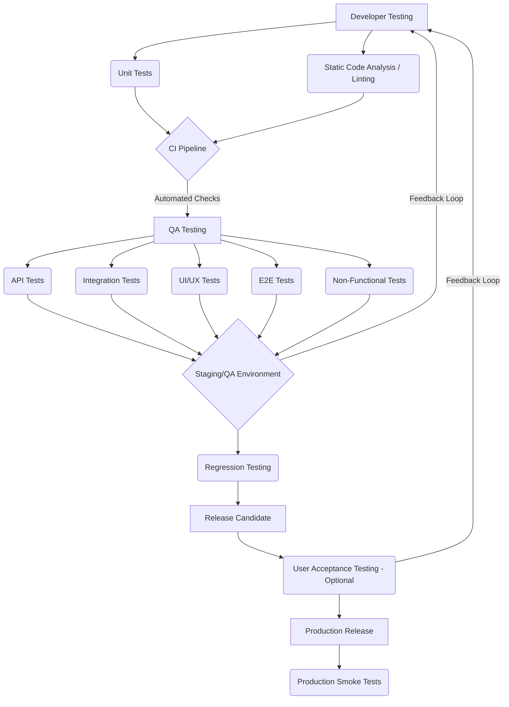

# Test Plan: TMDISTI - Music Distribution Platform

**Version:** 1.0
**Date:** 2025-04-17

## 1. Introduction & Overview

This document outlines the testing strategy for the TMDISTI Music Distribution Platform. The goal is to ensure the platform meets quality standards for functionality, reliability, performance, security, and user experience before release. This plan covers the scope, objectives, methodologies, resources, schedule, and deliverables for the testing process.

## 2. Scope

*   **Application:** TMDISTI - Music Distribution Platform
*   **Technology Stack:**
    *   Frontend: React (Vite)
    *   Backend: Node.js (Framework TBD - e.g., Express/Fastify)
    *   Database: PostgreSQL (with Drizzle ORM)
    *   APIs/Services: Internal Authentication API, Stripe Payment Gateway
*   **In Scope:**
    *   Frontend Application Functionality & UI/UX
    *   Backend API Services & Business Logic
    *   Database Interactions & Integrity
    *   Integration Points (Frontend <-> Backend, Backend <-> DB, Backend <-> Internal Auth, Backend <-> Stripe)
    *   Core User Flows (e.g., Registration, Login, Music Upload, Metadata Entry, Distribution Submission, Royalty Reporting)
    *   API Functionality (Endpoints, Schemas, Error Handling)
    *   UI/UX Consistency (vs. Figma) & Responsiveness
    *   Performance (Load Testing for specified concurrency)
    *   Security (OWASP Top 10 Checks)
    *   Accessibility (WCAG 2.1 AA)
*   **Out of Scope:** (Examples - adjust as needed)
    *   Third-party infrastructure testing (e.g., Cloud provider uptime)
    *   Testing of the Internal Auth API itself (beyond integration points)
    *   Exhaustive testing of every possible edge case (focus on risk-based approach)
    *   Usability testing with large, diverse external user groups (initial focus on internal/heuristic checks)
    *   Underlying OS/Network level testing.

## 3. Quality Objectives

*   **Functional Correctness:** Validate that all critical user flows, particularly the core music distribution process, function as specified without critical or high-severity defects.
*   **Code Quality:** Achieve a minimum of 80% code coverage through automated unit tests for both frontend (React) and backend (Node.js) codebases.
*   **UI/UX Compliance:** Ensure the user interface strictly adheres to the provided Figma mockups for visual design, layout, and branding elements across specified target platforms. No major visual deviations allowed.
*   **Performance:** Verify the application can reliably handle 100 concurrent users performing core actions with an average server response time below 500ms under peak load conditions.
*   **Security:** Identify and facilitate the mitigation of critical and high-severity security vulnerabilities based on the OWASP Top 10 list through planned security testing activities.
*   **Accessibility:** Ensure the frontend application meets WCAG 2.1 Level AA accessibility standards, verified through automated and manual checks.
*   **Reliability:** Achieve a defect density below [Specify Target, e.g., 0.5 defects per KLOC] for critical/high severity defects found post-release. Minimize rollback events due to quality issues.

## 4. Key Deliverables

*   Test Plan Document (This document)
*   Test Case Suite (Stored in Test Management Tool or Git Repo - e.g., `documentation/testing/test-cases/`)
*   Unit Test Suites (Code within `client/src/` and `server/src/` test directories)
*   API Test Collections/Scripts (e.g., Postman Collections, automated scripts in `scripts/tests/api/`)
*   Integration Test Suites (Code within test directories, potentially `scripts/tests/integration/`)
*   End-to-End Test Automation Scripts (e.g., Cypress/Playwright scripts in `client/tests/e2e/` or a dedicated `e2e-tests/` directory)
*   Test Execution Reports (Generated from Test Management Tool or CI/CD pipeline outputs)
*   Defect Reports / Bug Log (Tracked in Defect Management System)
*   Test Summary Report (Final overview document summarizing testing activities and quality assessment)
*   Performance Test Reports (Output from tools like k6/JMeter)
*   Security Scan Reports (Output from tools like OWASP ZAP, npm audit)
*   Accessibility Audit Report (Output from tools like Axe, manual review findings)

## 5. Testing Strategy & Approach

A multi-layered testing approach will be employed, integrating testing activities throughout the development lifecycle ("Shift-Left").

### 5.1 Functional Testing

*   **Unit Testing:**
    *   **Responsibility:** Developers
    *   **Frontend (React):** Use Jest/Vitest and React Testing Library. Focus: Individual components, hooks, state management logic, utility functions. Coverage Goal: 80%.
    *   **Backend (Node.js):** Use Jest/Vitest or Mocha/Chai. Focus: Individual modules, controllers, services, database interactions (mocked), utility functions. Coverage Goal: 80%.
    *   **Execution:** Run locally during development and automatically in CI pipeline on every commit.
*   **API Testing:**
    *   **Responsibility:** QA Engineers, Developers (for new endpoints)
    *   **Tools:** Postman (manual exploration), Newman/Supertest/Axios (automated tests).
    *   **Focus:** Validate endpoint contracts (request/response schemas via Zod/similar), CRUD operations, authentication/authorization, error handling (4xx/5xx status codes), parameter validation, business logic correctness.
    *   **Execution:** Manual exploration during development; Automated suite run in CI pipeline against deployed backend in QA/Staging.
*   **Integration Testing:**
    *   **Responsibility:** QA Engineers, Developers
    *   **Focus:** Verify interactions between components.
        *   *Frontend-Backend:* Test data flow from UI interactions to API calls and back using tools like MSW (Mock Service Worker) or by testing against a live backend.
        *   *Backend-Database:* Test service layer interactions with the actual database (PostgreSQL/Drizzle) in a controlled test environment (e.g., using Testcontainers or a dedicated test DB). Verify data persistence, retrieval, schema correctness, and transactions.
        *   *Service-to-Service:* Test interactions between the Node.js backend and Internal Auth API / Stripe API. Use mocked responses for automated tests; test against sandbox/staging environments for dedicated integration test cycles.
    *   **Execution:** Automated tests run in CI pipeline; Manual verification in QA/Staging.
*   **End-to-End (E2E) Testing:**
    *   **Responsibility:** QA Engineers
    *   **Tools:** Cypress or Playwright.
    *   **Focus:** Simulate real user scenarios traversing the entire application stack (UI -> API -> DB -> UI). Prioritize critical user flows (Registration, Login, Music Upload/Distribution, Payment).
    *   **Execution:** Automated suite run against the fully deployed application in the QA/Staging environment, typically less frequently than unit/integration tests (e.g., nightly or pre-release).

### 5.2 UI/UX Testing

*   **Responsibility:** QA Engineers, Designers (review)
*   **Cross-Browser/Device Compatibility:**
    *   **Targets:** Latest stable versions of Chrome, Firefox, Safari on Desktop; Chrome (Android) & Safari (iOS) on representative Mobile/Tablet viewports/emulators.
    *   **Method:** Manual testing, potentially using cloud platforms (BrowserStack/Sauce Labs) for wider coverage if needed. Check layout rendering, styling consistency, and core functionality.
*   **Usability Checks:**
    *   **Method:** Heuristic evaluation against established usability principles (Nielsen's Heuristics). Informal walkthroughs with internal stakeholders or target user proxies. Focus on task flow efficiency, navigation clarity, information architecture, and error prevention/recovery.
*   **Accessibility Validation:**
    *   **Standard:** WCAG 2.1 Level AA.
    *   **Method:** Combination of automated tools (Axe DevTools, WAVE), manual keyboard navigation testing, screen reader testing (NVDA, VoiceOver, JAWS), color contrast analysis, zoom testing.
*   **Visual Consistency Verification:**
    *   **Method:** Manual comparison against Figma mockups. Focus on adherence to design system components, layout, typography, color palette, spacing, and imagery. Consider automated visual regression testing tools (Percy, Applitools) integrated into the CI pipeline for key pages/components to catch unintended visual changes.

### 5.3 Backend Testing

*   **Responsibility:** Developers, QA Engineers
*   **Database Integrity:** Verify Drizzle schema migrations apply correctly, data types, constraints (foreign keys, unique constraints), indexes, and default values are enforced. Test data validation logic within the database layer if applicable.
*   **API Functionality:** Covered extensively under API Testing (Section 5.1). Ensure all business rules are correctly implemented and enforced at the API layer.
*   **Error Handling:** Test backend resilience to invalid inputs, unexpected conditions (e.g., database connection failure, external API timeouts), and malformed requests. Verify appropriate logging and user-friendly (non-revealing) error messages/status codes are returned.
*   **Security Checks:** Covered under Security Testing (Section 5.5). Focus specifically on backend vulnerabilities: secure handling of credentials, session management, protection against injection attacks, proper authorization checks at the API level.

### 5.4 Integration Testing (Detailed Scenarios)

*   **User Onboarding:** React Registration Form submission -> Node API validation -> Call to Internal Auth API for user creation -> Node API receives confirmation -> Postgres User Record creation -> React Login screen redirection.
*   **Music Upload & Processing:** React Upload Component interaction -> File upload to storage (e.g., S3/local via Node API) -> Node API receives metadata -> Metadata validation -> Postgres Metadata Record creation/update -> Background processing job trigger (if any).
*   **Distribution Submission & Payment:** React Distribution Form submission -> Node API validation -> Call to Stripe API to create Payment Intent -> React Stripe Elements handles payment -> Stripe Webhook confirmation received by Node API -> Node API updates distribution status in Postgres -> Confirmation displayed in React UI.
*   **Royalty Data Display:** React Dashboard component mount -> Node API request for royalty data -> Node API service queries Postgres (potentially complex joins/aggregations) -> Node API formats response -> React component renders charts/tables.

### 5.5 Non-Functional Testing

*   **Responsibility:** QA Engineers (potentially specialized performance/security testers)
*   **Performance/Load Testing:**
    *   **Tools:** k6, JMeter, Grafana (for monitoring).
    *   **Environment:** Dedicated performance testing environment mirroring production specs and data volume as closely as possible.
    *   **Scenarios:** Simulate 100 concurrent users executing a mix of critical actions (Login, Browse, Upload initiation, Distribution submission). Ramp-up, sustained load, and stress tests.
    *   **Metrics:** Average/95th/99th percentile response times (<500ms target), error rates (<1%), throughput (requests/sec), server resource utilization (CPU, RAM, Disk I/O, Network). Identify bottlenecks.
*   **Security Testing:**
    *   **Tools:** OWASP ZAP, Burp Suite (Community/Pro), `npm audit`/`yarn audit`, Snyk/dependabot.
    *   **Checks:**
        *   *Automated Scans:* Dynamic Application Security Testing (DAST) using ZAP/Burp against QA/Staging. Static Application Security Testing (SAST) tools if available. Dependency scanning in CI.
        *   *Manual Checks:* Focus on OWASP Top 10: Injection (SQLi, NoSQLi, XSS), Broken Authentication/Session Management, Sensitive Data Exposure, XML External Entities (XXE), Broken Access Control, Security Misconfiguration, Insecure Deserialization, Using Components with Known Vulnerabilities, Insufficient Logging & Monitoring. Test key authentication, authorization, and data handling endpoints. Basic penetration testing concepts.

### 5.6 Regression Testing

*   **Responsibility:** QA Engineers, Automated CI Pipeline
*   **Strategy:** Prevent previously fixed defects from recurring and ensure new changes haven't broken existing functionality.
*   **Scope:**
    *   *Automated:* Execute a curated suite of automated tests (Unit, API, critical Integration & E2E flows) on every merge to main/release branches within the CI pipeline.
    *   *Manual:* Risk-based manual testing focusing on the changed module, directly impacted areas, and historically problematic features before a release.
*   **Suite Management:** Regularly review and update the automated regression suite to keep it relevant, fast, and reliable.

## 6. Test Environment(s) & Data Management

*   **Environments:**
    *   **Development:** Local machines (Dockerized services recommended for consistency). Unit tests, linting, local debugging.
    *   **CI:** Ephemeral environment for running automated checks (Unit, API, Integration).
    *   **Staging/QA:** Stable, long-lived environment mirroring production infrastructure. Deployed via CI/CD. Used for most QA activities (Manual, E2E, Performance, Security). Integrated with sandbox/staging external services (Auth API, Stripe).
    *   **Performance:** Dedicated environment, potentially scaled-down production replica, specifically for load testing. Needs isolated database and potentially external service mocks/stubs.
    *   **Production:** Live environment. Post-deployment smoke tests only.
*   **Test Data Management:**
    *   **Strategy:** Use a combination of database seeding scripts (via Drizzle or custom scripts), data generation libraries (e.g., Faker.js), and potentially anonymized production data subsets (if feasible and compliant).
    *   **Data Sets:** Maintain distinct data sets for different scenarios (e.g., new users, users with large catalogs, users with payment issues, specific edge cases).
    *   **Isolation:** Ensure tests clean up after themselves or run in isolated containers/databases where possible to avoid data conflicts between tests.
    *   **Credentials:** Use secure methods for managing test credentials for external services (e.g., environment variables, secrets management tools). Use Stripe's test mode keys and cards exclusively.
    *   **Privacy:** Strictly adhere to data privacy regulations (GDPR, CCPA, etc.) when handling any user-like data, even in test environments. Anonymization is key if using production-derived data.

## 7. Automation Strategy

*   **Goals:** Increase test coverage, improve feedback loop speed, ensure regression safety, free up QA for exploratory and complex testing.
*   **Priority Areas for Automation:**
    1.  Unit Tests (Dev responsibility, highest priority)
    2.  API Tests (QA/Dev, high priority)
    3.  Backend Integration Tests (QA/Dev, high priority)
    4.  CI/CD Pipeline Checks (Linting, Unit, API, Integration - critical)
    5.  Critical Path E2E Tests (QA, medium/high priority)
    6.  Regression Suite (Composed of above automated tests)
    7.  Dependency Security Scans (CI, medium priority)
    8.  Basic DAST Scans (CI/Nightly, medium priority)
    9.  Visual Regression Tests (Optional/CI, medium priority)
    10. Accessibility Scans (Automated portion - CI, medium priority)
*   **Tools Selection:** (As listed in previous sections - Jest/Vitest, Cypress/Playwright, Postman/Newman, k6, ZAP, Axe, etc.)
*   **Framework:** Develop reusable testing utilities, page objects (for E2E), and clear reporting mechanisms. Store automated test code in the project repository alongside application code.

## 8. Defect Management & Reporting Process

*   **Tool:** Jira, Azure DevOps Boards, GitHub Issues, or similar designated tool.
*   **Workflow:**
    1.  **Discovery:** Defect identified during any testing activity (manual or automated failure analysis).
    2.  **Logging:** Create a detailed bug report including:
        *   Clear, concise title.
        *   Steps to reproduce (numbered).
        *   Expected Result.
        *   Actual Result.
        *   Severity (e.g., Critical, High, Medium, Low - defined criteria needed).
        *   Priority (Determined by Product Owner/Team).
        *   Environment(s) where observed.
        *   Screenshots, Videos, Logs (as applicable).
        *   Build/Version number.
        *   Labels/Components.
    3.  **Triage:** Regular meeting (e.g., daily/bi-weekly) with QA, Dev Lead, Product Owner to review new defects, assign severity/priority, and plan resolution.
    4.  **Assignment:** Defect assigned to the appropriate developer/team.
    5.  **Resolution:** Developer fixes the code, performs unit tests, merges changes.
    6.  **Verification:** QA Engineer re-tests the specific fix on a new build in the designated environment (usually QA/Staging). Also performs regression testing around the fix.
    7.  **Closure/Re-opening:** Close the defect if the fix is verified and no regressions are found. Re-open with comments if the issue persists or the fix causes new problems.
*   **Reporting:**
    *   **Dashboards:** Utilize defect tracking tool dashboards for real-time visibility (e.g., open bugs by severity, bug trends).
    *   **Test Cycle Reports:** Summarize execution status, pass/fail rates, new defects found, open critical defects after each major test cycle.
    *   **Test Summary Report:** Final report at the end of the release testing phase, detailing overall quality, coverage achieved, outstanding risks, and go/no-go recommendation.

## 9. Roles & Responsibilities

*   **Developers:** Write unit tests, perform code reviews, fix assigned defects, support QA in debugging complex issues, contribute to API/Integration tests.
*   **QA Engineers/Testers:** Develop test plan/strategy, design/write test cases (manual & automated), execute all levels of testing (API, Integration, E2E, UI/UX, NFT), log & verify defects, maintain test automation suites, report on quality status.
*   **DevOps Engineers:** Set up and maintain CI/CD pipelines, manage test environments, implement monitoring/logging solutions, assist with performance test setup.
*   **Product Owner/Manager:** Define requirements & acceptance criteria, prioritize features & defects, participate in UAT (if applicable), make release decisions based on quality reports.
*   **UI/UX Designers:** Provide Figma mockups/design specs, review UI implementation for visual consistency, provide feedback on usability/accessibility.

## 10. Schedule & Milestones (Example - Requires Project Timeline Integration)

*   **Sprint X:**
    *   Test Plan Finalization & Review
    *   Initial Test Case Design for Features A, B
    *   Unit Test Implementation for Features A, B (Dev)
    *   API Test Automation Setup
*   **Sprint X+1:**
    *   Test Execution for Features A, B (Manual & Automated API/Integration)
    *   E2E Automation Setup for Core Flow 1
    *   Defect Logging & Verification
    *   Unit Test Implementation for Features C, D (Dev)
*   **Sprint X+N (Pre-Release):**
    *   Full Regression Cycle (Automated & Manual)
    *   Performance Testing Execution
    *   Security Testing Execution
    *   Accessibility Audit
    *   Final Defect Verification
    *   Test Summary Report Generation
*   **Release Date:** [Target Date]

*(Detailed schedule to be maintained in project management tool)*

## 11. Risks & Mitigation Strategies

| Risk                                    | Likelihood | Impact | Mitigation Strategy                                                                                                                               |
| :-------------------------------------- | :--------- | :----- | :------------------------------------------------------------------------------------------------------------------------------------------------ |
| Insufficient Time/Resources             | Medium     | High   | Prioritize tests based on risk/criticality. Focus automation on high-ROI areas. Communicate resource needs early. Adjust scope if necessary.        |
| Unstable Test Environments              | Medium     | High   | Dedicated DevOps support for environments. Implement health checks. Automate environment setup/teardown where possible. Clear communication channel. |
| Late Discovery of Critical Defects      | Medium     | High   | Emphasize shift-left testing (early QA involvement). Robust CI checks. Frequent integration. Exploratory testing sessions.                          |
| Inaccurate/Insufficient Test Data       | Medium     | Medium | Implement automated data seeding/generation scripts. Define clear test data requirements per feature. Regular data refresh/cleanup procedures.      |
| Changes in Requirements Late in Cycle   | High       | High   | Maintain close collaboration with Product Owner. Agile testing approach. Perform impact analysis for changes. Adjust test plan/cases accordingly. |
| Flaky Automated Tests                   | Medium     | Medium | Implement robust test design patterns (e.g., Page Object Model). Use explicit waits. Regular test suite maintenance. Isolate external dependencies. |
| External Service Downtime (Stripe/Auth) | Low        | Medium | Use reliable mocks/stubs for most automated tests. Schedule integration tests during known stable periods. Have contingency plans.                 |
| Security Vulnerabilities Missed         | Medium     | High   | Combine automated scanning (SAST/DAST/Dependency) with targeted manual testing/review based on OWASP Top 10. Consider external penetration test.   |
| Performance Bottlenecks Found Late    | Medium     | High   | Conduct performance tests early and iteratively if possible. Profile application code during development. Monitor performance in staging.           |

## 12. Approval

This Test Plan has been reviewed and approved by:

*   **QA Lead:** _________________________ Date: _________
*   **Development Lead:** _________________________ Date: _________
*   **Product Owner:** _________________________ Date: _________